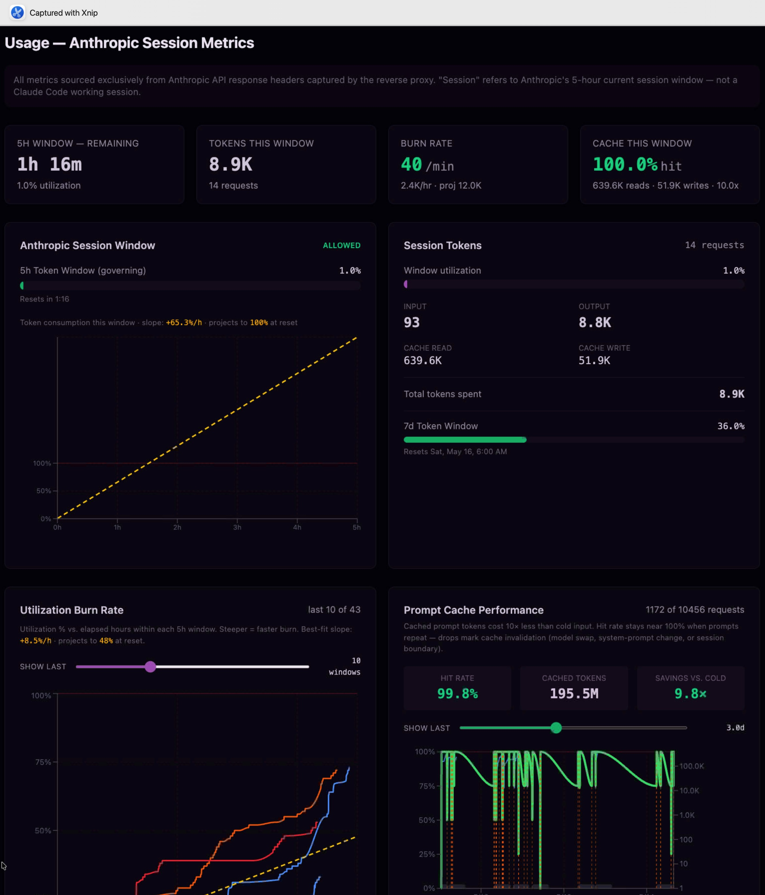
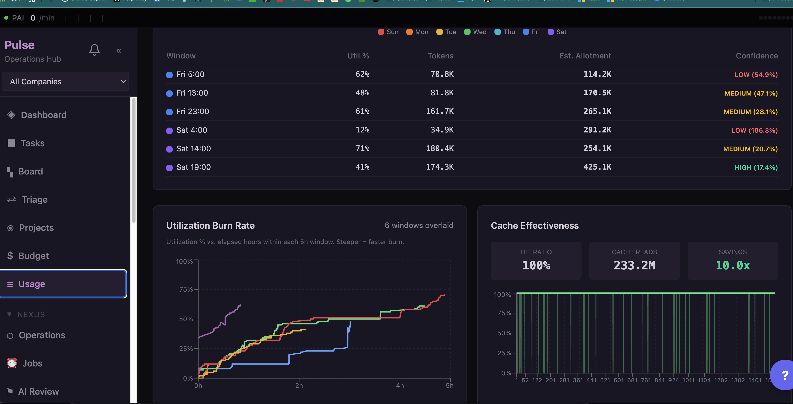

<p align="center">
  
  
  
  
  
  
</p>

# Project Aion

**A self-monitoring, self-improving AI development platform built on Claude Code.**

Project Aion is a production orchestration layer on top of [Claude Code](https://docs.anthropic.com/en/docs/claude-code) that adds persistent memory, intelligent context management, autonomous task pipelines, real-time API telemetry, and multi-agent coordination. Two AI Archons work in symbiosis: **Jarvis** (Master) handles deep collaborative development with 5-tier memory and adaptive context compression, while **Alfred** (Operations) runs headless pipelines with 24 AI personas, warm session forking, and full observability dashboards.

> [!NOTE]
> This is a personal infrastructure project, not a product. It represents ~4 months of iterative development solving real problems in long-running AI-assisted engineering sessions. The architecture reflects hard-won lessons about context window limits, API cost management, and making LLM development genuinely sustainable.

---

## Extending AI Development Beyond the Terminal

Claude Code is a capable CLI, but extended development sessions expose fundamental gaps: context windows exhaust mid-task, there is no memory between sessions, API costs are opaque, and nothing coordinates work across multiple agents. Project Aion addresses each of these directly.

| Problem | Solution | Implementation |
|---------|----------|----------------|
| Context window exhaustion | JICM v7.9 -- intelligent context compression | AI-driven summarization with checkpoint/restore cycles; zero-loss context transitions via Qdrant auto-ingest |
| No persistent memory | 5-tier memory hierarchy | Ephemeral -> session -> cross-session -> semantic search (Qdrant) -> structural knowledge graph (Neo4j) |
| Opaque API costs | Reverse proxy telemetry | Every API call captured with rate-limit headers, token accounting by class, burn-rate regression analysis |
| No task automation | Alfred pipeline with chain executor | Warm session forking achieves **6.2x cost reduction** vs cold subprocess spawning ($0.049 vs $0.305 per task) |
| No self-correction | 10 autonomic components | Self-launch, iterative verification loops, milestone review, self-reflection, self-evolution with risk gating |

---

## Architecture

```
┌──────────────────────────────────────────────────────────────────┐
│                         Project Aion                             │
│  ┌────────────────────────┐    ┌──────────────────────────────┐  │
│  │   Jarvis (Master)       │    │   Alfred (Operations)        │  │
│  │                         │    │                               │  │
│  │  5-Tier Memory          │    │  Pulse API (80+ endpoints)   │  │
│  │  JICM Compression      │<-->│  Nexus Dashboard (35+ pages) │  │
│  │  10 Autonomic           │    │  24 AI Personas              │  │
│  │    Components           │    │  Chain Executor              │  │
│  │  52 Behavior Patterns   │    │  Usage Proxy + Telemetry     │  │
│  └────────────────────────┘    └──────────────────────────────┘  │
│                                                                   │
│  ┌────────────────────────────────────────────────────────────┐  │
│  │              Shared Infrastructure (Docker)                 │  │
│  │  PostgreSQL/ParadeDB  |  Qdrant  |  Neo4j  |  Redis  | n8n │  │
│  │  Ollama  |  LiteLLM  |  MLX Embeddings  |  Caddy           │  │
│  └────────────────────────────────────────────────────────────┘  │
└──────────────────────────────────────────────────────────────────┘
```

---

## Telemetry and Observability

Every Anthropic API call passes through a reverse proxy that captures rate-limit headers, token accounting by class (input, output, cache_read, cache_write), and per-session cost attribution. The dashboard surfaces this as burn-rate curves with least-squares regression, cache effectiveness metrics, and utilization window forecasting.



The Nexus operations hub provides cross-window utilization overlays, estimated allotment projections with confidence scoring, and real-time cache effectiveness tracking (100% hit ratio, 10x savings vs cold calls in the session shown).



---

## Context Management (JICM v7.9)

The hardest operational problem in LLM-powered development is context window exhaustion mid-task. JICM (Jarvis Intelligent Context Management) monitors token usage in real-time and orchestrates compression cycles using a local Qwen3 model for summarization:

```
Token Usage --> Threshold Detection --> AI Summarization --> Qdrant Auto-Ingest
    |               |                        |                      |
 Live HUD     soft 250K / hard 300K    qwen3:8b (local)     Semantic recall
                                                             on session resume
```

Compressed checkpoints are auto-ingested into vector storage with 0.92 dedup threshold, enabling semantic recall across sessions without manual bookkeeping.

---

## Pipeline v2 -- Chain Executor

Alfred's pipeline replaces expensive `claude -p` subprocess spawning with a warm-session fork model:

```
Seed Session (cache-warm) --fork--> Chain Window 1 --sentinel--> Complete
                          --fork--> Chain Window 2 --sentinel--> Complete
                          --fork--> Chain Window N --sentinel--> Complete
```

Each fork inherits the parent's cached context prefix, avoiding the ~40K token cache-registration tax per child. Signal-file delegation coordinates execution: the executor writes request files, a host bridge daemon picks them up, and sentinel files signal completion.

> [!IMPORTANT]
> The 6.2x cost reduction is measured empirically from proxy telemetry data, not estimated. Warm forks cost $0.049 per child vs $0.305 for cold `claude -p` calls.

---

<details>
<summary><strong>Autonomic Components (AC-01 through AC-10)</strong></summary>

| AC | Name | Function |
|----|------|----------|
| AC-01 | Self-Launch | Load identity, read state, begin work autonomously |
| AC-02 | Wiggum Loop | Multi-pass verification: Execute -> Check -> Review -> Drift -> Continue |
| AC-03 | Milestone Review | Dual-agent code quality + project progress assessment |
| AC-04 | JICM | Intelligent context compression (described above) |
| AC-05 | Self-Reflection | Analyze corrections, identify behavioral patterns, generate evolution proposals |
| AC-06 | Self-Evolution | Implement queued improvements with risk gating (low=auto, medium=notify, high=approval) |
| AC-07 | R&D Cycles | Research external + internal efficiency opportunities |
| AC-08 | Maintenance | Health checks, freshness audits, log rotation |
| AC-09 | Session Meditation | End-of-session consolidation + knowledge capture to RAG and knowledge graph |
| AC-10 | Ulfhedthnar | Emergency override: parallel agent spawning, approach rotation |

</details>

<details>
<summary><strong>Service Inventory (16+ containers)</strong></summary>

| Service | Port | Purpose |
|---------|------|---------|
| PostgreSQL/ParadeDB | 5432 | Primary data store with pgvector + BM25 |
| Qdrant | 6333 | Vector search for RAG (2560-dim Qwen3 embeddings) |
| Neo4j | 7687 | Knowledge graph (Graphiti agent memory) |
| Redis | 6379 | Cache and queues |
| Pulse API | 8800 | Task management -- 80+ REST endpoints |
| Nexus Dashboard | 8701 | React operations dashboard (35+ pages) |
| Usage Proxy | 9800 | API telemetry: rate limits, tokens, cost attribution |
| LiteLLM | 4000 | Multi-model proxy (Qwen3 32B/8B) |
| MLX Embeddings | 8000 | Qwen3-Embedding-4B on Apple Silicon |
| Ollama | 11434 | Local LLM inference |
| Caddy | 443 | Reverse proxy + automatic HTTPS |

</details>

<details>
<summary><strong>Repository Structure</strong></summary>

```
Project_Aion/
├── .claude/              # Jarvis Archon (capabilities, context, hooks, skills, agents)
│   ├── context/          # Knowledge layer: 52 patterns, psyche, components
│   ├── scripts/          # Operational scripts (launcher, JICM, HUD, telemetry)
│   ├── skills/           # 12 active skill modules
│   └── plans/            # Implementation plans (adjective-animal naming)
├── alfred/               # Alfred Archon (operations, Nexus, Pulse, dashboard)
│   ├── pulse/            # Pulse task API (FastAPI, 80+ endpoints)
│   ├── dashboard/        # Nexus dashboard (React + Vite, 35+ pages)
│   ├── usage-proxy/      # Anthropic API telemetry reverse proxy
│   └── .claude/          # Alfred-specific hooks, personas, job executors
├── infrastructure/       # Shared Docker stack
│   ├── docker-compose.yml
│   ├── qwen3-embeddings-mlx/
│   └── litellm-config.yaml
└── projects/             # Development artifacts and reports
```

</details>

---

## Tech Stack

**Languages**: Python, TypeScript, Bash, SQL
**AI/ML**: Claude Opus 4 (1M context), Qwen3 (32B/8B/0.6B), MLX embeddings (2560-dim)
**Databases**: PostgreSQL/ParadeDB (pgvector + BM25), Qdrant, Neo4j, Redis
**Backend**: FastAPI, FastMCP 3.0, LiteLLM, Ollama
**Frontend**: React, Vite, Recharts
**Infrastructure**: Docker Compose, tmux, Caddy

> [!TIP]
> The full tmux session layout (12 windows including Jarvis, Watcher, Ennoia orchestrator, Virgil codebase guide, and service monitors) launches with a single command: `bash .claude/scripts/launch-aion.sh`

---

## License

MIT License -- see [LICENSE](LICENSE).

---

<p align="center">
  <em>Project Aion -- where AI builds its own tooling, autonomously.</em>
</p>
