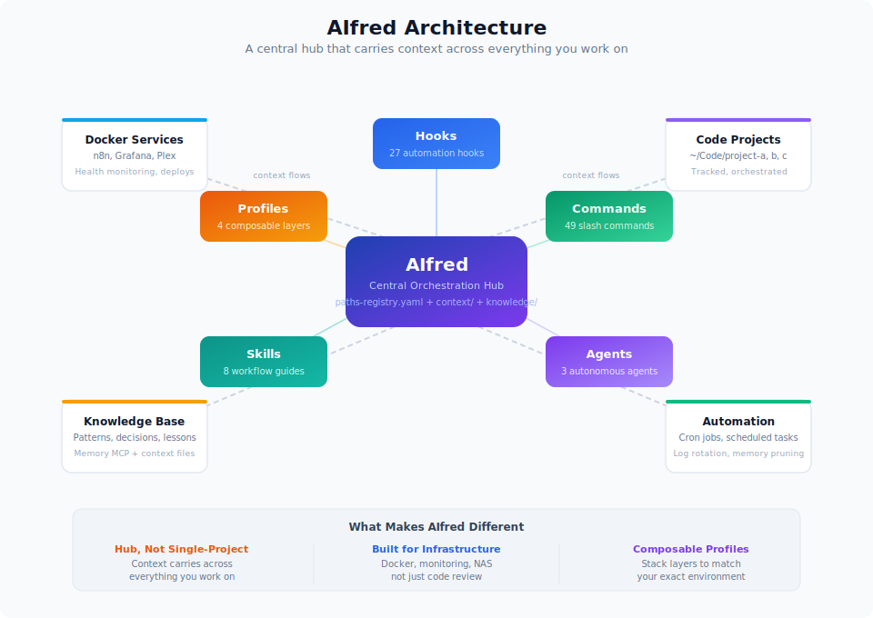
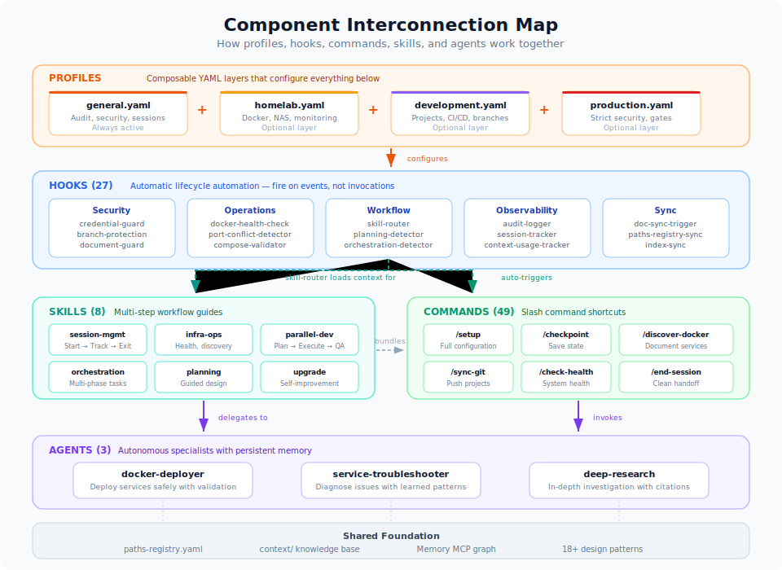
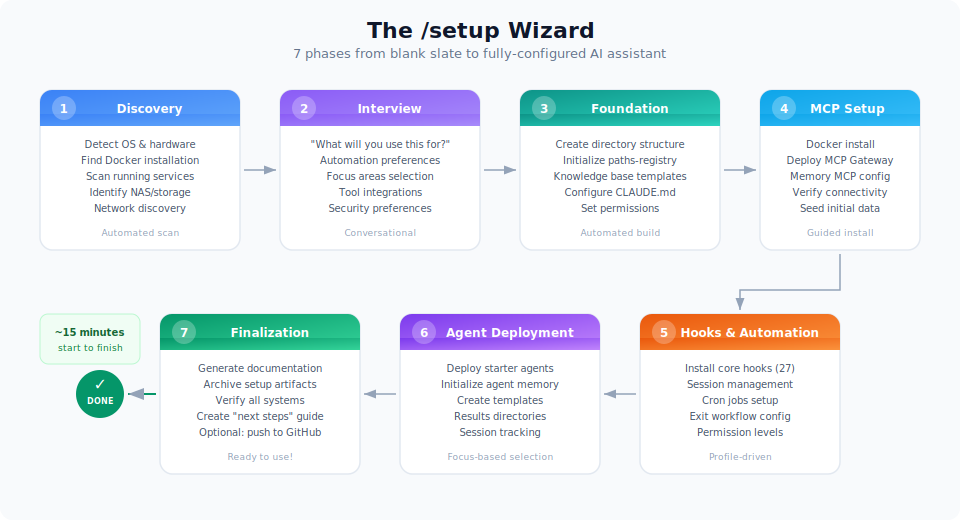

# AIfred

[](https://opensource.org/licenses/Apache-2.0)

**A configuration framework that turns Claude Code into an AI that understands your entire environment -- not just one project at a time.**

Most Claude Code setups live inside a single project. Your AI assistant knows that one codebase, follows that one set of rules, and forgets everything when you switch to something else. AIfred sits above your projects as a central hub, carrying context about your infrastructure, your decisions, and your workflows across everything you work on.

AIfred is built on the latest Claude Code capabilities -- hooks across all lifecycle events, skills with auto-invocation, composable subagents, and the full settings hierarchy. As Claude Code evolves, AIfred evolves with it.

Fork it, run the bootstrap script, and the system tracks its own setup as managed tasks -- self-operationalizing from the first command.

```bash
git clone https://github.com/CannonCoPilot/Project_Aion.git
cd Project_Aion
bash scripts/bootstrap.sh    # Docker, Pulse, plan import, cron -- all automated
claude                       # hard gate verifies infrastructure, then guides you through setup
```

<p align="center">
  
</p>

---

## Why Does This Exist?

Claude Code out of the box is powerful but empty. You get a blank CLAUDE.md and start from scratch every time. After months of daily use managing a home lab, building projects, and automating infrastructure, clear patterns emerged:

- **The same problems keep getting solved from scratch.** Session handoffs, Docker health checks, git workflows, project discovery -- these are universal.
- **Context dies between projects.** Decisions made in one project are invisible to another. Your AI assistant has no memory of what you learned yesterday.
- **Infrastructure work is different from coding.** Every Claude Code framework out there optimizes for writing and reviewing code. Nobody built one for managing Docker services, monitoring systems, or running a home lab.

AIfred captures those patterns into a reusable, composable framework.

---

## Who Is This For?

**Home lab operators** who manage Docker services, NAS storage, monitoring stacks, and want an AI assistant that understands their infrastructure.

**Developers managing multiple projects** who want consistent workflows, session continuity, and cross-project context instead of isolated per-project CLAUDE.md files.

**Claude Code power users** who want to see what's possible with hooks, skills, agents, and profiles working together as a system -- and want a head start instead of building from scratch.

---

## What Makes It Different?

### 1. A Hub, Not a Single-Project Config

Most Claude Code customizations live inside one project directory. AIfred is designed as a central orchestration point that tracks and manages multiple projects. It maintains a path registry, creates context files for each project, and carries institutional knowledge across everything you work on. When you discover something in Project A, that knowledge is available when you're working in Project B.

### 2. Built for Infrastructure, Not Just Code

Every other Claude Code framework helps you write and review code faster. AIfred also helps you deploy Docker services, discover infrastructure, monitor health, troubleshoot systems, validate compose files, detect port conflicts, and manage a home lab. It includes infrastructure-specific hooks that no other framework has.

### 3. Composable Environment Profiles

No other project in the Claude Code ecosystem has this. You stack YAML layers -- `general + homelab`, or `general + development`, or all three -- and each layer adds specific hooks, permissions, patterns, and agents. Like Docker Compose overrides, but for your AI assistant's behavior.

### 4. An Integrated System, Not a Collection

Most projects give you a bag of 100+ commands or a set of personas. AIfred integrates hooks, commands, skills, agents, profiles, and a setup wizard where each component reinforces the others. The skill router loads context when you invoke commands. The orchestration detector breaks down complex tasks automatically. The audit logger tracks everything for observability. It's a framework, not a folder of markdown files.

---

## How It Works

AIfred layers five capabilities on top of Claude Code:

<p align="center">
  
</p>

### Profiles Shape Your Environment

You choose which layers apply to your setup. Each layer activates the right hooks, permissions, and patterns:

| Profile | What It Adds |
|---------|-------------|
| **general** (always active) | Audit logging, security scanning, session management |
| **homelab** | Docker validation, port conflict detection, health monitoring |
| **development** | Project tracking, orchestration, parallel-dev, branch protection |
| **production** | Strict security, deployment gates, destructive command blocking |

```bash
# Pick your combination
node scripts/profile-loader.js --layers general,homelab,development
```

### Hooks Automate the Repetitive

31 active JavaScript hooks run automatically at key moments -- before tool calls, after edits, on session start. They handle audit logging, security checks, document protection, Docker health validation, skill routing, planning detection, environment validation, and documentation reminders. You don't invoke them; they just work.

### Commands Give You Shortcuts

67 slash commands for common operations: `/setup` to configure, `/checkpoint` to save state, `/discover-docker` to document services, `/fabric` for AI text processing, `/ollama` for local LLM management, `/sync-git` to push across projects, `/end-session` for clean handoffs.

### Skills Guide Complex Workflows

Skills are comprehensive workflow guides that bundle related commands, hooks, and patterns together. When you need session management, infrastructure ops, parallel development, or task orchestration, skills provide step-by-step guidance instead of making you remember which commands to run.

### Agents Handle Autonomous Tasks

Specialized agents work independently on complex tasks: deploying Docker services safely, troubleshooting infrastructure issues with learned patterns, or doing deep research with web sources and citations.

### Security Guards Protect Everything

Three layered guards run as hooks to prevent accidents:

- **Document Guard**: 4-tier file protection (critical/high/medium/low) with section preservation, heading structure checks, and semantic relevance validation. Critical files (.env, CLAUDE.md, settings.json) are blocked from writes.
- **Credential Guard**: Detects secrets (API keys, tokens, passwords) in tool output and blocks leakage. Configurable per-pattern policies in `credential-governance.yaml`.
- **Persona Guard**: Restricts what each headless persona can do — investigators get read-only, executors get scoped write access. Policies defined in `persona-policies.yaml`.

---

## Self-Bootstrapping Setup

AIfred's setup is **self-operationalizing**: a bootstrap script verifies prerequisites (Docker, Compose V2, jq, yq, python3, curl), deploys Pulse, imports a 23-task setup plan into its own task system, and registers the dispatcher cron. From that point, CLAUDE.md contains a hard gate that blocks all other work until infrastructure is healthy, then guides you through setup tasks in dependency order.

```bash
bash scripts/bootstrap.sh              # Interactive setup
bash scripts/bootstrap.sh --check      # Validate only (CI-friendly)
bash scripts/bootstrap.sh --non-interactive  # Unattended with defaults
```

> **Note**: If cloning via SSH, verify your GitHub key works first: `ssh -T git@github.com`. Many users have named keys (e.g., `id_github`) that require an SSH config entry for `github.com`.

Setup progress is tracked as Pulse tasks with `source:orchestration` labels. If interrupted, the next session automatically picks up where you left off. The setup-monitor job (12h interval) reports remaining tasks until finalization removes the hard gate.

<p align="center">
  
</p>

---

## Feature Overview

### Environment Profiles

Composable YAML layers that configure your entire AIfred installation:

```bash
/profile              # Show current layers
/profile list         # Available profiles
/profile add <layer>  # Add a layer
/profile remove <x>   # Remove a layer
```

See [`profiles/README.md`](profiles/README.md) for full documentation.

### Automation Hooks (31 active + lib)

| Category | Examples |
|----------|---------|
| **Security** | Document guard (4-tier), credential guard, persona guard, branch protection, secret scanning |
| **Operations** | Docker health checks, Docker validation, port conflict detection, YAML validation |
| **Workflow** | Prompt dispatcher (tool guidance + project detection + task routing), skill routing, orchestration detection, planning mode detection |
| **Observability** | Audit logging, context monitoring (usage + session tracking), subagent dispatcher (activity + metrics), documentation sync |
| **Task Management** | Cross-project commit tracking, file access tracking |

### Slash Commands (67)

| Category | Commands |
|----------|---------|
| **Setup** | `/setup`, `/profile` |
| **Session** | `/checkpoint`, `/end-session`, `/audit-log` |
| **Infrastructure** | `/discover-docker`, `/check-health`, `/check-service`, `/ssh-connect` |
| **Projects** | `/register-project`, `/new-code-project`, `/create-project`, `/code`, `/consolidate-project` |
| **AI Processing** | `/fabric`, `/fabric:analyze-logs`, `/fabric:commit-msg`, `/fabric:review-code`, `/ollama` |
| **Git** | `/sync-git`, `/push-all-commits` |
| **Planning** | `/plan`, `/design-review`, `/orchestration:plan` |
| **Development** | `/parallel-dev:plan`, `/parallel-dev:start`, `/parallel-dev:validate` |
| **Browser** | `/browser` (optional — requires Playwright) |

### Skills (11)

| Skill | Purpose |
|-------|---------|
| **session-management** | Session lifecycle: start, track, checkpoint, exit |
| **infrastructure-ops** | Health checks, container discovery, monitoring |
| **parallel-dev** | Autonomous parallel development with planning and validation |
| **orchestration** | Multi-phase task tracking with dependency management |
| **structured-planning** | Guided conversational planning for designs and features |
| **project-lifecycle** | Project creation, registration, and consolidation |
| **system-utilities** | Core CLI utilities: git sync, priority cleanup, history archival |
| **upgrade** | Self-improvement: discover and apply updates automatically |
| **fabric** | AI-powered text processing with local Ollama |
| **task-dashboard** | Formatted Pulse task views with label categorization (zero-token) |

### Agents (14)

| Agent | Purpose |
|-------|---------|
| **docker-deployer** | Deploy and configure Docker services safely |
| **service-troubleshooter** | Diagnose infrastructure issues with learned patterns |
| **deep-research** | In-depth topic investigation with web sources and citations |
| **ollama-manager** | Manage local Ollama LLM service |
| **project-plan-validator** | Validate project plans against infrastructure patterns |
| **code-analyzer** | Understand codebase structure, identify patterns |
| **code-implementer** | Write, modify, and refactor code with git workflow |
| **code-tester** | Validate changes through automated tests |
| **parallel-dev-implementer** | Focused implementation within parallel workflows |
| **parallel-dev-validator** | QA validation for parallel development |
| **parallel-dev-documenter** | Documentation within parallel workflows |
| **parallel-dev-tester** | Testing within parallel workflows |
| **memory-bank-synchronizer** | Keep documentation aligned with code |

### Design Patterns (18+)

Proven patterns extracted from real daily usage:

| Pattern | What It Does |
|---------|-------------|
| **DDLA** | Discover, Document, Link, Automate -- systematic knowledge capture |
| **COSA** | Capture, Organize, Structure, Automate -- information management |
| **PARC** | Prompt, Assess, Relate, Create -- design review before implementation |
| **Capability Layering** | Scripts for deterministic work, AI for judgment calls |
| **Fresh Context Execution** | Run tasks in isolated Claude instances to avoid context pollution |
| **Autonomous Execution** | Scheduled Claude jobs via cron with permission tiers |

Plus patterns for secret management, memory storage, MCP loading strategies, cross-project tracking, and more.

### Session Continuity

Every session leaves a trail. State is tracked automatically so you can pick up where you left off, even days later. Clean handoffs with `/end-session` ensure nothing is lost between sessions.

### Intelligent Memory

Persistent knowledge graph (via Memory MCP) that remembers decisions, relationships, and lessons learned. Smart pruning archives inactive knowledge without losing it. Access tracking identifies what information matters most.

---

## Dual CLI Support

AIfred works with both **Claude Code** (Anthropic) and **OpenCode** (open source):

| Feature | Claude Code | OpenCode |
|---------|-------------|----------|
| Instructions | `.claude/CLAUDE.md` | `AGENTS.md` |
| Settings | `.claude/settings.json` | `opencode.json` |
| Commands | `.claude/commands/*.md` | `.opencode/command/*.md` |
| Agents | `.claude/agents/*.md` | `.opencode/agent/*.md` |

Both share the context files, knowledge base, path registry, and external sources.

---

## Configuration

### Automation Levels

During setup, you choose how much autonomy your AI assistant gets:

| Level | Behavior |
|-------|----------|
| **Full** | Everything runs without prompting |
| **Guided** | Major changes need confirmation |
| **Manual** | Most operations prompt for approval |

### MCP Integration

AIfred works best with MCP servers for extended capabilities:

- **Memory MCP** -- Persistent knowledge graph (recommended)
- **Docker MCP** -- Container management
- **Filesystem MCP** -- Cross-directory file access
- **Browser MCP** -- Web automation via Playwright

The setup wizard walks you through enabling the ones you need.

---

## Directory Structure

```
AIfred/
├── profiles/               # Environment profile definitions (YAML)
│   ├── general.yaml        # Base layer (always active)
│   ├── homelab.yaml        # Docker, NAS, monitoring
│   ├── development.yaml    # Code projects, CI/CD
│   └── production.yaml     # Security hardening
├── docker-compose.yml        # Postgres + Pulse + Nexus Dashboard (3 services)
├── dashboard/                # Nexus Dashboard (React/TypeScript web UI)
│   ├── frontend/           # React/Vite app
│   └── server/             # Fastify/Express API
├── .claude/
│   ├── CLAUDE.md           # Claude Code instructions
│   ├── settings.json       # Permissions (generated from profiles)
│   ├── context/            # Knowledge base (80 files)
│   ├── commands/           # Slash commands (67)
│   ├── agents/             # Agent definitions (14)
│   ├── hooks/              # Automation hooks (31 active + lib/shared.js)
│   ├── skills/             # Workflow skills (11)
│   ├── jobs/               # Nexus automation framework
│   │   ├── dispatcher.sh   # Master scheduler (cron, every 5 min)
│   │   ├── executor.sh     # Persona-aware job runner
│   │   ├── event-watcher.sh # Reactive event watcher (cron, every 2 min)
│   │   ├── pipeline-runner.sh # Task automation pipeline
│   │   ├── team-runner.py  # Multi-agent consensus orchestrator
│   │   ├── registry.yaml   # Job definitions (schedules, budgets, prompts)
│   │   ├── personas/       # 30 example personas (customize for your environment)
│   │   ├── workflows/      # 50 job workflow definitions
│   │   ├── bin/            # Executors (pulsar-runner, nexus-turbo, exposure-audit)
│   │   ├── rules/          # Safety, routing, and quality rule files
│   │   └── lib/            # 28 support libs (label-ops, routing-helpers, msgbus, pulse-api, ...)
│   └── orchestration/      # Task orchestration configs
├── .opencode/              # OpenCode-specific configs
│   └── registries/         # Manifest + schema definitions
├── scripts/                # CLI automation scripts (30+)
│   ├── bootstrap.sh        # Self-bootstrapping setup entry point
│   └── setup-pulse.sh      # Pulse service configuration
├── tests/                  # Validation suite (structural, sync, CI)
├── knowledge/              # Documentation and reference
├── external-sources/       # Symlinks to external data
├── paths-registry.yaml     # Source of truth for all paths
└── setup-phases/           # 9-phase setup wizard + orchestration plan
    └── setup-plan.yaml     # 23-task dependency graph (imported into Pulse)
```

---

## Requirements

| Tool | Purpose | Checked by `bootstrap.sh` |
|------|---------|--------------------------|
| **Claude Code** | AI assistant CLI | Executor verifies at runtime |
| **Git** | Version control | -- |
| **Docker + Compose V2** | Pulse service, MCP servers | Yes |
| **Node.js** | Profile loader, hooks | -- |
| **Python 3** | jobsdb.py, team orchestration | Yes |
| **jq** | JSON parsing (all scripts) | Yes |
| **yq** | YAML parsing (dispatcher, executor) | Yes |
| **curl** | Pulse API calls | Yes |

**Platform**: Linux or macOS (Windows experimental via WSL).

Run `bash scripts/bootstrap.sh --check` to verify all prerequisites.

---

## Changelog

### v4.0.0 (2026-04-10) -- Nexus Sync & Dashboard

- **Comprehensive Nexus sync**: Full upstream sync of the Nexus automation framework
  - **30 example personas** (up from 7): infrastructure-deployer, security-reviewer, creative-thinker, bug-fixer, librarian, orchestrator, and 23 more covering infrastructure, creative, security, and QA domains
  - **50 workflow definitions**: Job orchestration configs for health checks, creative pipelines, threat intel, task evaluation, and more
  - **28 lib scripts** (up from 10): pulse-api, audit-log, persona-health-check, training-ops, gemini-api, and more
  - **7 new hooks**: audit-logger, credential-guard, document-guard, persona-guard, branch-protection, file-access-tracker, cross-project-commit-tracker
  - **Pipeline runner**: Task automation pipeline with watchdog and stage-gate validation
  - **Executors**: pulsar-runner (multi-persona), nexus-turbo, exposure-audit
- **Nexus Dashboard**: Full React/TypeScript web UI bundled as Docker service (3rd container alongside Postgres and Pulse)
- **Rebranding**: "Headless Claude Jobs Framework" → "Nexus" throughout
- **Bug fixes**: Executor MODEL pin, watchdog improvements, hardcoded path removal for standalone operation
- **Note**: Personas and workflows are example configurations — customize `${PROJECT_DIR}`, `${VAULT_ROOT}`, label prefixes, and persona interests for your environment
- Total: 31 hooks, 11 skills, 14 agents, 30 personas, 50 workflows, 28 lib scripts

### v3.1.0 (2026-03-19) -- Self-Bootstrapping Setup & Security Infrastructure

- **Self-bootstrapping setup**: `scripts/bootstrap.sh` verifies prerequisites (Docker, Compose V2, jq, yq, python3, curl), deploys Pulse, imports a 23-task setup plan, registers dispatcher cron, hardens .gitignore
  - CLAUDE.md hard gate blocks all work until infrastructure is healthy, then guides setup interactively
  - Setup progress tracked as Pulse tasks (`source:orchestration`) with dependency ordering
  - Resumable across sessions — interrupted setup picks up automatically
  - `setup-monitor` job reports remaining setup tasks on 12h interval
- **Security infrastructure**: Three layered guards deployed as hooks
  - **Document Guard**: 4-tier protection with `protectedSections` for safe finalization
  - **Credential Guard**: Secret detection with per-pattern policies (`credential-governance.yaml`)
  - **Persona Guard**: Per-persona tool restrictions (`persona-policies.yaml`)
- **Simplified lib scripts**: `label-ops.sh` (4 transition scenarios), `routing-helpers.sh` (eligibility + domain mapping), `event-watcher.sh` (cursor-based Pulse API polling)
- **Beads-to-Pulse conversion**: All 41 files migrated from `bd` CLI to `pulse` CLI and Pulse API
- **Testing framework**: 5-layer validation suite (`tests/validate-structure.sh`, `tests/validate-sync.sh`, CI workflow)
- **Setup-pulse.sh enhancements**: `--check` mode, auto `docker compose up`, Pulse source validation, pulse CLI check
- **Routing rules**: `routing-rules.yaml`, `safety.yaml` (8 hard constraints + 6 deny rules), `quality.yaml`, `routing.yaml`
- **Registry manifest**: All registries tracked in `.claude/registries/manifest.yaml` with consumer maps
- Total: 28 hooks, 11 skills, 14 agents, 7 personas, 9 setup phases, 14 lib scripts

### v3.0.0 (2026-03-05) -- Nexus Automation Framework

- **Full Nexus automation framework**: Autonomous Claude Code job execution via cron
  - **Dispatcher** (1,040 lines): Schedule evaluation, pre-check gates, lock acquisition, retry with backoff
  - **Executor** (983 lines): Persona-aware prompt building, engine routing (Claude/Ollama), transient error retry
  - **Team Runner** (934 lines): Multi-agent consensus orchestration with parallel execution and HITL escalation
  - **Message Bus**: SQLite-backed event store with threading, DND-aware delivery, and Telegram integration
  - **7 personas**: investigator, analyst, researcher, troubleshooter, autofix-executor, task-investigator, _template
  - **8 template jobs**: health-check, task-score, task-investigator, task-executor, weekly-cost-report, doc-sync-check, priority-review, ollama-test
  - **Observability**: Terminal dashboard, cost tracking, dispatcher watchdog, weekly digest
  - See [docs/nexus-automation.md](docs/nexus-automation.md) for full setup guide
- **Task automation pipeline**: Autonomous Pulse task processing with safety labels (auto:ready/candidate/blocked, risk:safe/moderate/destructive)
- **Hook consolidation**: prompt-dispatcher.js (replaces prompt-enhancer + project-detector), subagent-dispatcher.js (replaces subagent-stop + metrics-collector), shared lib/shared.js utilities
- **New skill**: task-dashboard — zero-token deterministic Pulse task formatting
- **New script**: scan-secrets.sh — pre-commit secret scanning (AWS, OpenAI, GitHub, Telegram patterns)
- **Updated skills**: parallel-dev (config, workflows, troubleshooting), upgrade (analysis, implementation, scheduling)
- **CLAUDE.md**: Added /tasks guidance, Nexus automation section, documentation routing
- **Sanitization**: Cleaned remaining hardcoded personal references in hooks, patterns, and scripts
- Total (at release): 25 hooks, 11 skills, 14 agents, 7 personas, 30 scripts

### v1.2.0 (2026-02-13) -- Feature Sync from AIProjects

- **14 new commands**: `/check-health`, `/check-service`, `/discover-docker`, `/new-code-project`, `/register-project`, `/browser`, `/create-project`, `/code`, `/ollama`, `/ssh-connect`, `/fabric`, `/fabric:analyze-logs`, `/fabric:commit-msg`, `/fabric:review-code`
- **2 new skills**: Fabric (AI text processing with Ollama) and Orchestration (multi-phase task tracking)
- **2 new agents**: `ollama-manager` (local LLM management), `project-plan-validator` (architecture validation)
- **3 new hooks**: `fabric-suggester` (suggests Fabric patterns), `env-validator` (environment checks), `network-validator` (connectivity checks)
- **Setup wizard Phase 8**: Optional Integrations (Ollama, SSH, Playwright) — can run during setup or independently
- **4 Fabric scripts**: `fabric-wrapper.sh`, `fabric-analyze-logs.sh`, `fabric-commit-msg.sh`, `fabric-review-code.sh`
- All ported features generalized with zero hardcoded paths or infrastructure references
- Total: 63 commands, 43 hooks, 10 skills, 13 agents

### v1.1.0 (2026-02-12) -- Strict Versioning Baseline

- Established strict semantic versioning (Major.Minor.Patch)
- `VERSION` file as single source of truth
- `scripts/bump-version.sh` for automated version management
- Version banner in session-start hook (shows Claude Code + AIfred versions)
- See [docs/VERSIONING.md](docs/VERSIONING.md) for versioning policy

---

<details>
<summary>Pre-release history (informal versioning)</summary>

### v2.4.0 (2026-02-12) -- Pulse + Nexus

- **Pulse task management** (required): `bd` CLI for all task tracking, replacing TodoWrite
  - Actor identity hook for session provenance
  - Shell aliases for zero-token views
  - Config template with AIfred-specific label conventions
- **Nexus job system**: Scheduled AI-powered automation
  - Dispatcher + executor with cron-based scheduling
  - 3 personas (investigator, analyst, troubleshooter) as safety tiers
  - Ollama engine routing for $0 local jobs
  - Message bus with Telegram notifications and DND
  - Observability dashboard with cost tracking and Prometheus metrics
  - 3 template jobs (health-summary, doc-sync-check, ollama-test)
- **Full sanitization**: All personal references replaced with auto-detecting `AIFRED_HOME` pattern
- CLAUDE.md updated with Pulse and Nexus documentation

### v2.3.0 (2026-02-08) -- Document Guard

- Document Guard V1: 4-tier file protection with pattern-based rules (critical/high/medium/low)
- 7 check types: no_write, credential scanning, key deletion, section/heading preservation, frontmatter protection, shebang preservation
- Document Guard V2: Optional semantic relevance validation via local Ollama (off by default)
- Feature registry for discoverability of configurable features
- Time-limited single-use override mechanism for approved exceptions
- Full audit logging to `.claude/logs/document-guard.jsonl`

### v2.2.0 (2026-02-05) -- Environment Profiles

- Composable YAML profile system with 4 layers
- Zero-dependency profile loader (`node scripts/profile-loader.js`)
- 5 new hooks: docker-validator, mcp-enforcer, port-conflict-detector, paths-registry-sync, service-registration-detector
- `/profile` command for managing layers
- Profile-driven setup wizard questions

### v2.1.0 (2026-02-05) -- Enhanced Automation

- 6 new hooks: skill-router, planning-mode-detector, priority-validator, compose-validator, context-usage-tracker, index-sync
- 3 new patterns: fresh-context execution, secret management (SOPS + age), external tool evaluation
- Fresh context execution for isolated task processing
- 3 new CLI scripts

### v2.0.0 (2026-01-21) -- Foundation

- 18 design patterns from real-world usage
- 26 automation hooks with matcher-based registration
- 7 skills: upgrade, structured-planning, parallel-dev, session-management, and more
- 16 CLI scripts with deterministic operations
- TELOS strategic goal alignment framework

</details>

---

## Contributing

AIfred is designed to be forked and customized. If you build something useful, consider contributing back:

1. Fork the repository
2. Create a feature branch
3. Submit a pull request

---

## Learn More

- [profiles/README.md](profiles/README.md) -- Profile system documentation
- [docs/PROJECT-PLAN.md](docs/PROJECT-PLAN.md) -- Architecture and development roadmap
- [docs/nexus-automation.md](docs/nexus-automation.md) -- Nexus job system setup guide

---

## License

Apache License 2.0 -- See [LICENSE](LICENSE) for details.
