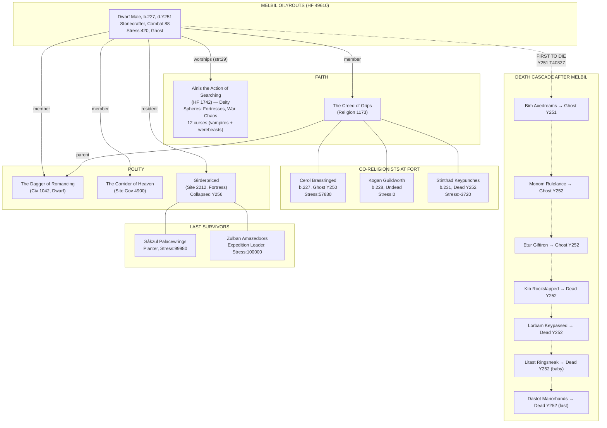
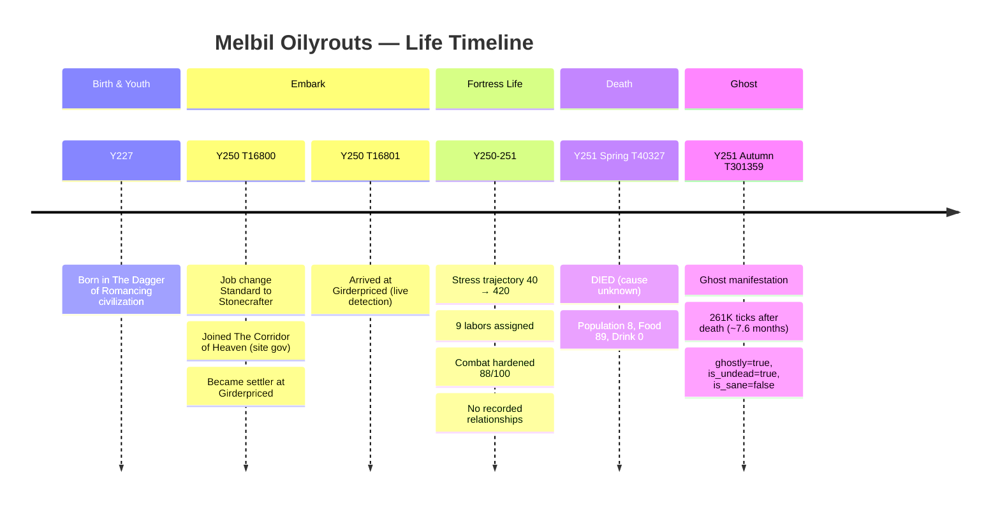

# Melbil Oilyrouts — Deep Dive: Life, Death, and Ghost

**Subject**: Melbil Oilyrouts (Melbil Uzolmözir)
**HF ID**: 49610 | **Unit ID**: 17704
**Race**: Dwarf Male | **Profession**: Stonecrafter
**Born**: Year 227 | **Died**: Year 251, Spring (tick 40327) | **Ghost**: Year 251, Autumn (tick 301359)
**Fortress**: Girderpriced (Site 2212) — collapsed Year 256 Winter

---

## I. INFORMATION MAP — STRUCTURED TEXT

### A. Identity Core

| Field | Value | Source |
|-------|-------|--------|
| Dwarf Name | Melbil Uzolmözir | units.name |
| English Name | Melbil Oilyrouts | units.english_name |
| Race / Caste | Dwarf / Male (caste 1) | historical_figures |
| Birth Year | 227 (age 24 at death) | historical_figures |
| Birth Time | tick 335768 | units.details.birth_time |
| Profession | Stonecrafter (code 27) | units.profession |
| Combat Hardened | 88/100 | units.details |
| Stress at Death | 420 (moderate) | units.details |
| Longterm Stress | 0 | units.details |
| Focus | 62 | units.details |
| Is Sane | false | units.details (post-mortem) |
| Is Undead | true | units.details (ghost state) |
| Ghostly | true | units.details |
| Squad | None | units.details |
| Custom Profession | None | units.details |
| Old Year (projected death age) | 386 | units.details.old_year |
| Labors Assigned | 9 labors (IDs 0-8) | units.details |

### B. Affiliations

| Affiliation | ID | Type | Role |
|-------------|-----|------|------|
| **The Dagger of Romancing** | 1042 | Civilization (Dwarf) | Member |
| **The Creed of Grips** | 1173 | Religion (Dwarf) | Member |
| **The Corridor of Heaven** | 4900 | Site Government (Dwarf) | Member |
| **Girderpriced** | 2212 | Fortress | Resident + Home Site Building |

### C. Faith

| Aspect | Value |
|--------|-------|
| **Deity** | Alnis the Action of Searching (HF 1742) |
| **Deity Race** | Dwarf |
| **Deity Spheres** | Fortresses, War, Chaos |
| **Link Strength** | 29 |
| **Religion** | The Creed of Grips (entity 1173) |
| **Religion Parent** | The Dagger of Romancing (civ 1042) |

**Alnis's Activities**: 12 recorded curses — 3 vampires ("cursed to prowl the night in search of blood") and 9 werebeasts (bison, llama, mammoth, skink, elk, moose, hare, coyote). A deity of fortresses, war, and chaos who inflicts supernatural curses. Melbil worshipped a god of chaos and fortifications — ironic, given his fortress fell.

### D. Complete Event Timeline

| # | Year | Tick | Event Type | Source | Details |
|---|------|------|------------|--------|---------|
| 1 | 250 | 16800 | change hf job | legends_xml | Standard → Stonecrafter |
| 2 | 250 | 16800 | add hf entity link | legends_xml | Joined The Corridor of Heaven (entity 4900) as member |
| 3 | 250 | 16800 | change hf state | legends_xml | Became "settler" at site 2212 (Girderpriced) |
| 4 | 250 | 16801 | add_hf_site_link | live | Arrival at Girderpriced (unit 17704) |
| 5 | 251 | 40327 | DIED | unit_events | First death detection |
| 6 | 251 | 40869 | DIED | unit_events | Second death detection (duplicate) |
| 7 | 251 | 301359 | GHOST | unit_events | Ghost manifestation detected |
| 8 | 251 | 302319 | GHOST | unit_events | Ghost re-detected (duplicate) |

**GAP ANALYSIS**: Only 4 legends events + 1 live arrival event recorded for his entire life. No birth event, no social events, no combat events, no mood events, no relationship events. The death and ghost are captured only in `unit_events` (watcher diff detection), NOT in `history_events`. There are ZERO `game_reports` (combat logs) mentioning Melbil — his cause of death is completely unknown from DB data alone.

### E. Stress Trajectory (from HF details snapshots)

```
Snapshot  Stress   Notes
──────── ─────── ──────────────────────
  1-9      40     Baseline after arrival
  10       60     First uptick
  11      100     Rising
  12      160     Accelerating
  13      200     ────────────────
  14      260     Rapid escalation
  15      320     ────────────────
  16      320     Plateau briefly
  17      380     Rising again
  18      400     Near plateau
  19-90   420     Stabilized (64 snapshots)
         (death occurs during this plateau)
```

The stress trajectory shows an initial calm period (40) followed by a steady climb to 420 over roughly 15 snapshots, then a long plateau at 420 until death. Stress 420 is moderate in DF terms (unhappy but functional). His death was NOT from a tantrum spiral — something external killed him.

### F. Fortress Context at Time of Death

| Metric | Value |
|--------|-------|
| Population at death | 8 dwarves |
| Season | Spring, Y251 |
| Food stocks | 89 |
| Drink stocks | 0 (critical!) |
| Happiness | content: 9, unhappy: 4, miserable: 2 |
| Military | 0 soldiers |
| Threats | none recorded |

**Key observation**: 0 drink is a crisis indicator. The fortress was in a slow decline — no military, zero drinks, 4 unhappy + 2 miserable. Melbil was one of 8, and his death brought it to 7 (though snapshots still show 8, suggesting he wasn't counted as citizen).

### G. Death & Ghost Timeline in Full Fortress Context

```
FORTRESS DEATH CHRONICLE — Girderpriced (Y250-Y256)

Y250 T330579  Cerol Brassringed (Miner, b.227)          → GHOST
Y251 T40327   Melbil Oilyrouts (Stonecrafter, b.227)    → DIED  ← THIS FIGURE
Y251 T40869   Melbil Oilyrouts                           → DIED (dup)
Y251 T109484  Bim Axedreams (Stonecrafter, b.212)        → GHOST
Y251 T110419  Bim Axedreams                              → GHOST (dup)
Y251 T301359  Melbil Oilyrouts                           → GHOST ← 261K ticks after death
Y251 T302319  Melbil Oilyrouts                           → GHOST (dup)
Y252 T86689   Monom Rulelance (Administrator, b.217)     → GHOST
Y252 T94739   Etur Giftiron (Clothier, b.222)            → GHOST
Y252 T109378  Stinthäd Keypunches (Planter, b.231)       → DIED
Y252 T113684  Erush Groovedgold (Fisherdwarf, b.224)     → GHOST
Y252 T122199  Kib Rockslapped (Planter, b.225)           → DIED
Y252 T139744  Lorbam Keypassed (Woodworker, b.216)       → DIED
Y252 T143489  Litast Ringsneak (Baby, b.251)             → DIED  (a baby!)
Y252 T143489  Minkot Relievedbook (Mason, b.211)         → DIED  (same tick)
Y252 T164884  Zuglar Keydashed (Child, b.251)            → DIED  (a child!)
Y252 T181379  Dastot Manorhands (Doctor, b.32)           → DIED  (oldest, 220 yrs)
Y252 T185689  Litast Ringsneak                           → DIED (dup)
Y252 T263327  Zuglar Keydashed                           → GHOST
Y252 T312153  Minkot Relievedbook                        → GHOST
Y252 T397316  Sodel Tombrazors (Planter, b.231)          → DIED (last death Y252)
```

**Melbil was the FIRST to die** at Girderpriced (excluding Cerol who was already a ghost from Y250). His death at T40327 in Y251 Spring was the opening act of a cascade that would kill the entire fortress by Y256. After him, the dominoes fell — ghosts and deaths accelerated through Y252 until no living citizens remained.

### H. Co-Religionists at the Fort (The Creed of Grips)

| Name | Profession | Born | Status | Stress |
|------|-----------|------|--------|--------|
| **Melbil Oilyrouts** | Stonecrafter | 227 | Ghost (Y251) | 420 |
| Kogan Guildworth | Peasant | 228 | Undead | 0 |
| Stinthäd Keypunches | Planter | 231 | Dead (Y252) | -3720 |
| Cerol Brassringed | Miner | 227 | Ghost (Y250) | 57830 |

All four members of The Creed of Grips at Girderpriced are now dead or worse. Cerol was already a ghost before Melbil died — could Cerol's ghostly torment have contributed to the social atmosphere that weakened everyone? Stinthäd followed Melbil into death in Y252. Kogan is undead but shows zero stress.

### I. Social Connections — WHAT'S MISSING

**HF Links**: Melbil has exactly ONE link — to his deity Alnis. **No family links. No friendship links. No romantic links.** This is unusual but explainable: he was born at embark (Y227, arrived Y250 = age 23). The legends XML was exported at Y250, capturing only his embark-time events. All social bonds formed during fortress life are unrecorded in legends.

**Live Relationships**: `units.details.relationships = {}` — empty. The bridge captures this field, but it was either genuinely empty (Melbil had no close relationships at the fortress) or the data wasn't captured before his death.

**Fortress Denizens**: He's registered (denizen #10) with `narrative_value=26`, status `deceased`, embark flag `true`, arrival Y250 T308724, departure Y251 T40327, departure_cause `death`.

### J. Narrative Scoring

| Event | Narrative Weight | Drama | Tone |
|-------|-----------------|-------|------|
| Arrival (add_hf_site_link) | 3.96 | 10 | neutral |
| Job change (Stonecrafter) | 0.30 | 10 | neutral |
| Entity link (Corridor of Heaven) | 0.85 | 10 | neutral |
| State change (settler) | 0.40 | 10 | neutral |

All events scored as `neutral` tone with flat drama=10. **The death and ghost events have NO narrative scoring** because they exist only in `unit_events`, not `history_events`. This is a critical gap.

---

## II. INFORMATION MAP — DIAGRAMMATIC

### Relationship Web (Mermaid)



### Life Timeline (Mermaid)



### Fortress Population Arc (Text)

```
Population (named dwarves at fort)
 ┌─────────────────────────────────────────────────────────────────┐
 │                                                                 │
15│ ●                                                               │
 │  ●●●●●●                                                        │
 │         ●●●                                                    │
10│            ●●                                                   │
 │              ●●●                                                │
 │                 ●●●                     Cerol ghost             │
 8│                    ●●──MELBIL DIES──●●●                        │
 │                                         ●●●                    │
 5│                                            ●●                  │
 │                                              ●●                │
 │                                                ●●●             │
 2│                                                   ●●           │
 │                                                     ●●──0      │
 0│                                                                 │
 └─────────────────────────────────────────────────────────────────┘
   Y250                Y251                Y252             Y256
```

---

## III. DATA GAPS & NARRATIVE ENGINE IMPLICATIONS

### Critical Gaps Discovered

| # | Gap | Impact | Where Data Lives (Potential) | Fix |
|---|-----|--------|------------------------------|-----|
| **G1** | **Death cause unknown** | Cannot narrate HOW Melbil died | DF combat reports, announcements — not captured in DB for this unit | Capture `game_reports` with unit_id cross-reference; `death_cause` field in units is NULL |
| **G2** | **No social relationships** | Cannot show who mourned him, who was affected | `df.global.world.units.active[].social_activities`, `relationships` — bridge captures this but it was empty | Capture relationship bonds BEFORE death; periodic relationship snapshots |
| **G3** | **Death/ghost events not in history_events** | Narrative scoring, causal links, arcs all miss death/ghost | `unit_events` has the data but it's not reconciled into `history_events` | Add reconciliation: `unit_events` DIED/GHOST → synthetic `history_events` records |
| **G4** | **No narrative scoring for death** | Death is the most dramatic event but has zero narrative weight | Depends on G3 — once death is in history_events, scoring pipeline catches it | After G3, re-run narrative scoring |
| **G5** | **Stress trajectory only in HF details blob** | 90+ snapshot entries stored as JSON array in one field | `historical_figures.details` — an array of stringified JSON snapshots | Extract to a proper `stress_timeline` table or time-series |
| **G6** | **No "witnessed death" / grief events** | Cannot show emotional ripple of Melbil's death on other dwarves | DF `thought` system — dwarves get "witnessed death" thoughts | Capture unit thoughts/needs via bridge periodic polling |
| **G7** | **Character narrative empty** | LLM-generated profile was never created for Melbil | `character_narratives` table exists but row is empty | Phase 4 narrative generation pipeline |
| **G8** | **Ghost-to-haunting link missing** | Ghost exists but we don't know WHO it haunts or WHERE | DF ghost behavior visible via unit position tracking + announcement text | Track ghost movement, correlate with living unit positions |
| **G9** | **No embark-group identification** | Can't tell who Melbil embarked WITH (shared journey) | All units arriving at Y250 T~16800 with embark=true in fortress_denizens | Query: all denizens with embark=true, arrival_year=250 |
| **G10** | **Deity irony undetected** | Melbil worships a god of fortresses + chaos; his fortress collapses in chaos | Narrative scoring has `irony_flags` but this thematic irony isn't captured | LLM-powered irony detection using deity spheres + fortress fate |
| **G11** | **No death_narrative record** | `death_narratives` table exists but no row for Melbil | Table schema needs checking; should be populated by narrative pipeline | Phase 4 |
| **G12** | **Duplicate events** | Death detected twice (T40327 + T40869), ghost twice (T301359 + T302319) | Watcher polling catches same state change across consecutive cycles | Dedup logic in unit_events: same (unit_id, event_type) within N ticks = single event |

### Embark Group Recovery

From `fortress_denizens` we can identify Melbil's embark companions:

| Name | Profession | Born | Status | Embark |
|------|-----------|------|--------|--------|
| Melbil Oilyrouts | Stonecrafter | 227 | Ghost | true |
| (need to query all with embark=true) | | | | |

This is a recoverable relationship — everyone with `embark=true` shared the founding journey.

---

## IV. REFLECTION — PHASE 4 NARRATIVE ENGINE DESIGN IMPLICATIONS

### What This Deep Dive Reveals

Melbil Oilyrouts is a **narratively rich** figure whose story the current data model can barely tell. He worshipped a god of fortresses and chaos, was the first to die at a fortress that collapsed into chaos, and his ghost haunted the survivors as they fell one by one. But the system captures almost none of this:

1. **The death itself is a black hole** — no cause, no combat log, no announcement. The watcher detected the state change (`is_alive: true → false`) but not the narrative context.

2. **Social bonds are invisible** — Melbil has zero HF links to other fortress dwarves, yet he lived alongside them. The 4 co-religionists of The Creed of Grips are a natural social cluster, but the system doesn't surface this.

3. **Thematic irony is the narrative gold** — a worshipper of Alnis (fortresses, war, chaos) dying as the first casualty of a doomed fortress is the kind of story that makes DF compelling. The narrative engine needs to detect these resonances.

4. **The death cascade pattern is invisible** — Melbil's death began a chain (him → 7 more deaths in Y252 → fortress collapse Y256). The `event_causal_links` table can encode this, but nothing generates these causal chains from `unit_events`.

### Recommended Phase 4 Enhancements

#### Priority 1: Event Reconciliation Pipeline
- **unit_events** DIED/GHOST → synthetic **history_events** records
- Enables: narrative scoring, causal linking, arc detection for live events
- Implementation: `reconcile_unit_events()` function that creates history_events rows with `source='live_reconciled'`

#### Priority 2: Death Narrative Generation
- Populate `death_narratives` table with:
  - Cause of death (from game_reports, announcements, combat logs)
  - Witnesses (dwarves at same z-level or within N tiles)
  - Grief impact (stress changes in other units after death tick)
  - Ghost manifestation timeline
  - Thematic resonance (deity spheres vs. cause of death)

#### Priority 3: Relationship Inference
- **Embark group**: All `fortress_denizens` with `embark=true` → implicit "fellow founder" bond
- **Co-religionists**: Shared `hf_entity_links` to same religion → implicit spiritual bond
- **Co-workers**: Same profession or labors → implicit professional bond
- **Temporal proximity**: Units dying within N ticks of each other → "died together" bond
- Store in `hf_links` with `link_type='inferred_<type>'`

#### Priority 4: Stress Timeline Extraction
- Parse the `historical_figures.details` JSON array into a `stress_timeline` table
- Enable: stress visualization, correlation with events, emotional arc charting

#### Priority 5: Thematic Irony Detection
- Cross-reference deity spheres with fortress events
- Detect resonance patterns: "worshipped war god, died in combat" etc.
- Store in `narrative_events.irony_flags`

#### Priority 6: Ghost Tracking
- Track ghost unit position over time
- Correlate with living unit positions → "Melbil's ghost haunted the dining hall"
- Link ghost manifestation to living unit stress increases

### UI Enhancements for the "Melbil Story"

1. **Character Page: Life Story Tab**
   - Timeline visualization: birth → embark → life events → death → ghost
   - Stress arc chart overlaid with events
   - "They worshipped..." religious context section
   - "They arrived with..." embark companion section

2. **Character Page: Death & Legacy Tab**
   - Death narrative (cause, witnesses, context)
   - Ghost manifestation timeline
   - "After their death..." section showing:
     - Subsequent deaths (cascade)
     - Stress increases in survivors
     - Fortress decline metrics

3. **Fortress Page: Death Chronicle**
   - Ordered death timeline with cause + context
   - Population arc visualization
   - "The first to fall was Melbil Oilyrouts, stonecrafter and worshipper of Alnis..."

4. **Relationship Web Page**
   - Interactive graph showing:
     - Explicit relationships (deity, religion, civ, site gov)
     - Inferred relationships (embark group, co-religionists)
     - Death cascade chains
   - Filter by: alive/dead/ghost, relationship type, time period

---

## V. RAW DATA APPENDIX

### A. All Tables With Melbil Data

| Table | Records | Key Data |
|-------|---------|----------|
| `historical_figures` | 1 | Core HF record, 90+ snapshot details blob |
| `units` | 1 | Live unit with full details JSONB |
| `fortress_denizens` | 1 | Denizen #10, narrative_value=26, embark=true |
| `history_events` | 4 | 3 legends + 1 live arrival |
| `unit_events` | 4 | 2 DIED + 2 GHOST (with duplicates) |
| `hf_links` | 1 | Deity link to Alnis (strength 29) |
| `hf_entity_links` | 3 | Civ + Religion + Site Government |
| `hf_site_links` | 2 | Resident + Home Site Building at Girderpriced |
| `narrative_events` | 4 | Scored, all neutral/low-weight |
| `character_narratives` | 0 | EMPTY — no LLM profile generated |
| `game_reports` | 0 | No combat/death reports captured |
| `narrative_arcs` | 0 | No arcs reference Melbil |
| `event_causal_links` | 0 | No causal chains involving Melbil |

### B. Tables With NO Melbil Data (Expected vs. Missing)

| Table | Expected? | Why Missing |
|-------|-----------|-------------|
| `death_narratives` | YES | Pipeline not run for live deaths |
| `character_narratives` | YES | LLM generation hasn't covered live units |
| `game_reports` | YES | Combat/death reports not captured for this unit |
| `event_causal_links` | YES | Death cascade not linked |
| `narrative_arcs` | MAYBE | Could be part of "fortress decline" arc |
| `event_clusters` | MAYBE | Death cluster not detected (live events not in pipeline) |
| `embeddings` | MAYBE | No embedding for Melbil's brief text |

---

*Deep dive completed 2026-03-23, Session 47*
*Melbil Oilyrouts — the first to fall at Girderpriced, worshipper of chaos, ghost of the doomed*
