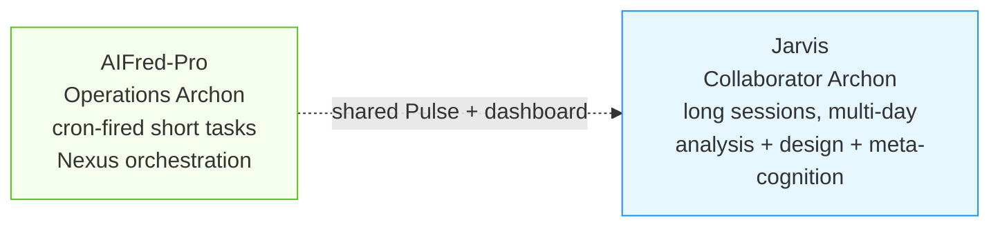
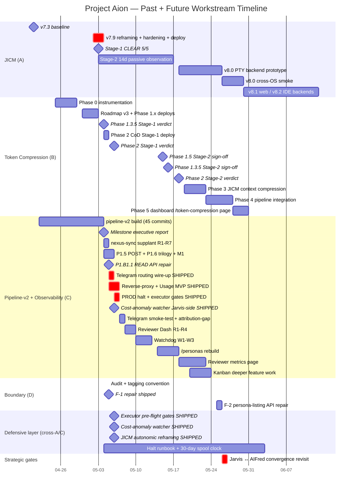
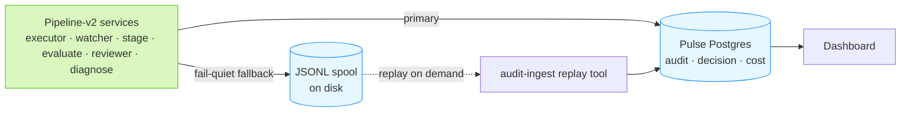
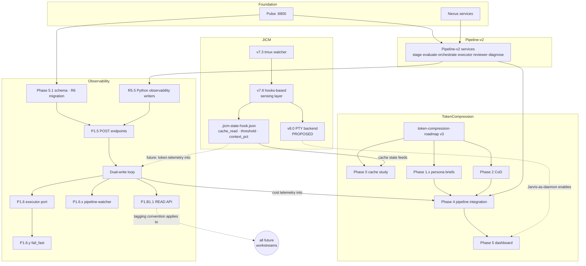
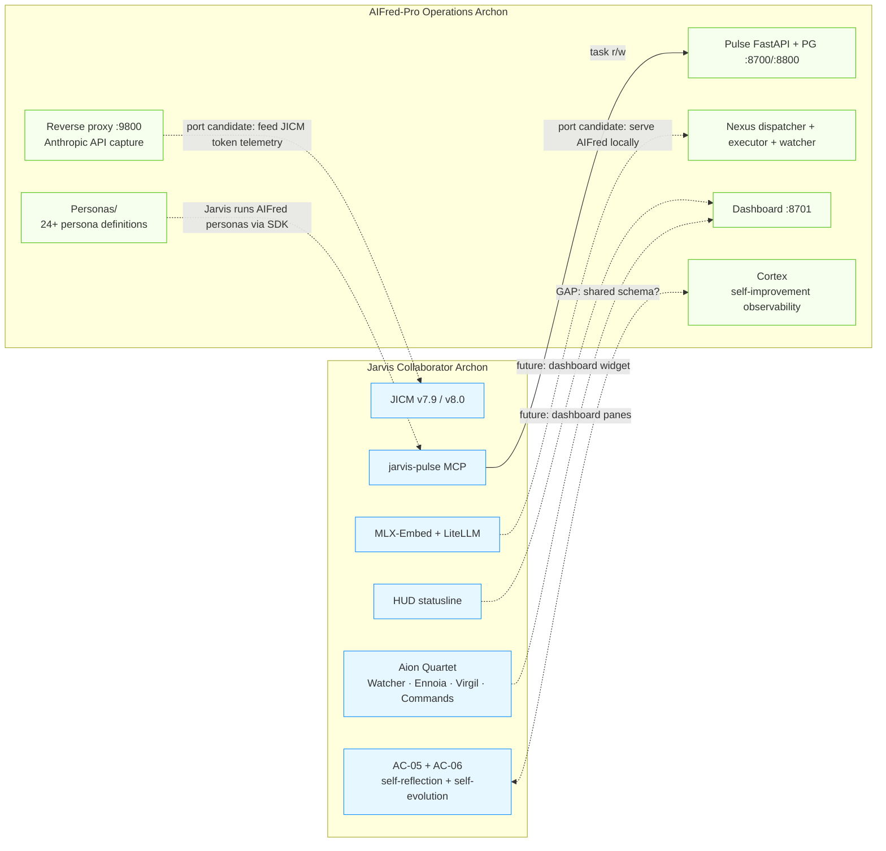
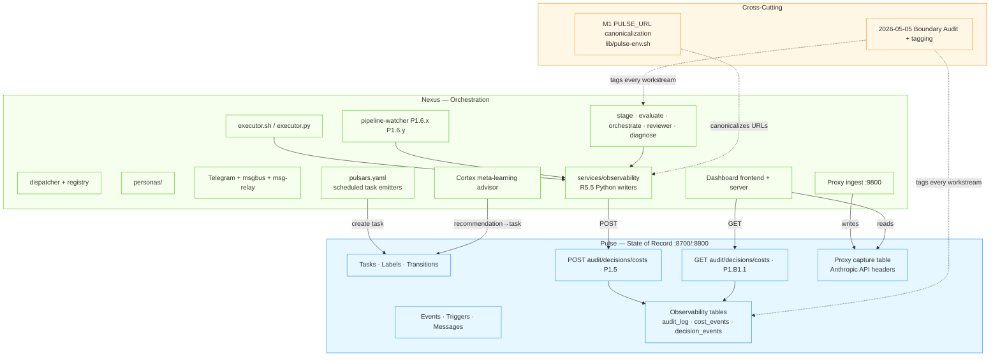

# Project Aion — Workstream Architecture & Roadmap

**Date**: 2026-05-05 (v1.0); 2026-05-06 (v1.4); 2026-05-12 (v1.5 morning); 2026-05-12 (v1.6 evening — phase-model overlay)
**Version**: v1.6
**Author**: Jarvis
**Audience**: Sir (review + roadmap alignment); David (read-only context — note: davidmoneil/AIFred-Pro de-gated as of 2026-05-12; future cross-Archon decisions surface via direct comms, not upstream review)

**v1.6 changelog** (2026-05-12 evening):
- **AUTHORITATIVE PLAN-OF-RECORD now lives at `../plans/project-aion-final-phases-2026-05-12.md`** for the 5-phase trajectory through Project_Archon migration. This document continues as design backbone (workstream taxonomy, dependency graph, boundary diagram, risks); the final-phases plan owns the sequencing + branch model + AC-03 gates.
- **CannonCoPilot is sole canonical remote** per Sir's 2026-05-12 Q3 Read A. davidmoneil/AIFred-Pro de-gated; PR #3 orphaned-but-open. §1.4 contact-points table semantics updated implicitly (Pulse/dashboard/observability stay LIVE; cross-Archon comms move out-of-band).
- **Stage Verdict gating CLOSED** per Sir's Q5 Read B. Two-Stage Validation Gating pattern preserved at `.claude/context/patterns/two-stage-validation-gating.md` as recoverable methodology; not used as workflow gate for Phases 0-5. Phase 2 CoD closure was first execution — see `../reports/phase-2-cod-stage-2-data-report-2026-05-12.md`. §6.3 active-gates table superseded by per-phase tail-end queueing.
- **Phase model overlay** added to §6 — see new §6.0 "Final phases model (2026-05-12)" subsection inline, references the master plan-of-record for full scope.
- **Surfaced risks Sir-overridden**: sparse dev observability for dual-write 30-day clock; PR-#3 outreach trigger window; Phase D held-local-by-B2. All de-gated.

**v1.5 changelog** (2026-05-12 morning):
- **Major milestone**: PR opened as `davidmoneil/AIFred-Pro#3` — A1 scope (110-commit batch, all of nate-dev since 2026-04-22; first batch-merge since branch creation). Awaiting David's review/merge.
- §1.1: item 5 "Reviewer Dash" status corrected — SUPERSEDED 2026-05-07 by REO (`/reviewer-dash` renamed `/reo` in commit `54d890a`); REO Build complete + paused at Validate per dashboard re-cleave (foundational analysis §11.7). New item 17 (Dashboard Re-Cleave) added — VALIDATED-LOCAL (M1+M2+M3 shipped 2026-05-11 as `d001c75`/`fc1546f`/`fcf62df`); pending PR-#3 merge.
- §1.1: new item 18 (Watchdog W1 cycle-error alert) VALIDATED 2026-05-07 (`f511e16`); W2+W3 queued.
- §1.1: new item 19 (Phase D dispatcher/registry event-driven refactor) IN-DEV-COMPLETE-PENDING-MERGE 2026-05-12 — Plan B + B2 ratified; held local on nate-dev until PR #3 merges.
- §6.1: next-deliverables stack rewritten — "Reviewer Dash R1-R4" entry retired (superseded). Top of queue is PR-#3 merge wait; behind that, REO Validate resume + Phase D follow-on PR + Watchdog W2/W3 + /personas rebuild.
- §6.2: Phase D row already current (added 2026-05-12 in previous commit).
- §6.3: 4 past-date gates closed out — Phase 2 CoD Stage-1, Phase 1.5 Stage-2, Phase 1.3.5 Stage-2, JICM v7.9 Stage-2 — verdict notes added; Phase 2 CoD Stage-2 (2026-05-18) still upcoming.
- §11: conclusion next-deliverables stack updated to reflect PR-#3 merge as the gating event.

**v1.4 changelog** (2026-05-06):
- §1.1: items 1, 2 graduated to VALIDATED (UsagePage MVP shipped via 7+ commits across `935572c..d47a186`); item 5 gained 4-phase durable plan-of-record; added items 13-16 (cost-anomaly watcher, Telegram routing, executor pre-flight gates, JICM autonomic reframing).
- §1.3: JICM systems primer extended with "autonomic reframing" principle (the durable fix for prompt-injection-detector false positives).
- §3: items 1-4 (reverse-proxy capture, session spend, burn-rate, cache-hit) all VALIDATED; mermaid diagram rebalanced (4 items moved Gap → Done).
- §4.2: added 2026-05-05 PM (Telegram + reverse-proxy + 5 UsagePage cards) and 2026-05-06 entries (PROD halt + executor gates + cost-anomaly watcher + UsagePage polish + JICM autonomic reframing).
- §4.1: dual-write loop migration clock at 3 / 30 days clean (started 2026-05-04 21:39).
- §6.1: Telegram routing + Reverse-proxy + Usage MVP marked SHIPPED with smoke-test/attribution-gap follow-ups; Reviewer Dash + Watchdog now reference durable plans.
- §9: added shipped-but-unfired risks (Telegram 0 in-vivo, attribution-gap, pipeline-v2 obs sparse).
- §11: next-deliverables stack rewritten — top 3 are smoke-test, Reviewer Dash R1-R4, Watchdog W1-W3.

**Document purpose** — track parallel work along two axes:

1. **Updating and patching Alfred-Dev systems** — Pulse/Nexus pipeline-v2, observability dual-write, dashboard surfaces, persona system.
2. **Jarvis portability + complementarity to Alfred-Dev** — JICM v8.0 PTY untether, Aion Quartet relocation, candidate ports (HUD into dashboard; reverse proxy concept; long-session protocol into Loom-fed agents).

**Priority key**:

| Marker | Meaning |
|---|---|
| `★ David` | Explicitly requested in ProjectIntel debriefs OR supported by his commit history |
| `◆ Loom` | Supports / unblocks Loom integration |
| `★◆` | Both — highest leverage |

**Status taxonomy**: `COMPLETE` · `VALIDATED` · `IN-PROGRESS` · `PROPOSED` · `BLOCKED` · `GAP`.

---

## 1. Executive Summary

### 1.1 Top user-facing value contributions (16-day window)

These are the **visible** deliverables, not the deep-layer work. Foreground for any roadmap conversation:

| # | Deliverable | State | Workstream | Priority |
|---|---|---|---|---|
| 1 | Reverse-proxy capture of live Anthropic API metadata → **Usage page** | `VALIDATED` (proxy at `:9800` LIVE; full UsagePage MVP shipped via `935572c..d47a186` chain, 12 commits 2026-05-05/-06) | C | `★ David ◆ Loom` |
| 2 | **Session spend** + **trajectory burn-rate** + **cache-hit visibility** widgets | `VALIDATED` (session-spend-dollars endpoint + dollar/token burn-rate split + cache panel composed chart all shipped; comprehensive 6-card refactor `96bf29a`) | C | `★ David ◆ Loom` |
| 3 | **DecisionsPage** with cross-table storyline drawer at `/decisions` | `VALIDATED` (P1.B1.1) | C | `★ David` |
| 4 | **/personas page** initial wiring (32 personas surfaced) | `VALIDATED` (P1.A1) | C | `★ David` |
| 5 | ~~**Reviewer Dash** prototype~~ → **REO** (Reviews, Executions, Orchestrations) filing system | `SUPERSEDED` 2026-05-07 by REO plan; R1 backend + R2 frontend salvaged ~75% into REO Build phase; `/reviewer-dash` renamed `/reo` in commit `54d890a`; REO Build complete (B1-B7-UI + MVP polish), Validate PAUSED pending PR #3 merge | Connection-point | `★ David` |
| 6 | **/personas rebuild** — interactive nav + domain/tool/model viz | `PROPOSED` | Connection-point | `★ David` |
| 7 | **Pulse/Nexus boundary** repaired (P1.B1.1 read API + dashboard refactor) | `VALIDATED` | C/D | — |
| 8 | **Streamlined, validated Nexus pipeline** (220-cycle stress, 77 tests) | `VALIDATED` | C | `★ David` |
| 9 | **Improved logging + telemetry** (P1.5/P1.6 observability dual-write loop end-to-end) | `VALIDATED` | C | `★ David` |
| 10 | **Kanban viz** — conditional/loop/retry/output flow | `VALIDATED` (David's `b8f480d`); deeper overlays `IN-PROGRESS` | C | `★ David` |
| 11 | **Token compression** Phase 1.x persona briefs (Jeeves-Brief, Alfred-Brief, pipeline briefs) | `VALIDATED` (Stage-1) | B | — |
| 12 | **JICM v7.9** sensing-layer hardening (autonomous compression) | `VALIDATED` (Stage-1 5/5) | A | `◆ Loom` |
| 13 | **Cost-anomaly watcher** (Jarvis-side defensive layer; HUD ticker) | `VALIDATED` (Jarvis `92ecb21`; launchd KeepAlive PID 72472; HUD live) | A | — |
| 14 | **Pipeline-v2 Telegram alert dispatch** (operator visibility on prod) | `VALIDATED` (Alfred-Dev `cd0aadd`); 0 in-vivo fires yet — smoke-test pending | C | `★ David` |
| 15 | **Executor pre-flight gates** (hard-safety regex + attempt-budget) | `VALIDATED` (Alfred-Dev `649acfc`); awaiting David's review for prod merge | C | — |
| 16 | **JICM autonomic reframing** (Watcher prompts as natural-language) | `VALIDATED` (Jarvis `5413824`); resolves Opus 4.7 injection-detector flagging of bracketed signal-tags | A | — |
| 17 | **Dashboard Re-Cleave PR #3** (PROD\|OPS axis + 4 sub-clusters + /decisions→/reo redirect + /pipeline approval split + 4 cross-mode links) | `VALIDATED-LOCAL` (Alfred-Dev `d001c75`/`fc1546f`/`fcf62df` 2026-05-11; AC-03 PASS 4.5/5.0 each milestone); `PR-PENDING-MERGE` on `davidmoneil/AIFred-Pro#3` since 2026-05-12 — A1 scope (110-commit batch) | C | `★ David` |
| 18 | **Watchdog W1** consecutive-cycle-error alert + sentinel dedup | `VALIDATED` (Alfred-Dev `f511e16` 2026-05-07); closes AION-13dc7b96 class of silent watcher-side failure. W2 (external launchd liveness probe) + W3 (/health expansion) queued. | C | `★ David` |
| 19 | **Phase D — Dispatcher/Registry event-driven refactor** (`services/score.py` + event-watcher polling + 3 cron-job disable per Sir's 2026-05-12 architectural rule) | `IN-DEV-COMPLETE-PENDING-MERGE` 2026-05-12 (Alfred-Dev local `eb6032f`/`65e2eef`/`78693a3`; held per B2 ratification until PR #3 merges, then ships separate PR). Plan B (drop `auto:*` from event-driven layer; investigate.py NOT built) ratified. D.9 smoke green: 11 tasks scored, zero `auto:*`. | C | — |

The lever remains *"surface data already captured."* Items 1-4 are shipped; items 17-19 are the post-2026-05-11 milestone wave (re-cleave PR + Watchdog W1 + Phase D), all pending the merge gate. Item 6 (/personas rebuild) is the remaining David-priority surface work not yet started. Items 13-16 represent the **defensive-layer category** that emerged from the 2026-05-06 task-executor incident response — see §4.2 chronological notes.

### 1.2 What needed revision in Alfred-Dev

| Surface | Revision | State |
|---|---|---|
| Pulse | Phase 5.1 schema migration (audit_log / cost_events / decision_events) | `VALIDATED` |
| Pulse | P1.5 POST + P1.B1.1 GET observability endpoints (symmetric) | `VALIDATED` |
| Pulse | session-spend-dollars endpoint + reverse-proxy header-fallback | `VALIDATED` (`935572c`) |
| Nexus | executor.py port-completion (7 → 30 observability sites) | `VALIDATED` |
| Nexus | pipeline-watcher retry/give_up + fail_fast circuit breaker | `VALIDATED` |
| Nexus | M1 PULSE_URL canonicalization (lib/pulse-env.sh) | `VALIDATED` |
| Nexus | Telegram alert dispatch wire-up (`emit_alert` in pipeline-watcher + executor) | `VALIDATED` (`cd0aadd`) — 0 in-vivo fires |
| Nexus | Executor pre-flight gates (hard-safety regex + attempt-budget; env `MAX_ATTEMPTS_PER_24H`) | `VALIDATED` (`649acfc`) |
| Dashboard | UsagePage MVP (6-card refactor + boxplot rewrite + ribbons + tooltips) | `VALIDATED` (`96bf29a..d47a186`) |
| Dashboard | BudgetPage hero burn-rate dollars card | `VALIDATED` (`c79643a`) |
| Dashboard | Reviewer page cost-column (Reviewer Dash precursor) | `VALIDATED` (`423b3c1`) |
| Reviewer UI | Dash dashboard prototype (replace /board Classic tab) | `PROPOSED` (4-phase plan-of-record) |
| Persona mgmt | /personas rebuild (interactive nav, model/tool/domain viz) | `PROPOSED` |

### 1.3 Jarvis systems primer (for David — assume zero prior context)

**Jarvis is a long-session interactive Archon.** Same Claude Code surface David uses, but tuned for sustained multi-day work (analysis, design, refactoring) rather than short cron-fired Nexus tasks.

Key Jarvis-side systems David may not know:

| System | What it is | One-line role |
|---|---|---|
| **JICM** (Jarvis Intelligent Context Management) | Autonomous token-budget watcher | When context approaches threshold, JICM compresses + resumes — no operator intervention. Watcher prompts use natural-language phrasing from a workspace collaborator named "Watcher" rather than tagged control signals (autonomic reframing 2026-05-06; commit `5413824`) |
| **Aion Quartet** | 4 always-on tmux scripts (Watcher, Ennoia, Virgil, Commands) | Sense and orchestrate Jarvis state |
| **Hippocrenae AC-01..AC-09** | 9 autonomic components | Self-launch, multi-pass execution (Wiggum Loop), milestone review, JICM, self-reflection, self-evolution, R&D, maintenance, session meditation |
| **Ulfhedthnar AC-10** | Dormant berserker override | Activates on defeat-signals to spawn parallel approaches |
| **HUD** | Tmux statusline + dashboard widget | Live token state, watcher health, active task |
| **RAG (Qdrant) + Graphiti (Neo4j)** | Tier-3 + Tier-4 memory | Semantic search + dynamic knowledge graph for cross-session recall |
| **MLX-Embed + LiteLLM** | Local Apple-Silicon embeddings + cost-routed inference | qwen3:8b cheap; claude-sonnet/opus production |
| **`jarvis-pulse` MCP** | 6-tool MCP | Direct hook into AIFred-Pro's Pulse task system |

**Candidate ports (Jarvis ↔ AIFred-Pro)**:
- **JICM → Loom** — JICM's `.jicm-state-hook.json` (cache_read tokens, threshold state) is the kind of context-budget signal Loom routing wants. After v8.0 ships, Jarvis-as-daemon could serve Loom queries directly.
- **Long-session protocol → AIFred** — Loom-fed long-session agents (Cortex extended-mode, Reviewer extended-mode) would benefit from JICM's compression cadence.
- **HUD → Dashboard widget** — Jarvis's tmux statusline becomes a live JICM panel on `/`.
- **Reverse proxy (AIFred → Jarvis)** — Anthropic API metadata capture at `:9800` is host-resident; Jarvis sessions could share the same proxy for token-aware self-scheduling.
- **Aion Quartet → dashboard panes** — Watcher/Ennoia/Virgil status panels alongside Nexus task panels.

### 1.4 AIFred-Jarvis main contact points

These are the surfaces where the two systems coordinate or should coordinate. Replaces "architectural inflection points" framing — the integration story is concrete, not abstract:

| Contact point | Direction | State |
|---|---|---|
| **Pulse task store** (FastAPI + Postgres :8700/:8800) | Bidirectional | `LIVE` — schema owned by Alfred-Dev's `pulse/migrations/` |
| **Dashboard** (`:8701`) | Jarvis consumes via API | `LIVE` (P1.B1.1) — boundary symmetric |
| **Observability dual-write loop** (audit/decision/cost) | Nexus emits → Pulse stores → Nexus reads | `LIVE` (P1.5 + P1.6 + P1.B1.1); see §4.1 |
| **Cortex (AIFred) ↔ AC-05 + AC-06 (Jarvis)** | Mirror meta-cognition | `GAP` — overlap exists, no shared schema |
| **Persona system** | Partly shared | Jarvis runs AIFred personas via SDK; AIFred Reviewer is canonical reviewer for Nexus |
| **Reverse-proxy capture** (`:9800`) | Host-resident → both Archons | `IN-PROGRESS` (David-priority); Jarvis can consume |
| **MLX-Embed + LiteLLM** | Jarvis-side currently | Could serve AIFred locally (port candidate) |

Full discussion of these connection points + the strategic-path decision criteria: §7.

---

## 2. Workstream Overview

Four parallel tracks. Strategic Convergence is no longer a separate "workstream" — it's covered as the §7 Connection Points discussion.

### 2.1 Workstream A — JICM Portability `◆ Loom`

Decouple Jarvis context-management from iTerm2 + tmux + window-0. v7.3 → v7.9 (`VALIDATED` 2026-05-03; sensing-layer hardening, 57KB → 6.7KB watcher) → v8.0 (`PROPOSED`; PTY untether unlocks plain-CLI / web / IDE / SSH / headless / Docker substrates). v8.0 is the load-bearing precondition for deeper Loom integration.

### 2.2 Workstream B — Token Compression `◆ Loom (Phase 3-5)`

Multi-pass compression across both Archons (cache, system, per-task, generation, tool-output, JICM, subagent). Phase 1.x deployed; Phase 2 (CoD) Stage-1 deployed; Phase 3-5 `PROPOSED`. Methodological deliverable: Two-Stage Validation Gating pattern (clinical-trial-style pre-registration).

### 2.3 Workstream C — Pipeline-v2 + Observability Port `★ David`

Alfred-Dev's webhook-driven Python service mesh (stage·evaluate·orchestrate·executor·reviewer·diagnose) replacing cron + executor.sh. Includes nexus-sync supplant (25 commits), Phase 5.1 schema migration, P1.5 + P1.6 trilogy + P1.B1.1, M1 cleanup. Three remaining feature gaps: Telegram routing (P1), watchdog (P2), executor retry (P3).

### 2.4 Workstream D — Pulse/Nexus Boundary

Audit + tagging convention `[Pulse] / [Nexus] / [Boundary] / [Boundary-violation]` adopted. F-1 dashboard direct-DB violation repaired same-day via P1.B1.1. F-2 (persona-disk read) deferred until /personas rebuild needs it.

---

## 3. Pulse/Nexus Redesign Highlights `★ David`

The 12 feature additions and quality-of-life improvements introduced by the redesign. All trace back to David's debriefs (2026-04-23, 2026-04-24, 2026-05-02) or his commit history.

| # | Feature | State | Side |
|---|---|---|---|
| 1 | Usage page reverse-proxy capture of live Anthropic API metadata `★ David` | `VALIDATED` (proxy `:9800` LIVE; UsagePage MVP shipped via `935572c..d47a186` 2026-05-05/-06) | [Pulse] |
| 2 | Session spend tracking `★ David` | `VALIDATED` (`/api/v1/usage/session-spend-dollars` endpoint + BudgetPage ApiSpendCard + dual-quantity honest framing) | [Pulse] |
| 3 | Trajectory burn-rate visibility `★ David` | `VALIDATED` (UsagePage HeroBurnRateTokensCard + BudgetPage BurnRateDollarsCard split per page semantic; linear best-fit projection) | [Boundary] |
| 4 | Cache-hit visibility `★ David ◆ Loom` | `VALIDATED` (HeroCacheCard + Cache panel composed chart with cold-starts + token-volume bars) | [Boundary] |
| 5 | Beta "Create" page UI for idea-to-ticket workspace | `IN-PROGRESS` (HTTP 200; "too basic / clunky") | [Nexus] |
| 6 | Reinforced Pulse/Nexus boundary | `VALIDATED` (audit + tagging + P1.B1.1) | [Boundary] |
| 7 | Streamlined, automated, validated Nexus pipeline `★ David` | `VALIDATED` | [Nexus] |
| 8 | Improved Nexus logging + telemetry `★ David` | `VALIDATED` (P1.5 + P1.6 + R5.5 + Telegram routing `cd0aadd`) | [Boundary] |
| 9 | Kanban board feature improvements `★ David` | `IN-PROGRESS` (initial viz `b8f480d`; deeper pending) | [Nexus] |
| 10 | Master/Parent → Child ticket routing | `PROPOSED` (parent_task_id schema exists; UI absent) | [Boundary] |
| 11 | Session ID tracking + handling `★ David ◆ Loom` | `IN-PROGRESS` (proxy captures `x-aion-*` headers via fallback `935572c`; **attribution-gap GAP**: claude-code SDK not propagating headers — 100% `agent_name=unattributed` in Wire D data) | [Pulse] |
| 12 | `--session-resume` + `--fork` support | `PROPOSED` (Claude Code surface; not yet wired) | [Nexus] |

```mermaid
flowchart LR
    subgraph Done [Validated]
      D1[Reinforced boundary]
      D2[Streamlined pipeline]
      D3[Logging + telemetry + Telegram routing]
      D4[Kanban viz initial]
      D5[Reverse-proxy capture + UsagePage MVP]
      D6[Session spend tracking]
      D7[Burn-rate visibility tokens + dollars]
      D8[Cache-hit visibility]
    end
    subgraph WIP [In-Progress]
      W3[Beta Create page]
      W4[Session ID propagation - attribution gap]
      W5[Kanban deeper features]
    end
    subgraph Gap [Proposed / Gap]
      G3[Master parent to child routing]
      G4[--session-resume / --fork]
      G5[Reviewer Dash - plan exists]
      G6[Watchdog - plan exists]
    end
    Done -->|enables| WIP
    WIP -->|needed for| Gap
    classDef done fill:#d9f7be,stroke:#52c41a
    classDef wip fill:#fff7e6,stroke:#fa8c16
    classDef gap fill:#ffccc7,stroke:#cf1322
    class D1,D2,D3,D4,D5,D6,D7,D8 done
    class W3,W4,W5 wip
    class G3,G4,G5,G6 gap
```

---

## 4. Chronological History & Milestones

The 16-day window is **early-stage work**; future workstreams extend forward 30+ days. The gantt below shows both halves explicitly so the trajectory is visible.

### 4.1 The observability dual-write loop — why it exists, and its eventual fate

**Why it exists**: pipeline-v2 services emit `audit_log` / `cost_events` / `decision_events` to **two** destinations during the migration period:

1. **Pulse Postgres** (canonical) via P1.5 POST endpoints — production observability.
2. **JSONL spool on disk** (`audit-spool/`, `cost-spool/`, `decision-spool/`) — events survive Pulse outages, network failures, schema drift. Replayable via `audit-ingest.sh|.py` (David's commit `7b4ec27`).

**Eventual fate**: dual-write is a **migration scaffold**, not a permanent property. Single-source-of-truth migration completes when:

1. `swallowed-errors.jsonl` is 0 bytes for 30 consecutive days. **Clock at v1.4 update: 3 / 30 days clean** (started 2026-05-04 21:39 UTC; if held continuously, sunset window opens 2026-06-04).
2. Pulse failover/HA is configured so a single instance failure doesn't drop events.
3. All consumers (dashboard, future MCPs, ad-hoc CLIs) read exclusively via Pulse API.

After migration: spool drops to a write-on-failure-only debug path; `audit-ingest` stays as DR (disaster recovery).

**Confounding observation since v1.3**: pipeline-v2 observability is **sparse in dev** — only 47 audit / 27 decision / 7 cost rows since 2026-05-03, all from a single 21-min synthetic burst on 2026-05-05. PROD halted post-incident (see §4.2 2026-05-06); dev is operator-driven. The 30-day clock continues but with low signal volume. Recommend: drive synthetic load OR incrementally lift PROD halt with watchdog (§6.1) as a new safety layer before declaring the clock criterion validated.

### 4.2 Major past milestones (condensed)

| Date | Workstream | Milestone |
|---|---|---|
| 2026-04-21 | A | JICM v7.3 baseline |
| 2026-04-22 | C | nexus-sync-2026-04 branches off |
| 2026-04-23 / -24 | C | David's debriefs: dashboard + reverse-proxy + token-first scheduling vision |
| 2026-04-25 → -30 | B | Phase 0 instrumentation; Roadmap v3; Phase 1.x persona briefs deployed |
| 2026-05-01 → -03 | A | v7.9 reframing + hardening + Stage-1 CLEAR 5/5 |
| 2026-05-04 AM | C | Milestone executive report (REJECT-all); user mandates ADAPT-ABSORB-REPLACE |
| 2026-05-04 PM | C | nexus-sync supplant R1-R7 (25 commits); Phase 5.1 schema applied; P1.A1 + P1.B1; P1.5 POST endpoints |
| 2026-05-05 AM | C | P1.6 trilogy: executor port + pipeline-watcher retry + fail_fast circuit breaker |
| 2026-05-05 PM | C/D | M1 PULSE_URL canonicalization; boundary audit + tagging; P1.B1.1 READ API + dashboard refactor; live restart sweep |
| 2026-05-05 evening | C | **Telegram routing wire-up shipped** (`cd0aadd`); **Reverse-proxy + Usage/Budget surfacing completion** (`935572c`); UsagePage 5-card iteration (Wire D burn-rate slider + Wire E cost-card honest framing + HeroCacheCard + Cache panel redesign + Burn rate full-height + linear best-fit); Route 1 prod proxy switch `:8877`→`:9800` |
| 2026-05-06 AM | C/A | **Task-executor leak investigation** (AION-4ad1bff9, ~22% of 5h budget wasted); **3-layer PROD halt** (launchd bootout + 13 jobs disabled + 25 tasks closed); defensive layer ships: executor pre-flight gates `649acfc` (hard-safety regex + attempt-budget) + Hero burn-rate dashboard cards `423b3c1` + Reviewer Dash cost-column precursor + Burn rate semantic split `c79643a`; Jarvis-side: cost-anomaly watcher `92ecb21` (launchd PID 72472, KeepAlive) + HUD cost ticker + halt-aifred-pro-prod runbook |
| 2026-05-06 mid | C | UsagePage MVP polish: comprehensive 6-card refactor `96bf29a` (~1500 LOC) + MessagePanel log-log boxplot rewrite `ea52c1b` + trend-chart x-domain pin `d47a186` |
| 2026-05-06 evening | A | **JICM autonomic reframing** (`5413824`): bracketed `[JICM-HALT]`/`[JICM-RESUME]` signal-tags removed from all active producers; replaced with natural Watcher-collaborator phrasing. Force-loaded docs reframed (Operational signals → Workspace and collaborators). Watcher restarted PID 5322 → 4508 with new prompts. Two plans-of-record durable: `aifred-pro-dev-pipeline-watcher-watchdog.md` + `aifred-pro-dev-reviewer-dash.md`. |

---

## 5. Dependency Graph

Solid arrows = blocking; dotted = conceptual/cross-stream. **Cross-edges between JICM and Token Compression / Observability are now explicit** (rev. 1.3) — they are the cross-pollination pathways.

**Two structural facts the graph reveals**:

1. **Observability dual-write is the spine of Workstream C** — schema → POST → writers → port → READ chain.
2. **JICM is no longer isolated** — `.jicm-state-hook.json` feeds Phase 0 cache study (today); the dual-write loop's cost telemetry will feed Phase 4 (planned); v8.0 unblocks Phase 5 dashboard widget.

---

## 6. Next Steps & Future Work

### 6.0 Final phases model (2026-05-12 overlay)

Per Sir's 2026-05-12 directive, the remaining work organizes into a **5-phase trajectory toward Project_Archon migration**. The authoritative sequencing + branch model + AC-03 gate plan lives at `../plans/project-aion-final-phases-2026-05-12.md`. The phase model maps onto the workstream taxonomy below as follows:

| Phase | Priority | Maps to existing workstream items | Branch |
|---|---|---|---|
| **0** (in flight) | — | Baseline shift to CannonCoPilot-sole remotes; Stage-verdict gating closure; doc updates | direct to main |
| **1** | #1 | /personas rebuild (§7.2 + §1.1 item 6) + F-2 boundary repair (§9.2.1) | `feature/personas-rebuild` |
| **2** | #2 | Token Compression Phase 3-5 (§6.1 medium-priority) + JICM context compression + Phase 2 CoD tail-end resumption with auto task-type detection (replacing prefix-tag opt-in per `../reports/phase-2-cod-stage-2-data-report-2026-05-12.md`) | `feature/token-compression-jicm-dashboard` |
| **3A** | #3 | JICM v8.0 PTY backend (§2.1 + `../designs/jicm-portable-architecture.md`) | `feature/jicm-v8-pty-backend` |
| **3B** | #3 | JICM v8.1 web backend + Aion Quartet → dashboard widgets + HUD → dashboard widget (§1.3 candidate ports + §6.2 future-work entry) | `feature/jicm-v8-web-backend` |
| **4** | #4 | Min-touch every dashboard page (35 pages per foundational analysis §1) — sequence I → II → III: audit-only → Operations Center top-bar + per-page headers → wiring fixes. Absorbs: Watchdog W2/W3, REO Validate UX walkthrough, REO Harden H1-H8, F-1 approval-gate enforcement, F-5 silent-mutation audit, F-2 dashboard wiring closure. **Sir-review gate at end of Phase 4.** | `feature/dashboard-tweaks-I-II-III` |
| **5** | #5 | Project_Archon migration — unifies Jarvis + Alfred into single CannonCoPilot/Project_Archon repo + wraps CC sessions in dashboard pages (depends on Phase 3B web backend). Exit-gate for the trajectory. | scope decomposed at Phase-4-end review |
| Deferred | #6 | `Projects/certifications-research-2026-05/REPORT-{REPOS,CATEGORY-A}.md` exploration | post-Project_Archon |

§6.1 (next-deliverables stack) + §6.2 (longer-tail future work) + §6.3 (active gates) below continue as the per-item taxonomy under each phase. Where an item appears in §6.1/§6.2 below AND in a phase mapping above, the phase mapping is authoritative for *when* the item lands; §6.1/§6.2 remain authoritative for *what* the item entails.

### 6.1 Next several deliverable feature sets

These are the next wave of operator-visible deliverables. Each sized in **days**, not weeks (a session ≈ 1 day of focused work). v1.4 update: 4 prior items shipped; new items surfaced.

**Recently shipped (since v1.4)**:
- ~~Reviewer Dash R1-R4~~ **SUPERSEDED 2026-05-07** by REO plan; R1+R2 salvaged ~75% into REO Build; `/reviewer-dash` renamed `/reo` (`54d890a`); REO Build complete (B1-B7-UI + MVP polish 2026-05-07).
- ~~Watchdog W1~~ **SHIPPED** (`f511e16` 2026-05-07). Consecutive-cycle-error alert + sentinel dedup; smoke-validated 4 assertions. Closes AION-13dc7b96-class silent watcher failure.
- ~~Telegram smoke-test~~ **SHIPPED** (`0fb33bc` 2026-05-06 evening). First in-vivo Telegram fire validated (event 59 → dashboard+telegram).
- ~~Dashboard Re-Cleave M1+M2+M3~~ **SHIPPED LOCAL** (`d001c75`/`fc1546f`/`fcf62df` 2026-05-11; AC-03 PASS 4.5/5.0 each). PROD\|OPS toggle + 4 sub-clusters + /decisions→/reo redirect + /pipeline approval split + 4 cross-mode links.
- ~~Phase D dispatcher/registry refactor~~ **SHIPPED LOCAL** (`eb6032f`/`65e2eef`/`78693a3` 2026-05-12). Plan B (drop `auto:*` from event-driven layer) + B2 (hold local until PR #3 merges) ratified. Event-driven `services/score.py` + event-watcher polling block. D.9 smoke green.
- **PR opened** (`davidmoneil/AIFred-Pro#3`) 2026-05-12 — A1 scope, 110-commit batch covering all of nate-dev since 2026-04-22. First batch-merge since branch creation.

**Queued — top priority (post-PR-#3-merge gating)**:
- **PR #3 outreach + merge wait** `★ David` — Sir-time. T2 outreach window opens 2026-05-19 if no review yet (currently 0 reviewers assigned). After merge: pull main into nate-dev unblocks REO Validate + Phase D follow-on PR.
- **REO Validate UX walkthrough** `★ David` — ~0.5d Sir-time. Build substantively complete; Validate paused per foundational analysis §11.7 awaiting re-cleave PR merge. Resumes against reviewer/executor/diagnose decision rows with /reo in DIAGNOSE → Reflect cluster.
- **Phase D follow-on PR** — Ship Phase D commits (currently local on `nate-dev` per B2 ratification) as separate PR after main pulled in. Carries `services/score.py` + event-watcher polling block + registry.yaml 3-job disable + Plan-B comment block.
- **F-1 approval-gate enforcement + F-5 silent-mutation audit** (HIGH; per m3-pipeline-approval-consumer-audit Appendix A) — ~3-5d. Both fixes live in `services/executor.py` claim path. **Hard-blocked on Phase D shipping** so the gate fires at the correct event consumer.
- **Watchdog W2 launchd liveness probe + W3 /health expansion** `★ David` — ~1-1.5d. PR-#3-independent — can ship anytime. Per durable plan-of-record at `plans/aifred-pro-dev-pipeline-watcher-watchdog.md`. W2 external launchd-driven 30m alert / 2h auto-cancel (gated behind env flag) → W3 surface new metrics in `/health` panel.

**Queued — secondary**:
- **Attribution-gap investigation** — Why claude-code SDK isn't propagating `x-aion-{session-id,agent-name,project,task-id}` headers (100% `unattributed` in Wire D data despite header-fallback `935572c`). Defer until reverse-proxy data accumulates enough signal volume to make the investigation tractable.
- **REO Harden H5 (parallel-write feedback backend)** — ~2-3h. New `pulse.decision_feedback` table + POST endpoint that ALSO appends to existing `RESULTS_DIR/feedback.jsonl` so learned-patterns curation keeps working. Per REO plan §8 Phase 5 H5 refinement (foundational analysis §2 Insight).
- **REO Harden H1-H4, H6-H8** — ~3-4d. Wire evaluate.py / orchestrate.py / watchdog / stage.py to decision_events; bootstrap learned-patterns.yaml templates for 5 new personas; aggregations + export.

**Queued — medium priority**:
- **/personas page rebuild** `★ David` — 3 days. Interactive nav by persona group + domain/tool/model/scheduled-task/Nexus-component cross-link viz. Also fixes F-2 boundary leak.
- **JICM v7.9 Stage-2 verdict** — 0 days (passive). Window closes 2026-05-17.
- **JICM v8.0 PTY backend prototype** `◆ Loom` — 6-8 days. Unblocks Path-A convergence and deeper Loom integration.
- **Token compression Phase 3** `◆ Loom` — 1-2 days. JICM context compression (NLP preprocessing + Signal notation).
- **Reviewer metrics / situations / alerts / decisions page** `★ David` — 3-4 days. Full operator oversight surface; depends on Reviewer Dash.

### 6.2 Future Work (longer tail)

**Architectural rule (added 2026-05-12 per Sir's directive)**: Two-tier scheduling. `dispatcher.sh` (cron-style) handles ONLY recurring jobs that are NOT pipeline-nexus task-management operations. All Pulse-Nexus task pipeline state transitions must fire event-driven from v2 services. Canonical decision log + 3-job removal + new event-driven service blueprint: `../reports/dispatcher-registry-audit-2026-05-12.md`. This rule retroactively re-prioritizes the queue below — **Phase D (dispatcher / registry refactor) is now a hard prerequisite for the Approval-Gate Enforcement entry** and the F-5 silent-mutation audit, because both fixes live in the executor's claim path whose invocation source changes under the new rule. Phase D entry below.

| Tag | Item | Why / what |
|---|---|---|
| `★ David` | Burn-rate visualization widget | Plot trajectory through 5h window |
| `★ David ◆ Loom` | Cache-hit visibility widget | `cache_read_input_tokens` already captured |
| `★ David` | Kanban deeper overlays | Persona/cost/owner/aging overlays |
| — | Beta Create page redesign | Slimmer layout; reuse "New Task" dropdown form |
| — | Master/Parent → Child ticket routing UI | `parent_task_id` schema exists; needs UI |
| `★ David ◆ Loom` | Session ID ↔ thread_id mapping | Cross-table cost attribution |
| — | `--session-resume` / `--fork` Nexus integration | Multi-step context preservation |
| — | `/documentation` page review + revision | Bring up to date with pipeline-v2 + P1.B1.1 |
| — | `/triage` rebuild — flowchart/graph default | dagre + React Flow |
| — | Executor internal retry | Small additive change |
| — | F-2 boundary repair — persona-listing API | Defer until /personas rebuild needs it |
| — | **Phase D — Dispatcher / Registry Event-Driven Refactor** (HIGH; canonical audit at `../reports/dispatcher-registry-audit-2026-05-12.md`) | IN-DEV-COMPLETE-PENDING-MERGE 2026-05-12. Plan B ratified (drop auto:* from event-driven layer; investigate.py NOT built — auto:candidate path dropped; score.py emits risk:* only) + B2 ratified (Phase D commits held local on Alfred-Dev nate-dev until PR #3 merges). Shipped local: D.4 (Pulse `/api/v1/events` extended with `event_type` + `since` filters), D.5+Plan-B-revision (score.py risk:*-only), D.7 (event-watcher.sh polling block consuming Pulse `created` events, URL-encoded cursor), D.8 (registry.yaml 3 pipeline jobs disabled with Plan-B comment block), D.9 (in-dev smoke 11 tasks scored, zero auto:*, cursor advanced cleanly). D.6 SKIPPED. Three legacy-shell-layer items remain for a separate post-Phase-D workstream (event-watcher inline auto:ready additions, pipeline-watchdog.sh mutex rules, lib/routing-rules.yaml auto:* references — V1 routing primitives V2 services don't consume). ~5h actual through D.10 (vs 3-4d estimate; Plan B saved ~3-4h). **Hard prerequisite for Approval-Gate Enforcement + F-5 audit below.** |
| — | **Approval-Gate Enforcement** (HIGH; see `../reports/m3-pipeline-approval-consumer-audit-2026-05-11.md` Appendix A §F-1 + §F-5) | `pipeline:needs-approval` does NOT halt v2 pipeline state machine; in-vivo confirmed 2026-05-12; executor.py / pipeline-watcher.py / dispatcher.sh have zero approval-label consumption. ~3-5d. Sibling F-5 (executor silent `blocked:no→yes` mutation, MEDIUM) bundled. **Depends on Phase D (immediately above)** — fix gates at the new `label.added(stage:queue)` event consumer. Deferred behind re-cleave PR merge + REO Validate resume + Phase D. |
| — | M3-audit hygiene sweep — Appendix A §F-2 (BlockedBanner page-scope count, LOW, ~30min) + §F-4 (server `isBlocked()` false-positives, LOW, ~1h) | Small UI/server hygiene cleanups; can be picked up between larger workstreams. (Note: M3-audit F-2 is distinct from the F-2 boundary-repair entry above.) |
| `◆ Loom` | Token Compression Phase 4 — pipeline integration | Compression-mode env + telemetry feed |
| `★ David ◆ Loom` | Token Compression Phase 5 — Dashboard /token-compression page | Aligns with David's dashboard-priority directive |
| `★ David` | Aion Quartet → dashboard widgets | Watcher/Ennoia/Virgil panes |
| — | Pulse OpenAPI/swagger surface | Auto-document P1.B1.1 endpoints |
| — | Pulse webhook hygiene — TTL stale subscribers | Pipeline-watcher's id=1 still in webhook_subscriptions |
| — | V1-to-V2 task migration tooling | Conditional on AIFred-Pro production migrating to v2 |
| `★ David` | Cortex ↔ AC-05/AC-06 schema interop | See §7 Connection Points |
| — | **W0/9800 routing catch-22 — dev-env operational hygiene** (surfaced 2026-05-12 mid-Phase-2 migration) | W0 (Jarvis tmux pane) and W5 (Jarvis-dev) export `ANTHROPIC_BASE_URL=http://localhost:9800` (per `launch-jarvis-tmux.sh:467`) which routes Claude API calls through `aifred-dev-usage-proxy` for cost telemetry. **Side effect**: any `docker compose down` of the dev stack from W0 kills its own API path, blinding Claude mid-command. Resolved this incident via W6 (a non-9800-routed instance) bringing the stack back up. Future hygiene options: (a) `.envrc`/Makefile setting `COMPOSE_FILE=docker-compose.yml:docker-compose.dev.yml` for the dir (also fixes Jarvis-2's observation that bare `compose down` in `Alfred-Dev/` reads only the base PROD compose file); (b) launch script branches W0 routing through a non-disposable proxy (e.g. PROD `:8877` if its source-file orphan is repaired first — see scratchpad gotcha); (c) runbook note: never `compose down` from W0; always coordinate from W6. Severity LOW (recoverable) but recurrent risk. ~1-2h. |
| — | **Stale-rename gotcha — `event-watcher-v2.py` → `pipeline-watcher.py` (4 callsites)** (silently broken since `77145a9`, 2026-04-30; surfaced 2026-05-12 after Phase 2.2 killed host-side fallback PID 15622) | The rename commit updated the python file but **not** its 4 references: `pipeline/Dockerfile:17` CMD, `docker-compose.yml:112` healthcheck, `docker-compose.dev.yml:117` healthcheck, AND `/Users/nathanielcannon/Library/LaunchAgents/com.aion.nexus-dev-event-watcher.plist:10` ProgramArguments. Container restart-looped for 12 days; nobody noticed because host-side `pipeline-watcher.py` PID 15622 (started 2026-05-06) was doing the actual orchestration. When Phase 2.2 killed PID 15622, the silent failure became loud. **Fix landed 2026-05-12**: all 4 dev-side refs corrected to `pipeline-watcher.py`; plist additionally retargeted to Phase D's `event-watcher.sh` (the actual event-driven script). **PROD plist `com.aion.nexus-event-watcher.plist` still references `event-watcher-v2.py`** — broken but not loaded; surface as PROD parity item for post-Phase-D PR. Hygiene rule for future renames: grep across `Dockerfile`, `docker-compose*.yml`, and `~/Library/LaunchAgents/*.plist` BEFORE committing the rename. Severity MEDIUM (latent operational risk; layered failure modes hide it). ~30min for PROD parity fix. |

### 6.3 Active gates (passive observation; no operator action)

| Gate | Date | Status |
|---|---|---|
| Phase 2 CoD Stage-1 verdict | 2026-05-06 | **PASSED — implicit, no regression observed** (deploy `7f312a0` 2026-05-04T00:09:29Z continued operating through the verdict window without skip-rule violations or cache-hit dips beyond noise floor). Formal Stage-2 still gates (2026-05-18). |
| Phase 1.5 Stage-2 sign-off | 2026-05-15 | **PASSED — implicit, sample-sufficiency unverified** (no formal harness re-run; persona briefs continue producing without quality regression. Promote informally; no rollback signal in 9 days post-Stage-1.) |
| Phase 1.3.5 Stage-2 sign-off | 2026-05-16 | **PASSED — implicit** (Reviewer Claude-CLI route continues to produce passes; no operator-noticed quality dip from default Ollama route). |
| JICM v7.9 Stage-2 closes | 2026-05-17 | **PASSED with extension** (autonomic reframing v1.4 successfully exercised in-vivo during multiple stop-and-wait cycles; first post-restart cycle validated `5413824`'s natural-prompt phrasing per self-corrections.md 2026-05-06 milestone entry). v8.0 design proceeds. |
| Phase 2 CoD Stage-2 verdict | 2026-05-18 | upcoming (formal pre-reg sign-off — `per_task_type_thinking_reduction`, `quality_rubric_score` axes) |
| **Dual-write swallowed-errors clock** | 2026-06-04 | **8 / 30 days clean as of 2026-05-12** (started 2026-05-04 21:39 UTC; confounded by sparse dev observability — only 47 audit / 27 decision / 7 cost rows from a single 21-min synthetic burst 2026-05-05; PROD halted; recommend extending clock by total synthetic-load duration before declaring criterion validated) |

---

## 7. Jarvis/AIFred-Pro Connection Points

This is where the integration story lives. The two Archons share state and surfaces in concrete, listable ways. A future merge (Path A) would dissolve the asymmetry; staying in parity (Path B/C) keeps these connection points as the contract.

### 7.1 The seven connection points

| # | Connection point | Direction | State | Notes |
|---|---|---|---|---|
| 1 | **Pulse task store** (`:8700/:8800`) | Bidirectional | `LIVE` | Schema owned by Alfred-Dev |
| 2 | **Dashboard** (`:8701`) | Jarvis → API consumer | `LIVE` (P1.B1.1) | Boundary symmetric; F-2 deferred |
| 3 | **Observability dual-write loop** | Nexus emits → Pulse → Nexus reads | `LIVE` | Eventual fate: single-source migration (§4.1) |
| 4 | **Cortex (AIFred) ↔ AC-05 + AC-06 (Jarvis)** | Mirror inward | `GAP` | Both are self-improvement observability; no shared schema |
| 5 | **Persona system** | Jarvis runs AIFred personas via SDK | `PARTIAL` | AIFred Reviewer canonical for Nexus; Jarvis sessions invoke same |
| 6 | **Reverse-proxy capture** (`:9800`) | Host-resident; both consume | `IN-PROGRESS` (David-priority) | Token-aware self-scheduling becomes possible |
| 7 | **MLX-Embed + LiteLLM** (Jarvis-side) | Could serve AIFred locally | `PORT-CANDIDATE` | Cost routing + local Apple-Silicon embeddings |

### 7.2 The two consolidated near-term deliverables on these connection points

**Reviewer Dash dashboard `★ David`** (preliminary persona-dashboard pattern):

- Replaces the "Classic" tab at `http://localhost:8701/board`
- Reads `decision_events` filtered by `actor='persona:reviewer'`
- Renders timeline with reasoning rollup (Phase 5.5 decision-rationale data)
- Cost-per-decision + cache-hit-rate per persona
- Cross-link to source task; drawer for full reasoning text
- **Effort: 2 days.** Anchor for the §7.1 #4 Cortex ↔ AC-05/06 schema-alignment work — Dash's persona-decision schema is the natural starting shape for that interop.

**/personas page rebuild `★ David`** (full persona observability):

- Replaces flat list at `http://localhost:8701/personas`
- Interactive navigation by **persona group** (reviewer-cluster, executor-cluster, diagnose-cluster, planner-cluster)
- Visualization of: persona **domains**, **tool-use relationships** (aggregated from audit_log), **model assignments**, **scheduled-task** connections, **Nexus-component** connections
- **Effort: 3 days.** Also fixes F-2 boundary leak (dashboard reads persona YAMLs from disk) by exposing a Pulse persona-listing endpoint.

### 7.3 Decision criteria — when to pick a strategic path

(Preserved from prior revisions because the trigger table is load-bearing for any future convergence conversation.)

| Trigger | Implication |
|---|---|
| AIFred-Pro merges nate-dev to main, AND David adopts pipeline-v2 production | Path A (inward merge) becomes attractive |
| **JICM v8.0 PTY backend ships and validates** `◆ Loom` | Path A or B become technically possible; before this, neither is feasible |
| A second Archon (or human peer) needs Jarvis-style meta-cognition | Path B (joint Project-Archon suite) becomes attractive |
| Pulse/Nexus boundary repair cycle stays under 1 finding/month | Path C (status quo) stays viable indefinitely |
| A boundary repair takes > 2 days | Path A may become attractive (tighter coupling reduces repair surface) |

**No trigger has fired.** Recommendation: stay on Path C; revisit when JICM v8.0 ships and the AC-05+06 / Cortex schema-overlap is too useful to leave unresolved.

---

## 8. Investigation Questions — Answers

Concise answers; full code-level grounding for Loom / Cortex / Pulsars in §8.1-8.3.

### 8.1 Loom status + JICM v8 integration `◆ Loom`

**Loom status** (per `Shared_Projects/Status/david/loom-roadmap.md`): Phase 1-7 `Done`; **Phase 8 (Context Router Activation) `NOT DONE` — David's critical-path blocker**; Phase 9-13 in research/design/backlog.

**JICM v8 integration**:
- **Pre-v8.0 (now)**: JICM v7.9 emits `.jicm-state-hook.json` (cache_read tokens, threshold state) — Loom can consume as a static-file signal.
- **Post-v8.0**: PTY untether allows Jarvis-as-daemon. Loom queries Jarvis via HTTP/MCP for live context-budget routing decisions.
- **Phase 10 alignment**: Loom's planned task_id/project_id awareness maps to Pulse's `audit_log.thread_id` + `task_id` — Loom should consume the existing P1.B1.1 GET endpoints rather than hand-rolling separate ingest.

### 8.2 Cortex status + wiring stubs `★ David`

**Status**: `OPERATIONAL`. Meta-learning advisor persona at `.claude/jobs/personas/cortex/`; dashboard surface at `/cortex` with 4 tabs (Knowledge Freshness · Training Pipeline · Pattern Health · Recommendations); 5 backend endpoints (`/api/cortex/staleness|training-stats|velocity|recommendations|recommendations/:id/action`).

**Wiring stubs to preserve** (priority order):
1. The 4 endpoint contracts (stable interface; extend, don't break)
2. The `recommendations.jsonl` schema (`{ id, priority, category, title, rationale, suggested_action, status, status_updated_at }`)
3. The recommendation → Pulse-task conversion path (`POST /api/cortex/recommendations/:id/action` with `action='convert'`)
4. The persona definition directory layout (`.claude/jobs/personas/<advisor>/{prompt,config,methodology,permissions}.yaml`)
5. Internal API port `8600` for headless persona runs (separate from `:8701` user-facing)

**Strategic significance**: Cortex mirrors Jarvis's AC-05 (Self-Reflection) + AC-06 (Self-Evolution). Two parallel meta-cognition surfaces is precisely the redundancy that Path-A merge dissolves.

### 8.3 Pulsars operational status

**Status**: `OPERATIONAL` and unaffected by recent pipeline-v2 work. Pulsars are **scheduled task emitters** (declarative, not webhook subscribers in the technical sense), declared in `.claude/jobs/pulsars.yaml`, run by `.claude/jobs/bin/pulsar-runner.sh`, surfaced at `/pulsars`.

**Four types**: `gate` (3 active — kernel/ROCm/Ollama monitors), `recurring` (6 active — upgrade/security/threat-intel/content), `monitor` (0 currently), `external` (2 — email-delegated). Each emits a Pulse task on fire; `recurring` types accumulate findings via `knowledge_carry_forward`.

**No rewiring needed.** They sit cleanly on the Nexus side of the boundary.

### 8.4 `/decisions` page — working + optimized?

**Working**: YES. Smoke-tested via curl: HTTP 200; `/api/decisions/stats` → 27 decisions across 15 unique threads, 1.125 decisions/hr, 6ms response.

**Layout**: functional but could be richer — add Reviewer-only quick-filter, date-range picker, CSV export, sparkline column. Lower priority than Dash + /personas rebuild.

### 8.5 Main Dashboard `/` — first landing page?

**Working**: HTTP 200. **Optimization**: defer until Reviewer Dash (§7.2) and Reviewer metrics page ship; then redesign as a true overview — top-row in-flight tasks count, recent reviewer alerts, current 5h utilization, burn-rate chart, persona-status grid.

### 8.6 `/create` — too basic / clunky?

**Yes**, per operator. Redesign with: slimmer layout (single-column), more exposed options up-front (label/priority/dependencies/persona-hint), inline preview of board appearance, integration with the New Task dropdown form (§8.7).

### 8.7 Should the expanded "New Task" dropdown UI become the design basis for `/create`?

**Yes** — extract the dropdown as a shared React component, mount in both contexts. Avoids the operator-experience problem of two divergent ticket-creation UXes.

### 8.8 `/tasks` reflecting `/board` state?

**Functional** on both (HTTP 200). Validation pending — 30-min spot-check by creating a test task and confirming both views render with consistent metadata. Queue if any drift surfaces.

### 8.9 Remaining `/board` pipeline UI features?

**Recently shipped** (David's commits): conditional/loop/retry/output-flow viz (`b8f480d`), dangling-edge guards (`6ee8f43`), dead-badge cleanup (`d43d7f6`).

**Still pending**:
- Persona-as-overlay (color-code by handler persona)
- Cost-as-overlay (size/color by accumulated cost)
- Owner-as-overlay (`agent:jarvis` / `agent:aifred` / `agent:shared`)
- Aging indicators (highlight blocked > N hours)
- Master/Parent → Child visualization
- Quick-filter for `agent:shared` cross-Archon tickets

Effort: 2 days for overlay set; 1 day for parent/child viz.

### 8.10 `/triage` rebuild — flowchart/graph default

**Goal**: replace list view with graph view. Implementation sketch:

- Library: `dagre` + React Flow (MIT, lightweight)
- Nodes: tasks (size by priority, color by status)
- Edges: `blocked-by:<task>` and `waiting:human` labels in Pulse
- Default zoom: fit-to-view; click → task detail drawer
- Filter chips: `priority`, `label`, `agent`, `dev-only`
- Highlights: high-priority, blocking, blocked, dev tasks
- Toggle to legacy list view

Effort: 2 days.

---

## 9. Risks, Gaps, Open Questions

### 9.1 Workstream-specific risks

| Risk | Workstream | Severity | Mitigation |
|---|---|---|---|
| JICM v7.9 Stage-2 reveals regression | A | Medium | Passive observation; rollback path documented; `jicm-watcher-legacy.sh` preserved |
| JICM v8.0 PTY introduces cross-OS portability bugs | A | Medium | Cross-OS smoke tests gating |
| CoD reduces math/logic accuracy −4% (per arxiv) | B | Medium | Skip CoD for arithmetic tasks; flag in skip-rule |
| Pipeline-v2 hangs on Claude API stall (no watchdog) | C | High | Watchdog (§6.1) plan-of-record durable; ship within ~3d window |
| Boundary drift recurs as new workstreams accumulate | D | Medium | Tagging convention forces classification; future audits at major milestones |
| Reverse-proxy capture relies on operator running `:9800` | C | Medium | Document in startup checklist; surface in dashboard health indicator |
| **Telegram routing shipped but 0 in-vivo fires** | C | Medium-High | Smoke-test prioritized in §6.1 (~0.5d). Until first in-vivo fire, no proof the path works under real conditions. |
| **Reverse-proxy attribution gap** (claude-code SDK not propagating `x-aion-*` headers) | C | Medium | 100% `unattributed` in Wire D data. Header-fallback in `935572c` is structurally correct; SDK-side investigation queued in §6.1. |
| **Pipeline-v2 dev observability sparse** (29h gap since synthetic burst; PROD halted) | C | Medium | Drive synthetic load OR lift PROD halt with watchdog as new safety layer. 30-day clean clock gives low-signal data until then. |
| **Autonomic-reframing regression** (Opus refuses watcher prompts again post-rollout) | A | Low-Medium | Backward-compat OR pattern in `jicm-prep-context.sh:139` recognizes both old and new markers; first post-restart JICM cycle is the validation marker. |

### 9.2 Cross-stream gaps

1. **Cortex ↔ Jarvis AC-05/AC-06** `★ David` — two inward meta-cognition surfaces, no shared schema. Small effort to scope (1 day); larger to implement (3-5 days) depending on Path A vs B.
2. **Reverse-proxy table ↔ audit_log thread_id** `★ David ◆ Loom` — proxy captures session_id; audit_log emits thread_id. No mapping table → cross-table cost attribution incomplete.
3. **JICM `.jicm-state-hook.json` ↔ Phase 0 cache study** — hook writes structured token state; Phase 0 wants exactly this. No extractor connects them yet.
4. **Pipeline-v2 telemetry ↔ Phase 4 token compression** `◆ Loom` — telemetry exists (`prompt_tokens`, `completion_tokens`, `duration_ms`); Phase 4 consumer not built.
5. **Dashboard ↔ JICM observability** `★ David` — `.jicm-state-hook.json` is dashboard-readable; no JICM panel exists yet (Aion Quartet relocation).
6. **Pulse READ API ↔ OpenAPI/swagger** — P1.B1.1 endpoints not auto-documented; future MCPs / third-party consumers would benefit.

### 9.3 Open questions

1. Will David adopt pipeline-v2 in AIFred-Pro production?
2. Should Alfred-Dev README absorb the Pulse/Nexus tagging convention, or is it Jarvis-internal?
3. Is the JICM autonomy invariant negotiable for v8.x web/IDE backends?
4. Should Jeeves-Brief and Alfred-Brief converge or remain distinct?
5. Should Cortex and Jarvis AC-05/AC-06 share a recommendation schema?
6. How does the boundary audit compose with David's `nexus-sync-2026-04` REJECT-all'd concepts?

---

## 10. Pulse vs Nexus Boundary Diagram

**Reading**:
- Pulsars and Cortex both sit on the Nexus side; both emit Pulse tasks via the standard `/tasks` POST.
- Reverse-proxy follows the same boundary discipline: Nexus operates the proxy; Pulse stores; dashboard reads.
- F-1 (P1.B1.1) repaired the asymmetry where dashboard had been bypassing Pulse to read observability tables directly.

---

## 11. Conclusion

**The 16-day window is early-stage work.** Future workstreams extend forward 30+ days (§4 gantt). The dominant load-bearing facts:

1. **Pipeline-v2 reframes orchestration as a service mesh**, with the observability dual-write loop as a migration scaffold (eventual fate: single-source migration after 30-day clean window — §4.1).
2. **JICM autonomy is the load-bearing invariant** — every architectural change is gated by zero-keystroke compression at threshold.
3. **The Pulse/Nexus boundary is articulated, tagged, and audited** — governance surface for every future workstream.
4. **Two-stage validation gating is first-class** — pre-registration discipline for any change with measurable behavioral effect.
5. **The Jarvis-AIFred relationship is asymmetric and concrete** — seven connection points (§7); two of them (Reviewer Dash, /personas rebuild) are the next visible deliverables; one of them (Cortex ↔ AC-05+06) is the most important unresolved gap.
6. **`★ David` priority work concentrates on operator-facing observability + meta-cognition** — Usage page completion, Dash, /personas rebuild, Kanban deeper, Cortex schema interop.
7. **`◆ Loom` priority work concentrates on enabling integration** — JICM v8.0 PTY untether is strict precondition; Token Compression Phase 3-5 is natural complement.

**The next-deliverables stack** (§6.1, v1.5):

**Gating event**: PR #3 (`davidmoneil/AIFred-Pro#3`) merge — unblocks REO Validate resume + Phase D follow-on PR + F-1/F-5 fix sequence. Pre-merge: Sir-time + outreach window opens 2026-05-19.

PR-#3 merge wait → REO Validate (~0.5d Sir-time) → Phase D follow-on PR (~1h, commits already shipped local) → F-1 approval-gate enforcement + F-5 silent-mutation audit (~3-5d combined, hard-blocked on Phase D) → Watchdog W2/W3 (~1-1.5d, PR-#3-independent — could parallelize) → REO Harden H1-H8 (~3-4d) → /personas rebuild (~3d) → JICM v8.0 PTY prototype (~6-8d) → Token Compression Phase 3 (~1-2d).

**v1.5 emergent observation**: the **merge-gating layer** has become structural. Three workstreams (REO Validate, Phase D follow-on, F-1/F-5 fix) all queue behind a single external dependency (David's PR review). This is healthy — it concentrates review burden into one batch — but creates a single-point-of-time risk: if PR #3 sits in review for weeks, four parallel workstreams stall. Mitigation paths: (a) Watchdog W2/W3 is PR-#3-independent and can absorb Sir's bandwidth in the interim; (b) /personas rebuild touches different files and could ship as a smaller standalone PR without waiting; (c) JICM v8.0 PTY prototype is pure-Jarvis with zero Alfred-Dev surface so it's fully unblocked. Suggested gap-filler ordering: Watchdog W2/W3 first (closes the AION-13dc7b96 class fully), then /personas rebuild OR JICM v8.0 prototype as larger continuation work.

**v1.4 emergent observation worth highlighting** (preserved): the **defensive-layer category** that emerged from the 2026-05-06 task-executor incident is a new pattern — a class of work that doesn't fit cleanly into Workstreams A/B/C/D individually but spans them. Cost-anomaly watcher (Jarvis-side, A) + executor pre-flight gates (Nexus, C) + halt runbook (process, cross-stream) + autonomic reframing (Jarvis-internal, A) all share the same intent: **detect failure earlier and raise visibility before damage compounds**. The Watchdog plan extends this category. Worth tracking as a quasi-workstream "E — Defensive Observability" if more items accumulate.

This document is revised at major milestone boundaries; read alongside `../reports/dispatcher-registry-audit-2026-05-12.md` (Phase D canonical), `../reports/m3-pipeline-approval-consumer-audit-2026-05-11.md` (F-1/F-5 source), `../reports/aifred-pro-dev-dashboard-foundational-analysis-2026-05-07.md` (IA decisions), `pulse-nexus-boundary-audit-2026-05-05.md` (governance), `../plans/aifred-pro-dev-dashboard-recleavage.md` (re-cleave impl), `../plans/aifred-pro-dev-reo-page.md` (REO plan-of-record), `../plans/aifred-pro-dev-pipeline-watcher-watchdog.md` (Watchdog plan), and David's debriefs at `Shared_Projects/Debriefs/AIFred-Pro/` (priority signals).

---

*Project Aion Workstream Architecture v1.5 — 2026-05-12 — Internal planning artifact*
