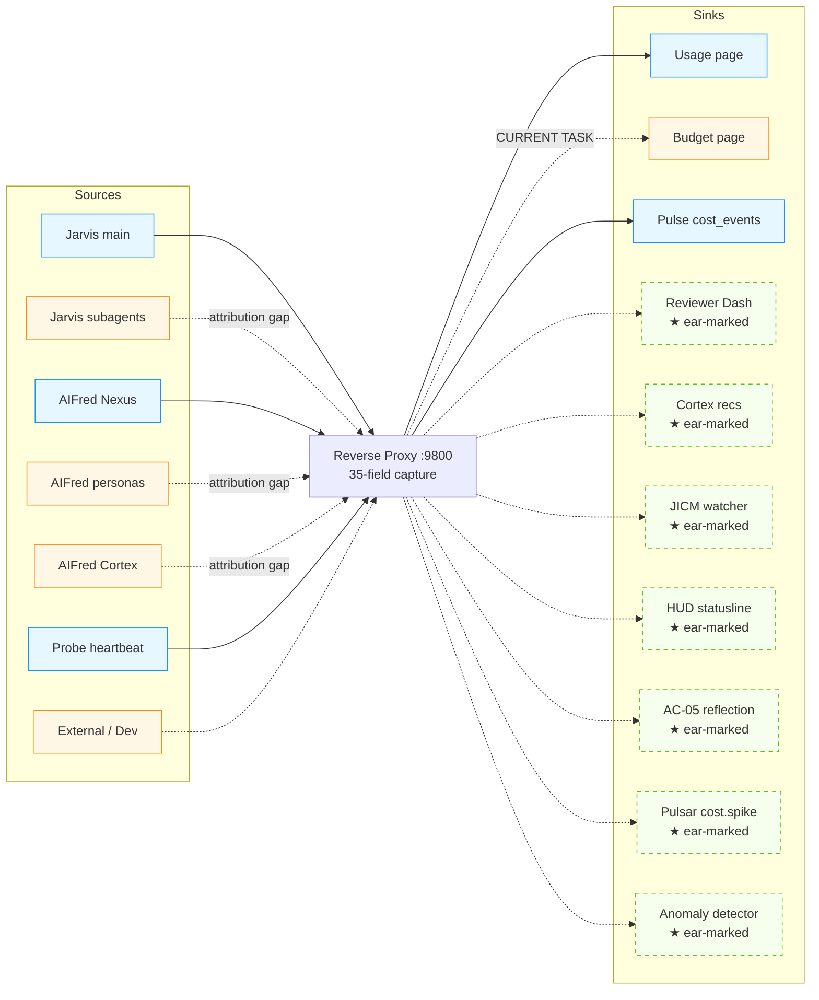

# Reverse-Proxy Paradigm + Usage/Budget Surfacing

## §1 Executive Summary

The AIFred-Pro reverse proxy at `:9800` (and the predecessor `anthropic-header-proxy.js` at `:8877` on production) is **over-instrumented for its current job**. It captures 35 fields per Anthropic API request — full token economics, three rate-limit families, identity attribution, error state, raw header dump — but only ~60% of that surface is wired to consumers. The Budget page reads zero proxy-derived data; it shows job-cost-ledger heuristics instead of authoritative API spend.

This document maps the full paradigm space (what reverse-proxying *could* do across Jarvis and AIFred), inventories sources and sinks, and narrows to the concrete current-task scope: complete the v1.3 §6.1 #2 deliverable "Reverse-proxy + Usage page surfacing completion" with the **expanded option** — Wires A+B+C + redesign + metadata header-fallback (the discipline-gap fix that unblocks per-source attribution downstream).

**Effort**: ~1.5 days (1 day per v1.3 + half-day for metadata helper).

**Out-of-scope future work** (§10): nine ear-marked downstream wirings (Reviewer Dash cost column, Cortex cost-aware recs, JICM token gating, HUD burn-rate widget, AC-05 cost-quality reflection, Pulsar cost.spike events, predictive 429 dodge, anomaly detection service, cross-archon coordinator) — each gets a documented home so it does not get lost between sessions.

---

## §2 Reverse-Proxy as Architectural Primitive (10 patterns)

A reverse proxy can serve up to ten distinct architectural functions. Every additional pattern wired in is leverage; the proxy is one of the highest-leverage single artifacts in the constellation because it is the only chokepoint where every Anthropic API call is observable.

| # | Pattern | Today | Enables when wired |
|---|---|---|---|
| 1 | Telemetry capture | `LIVE` | Backbone for all other patterns; the data plane |
| 2 | Request shaping | `OFF` | Auto-inject metadata.*, strip secrets, add anthropic-beta selectively, rewrite model for cost |
| 3 | Response shaping | `OFF` | Mathematically-identical-prompt cache, tool_use extraction, citation decomposition |
| 4 | Routing | `OFF` | Multi-account budget split, Bedrock/Vertex failover at 5h limit, Ollama offload for low-stakes |
| 5 | Auth / multi-tenant | `OFF` | PAT rotation, per-project keys, per-persona quotas at proxy layer |
| 6 | Compliance / audit | `PARTIAL` (raw_headers JSONB) | Full request capture with redaction layer, replay-for-test fixtures |
| 7 | Throttling / queueing | `OFF` | Pre-emptive 429 dodge, priority queue (P1 always, P5 off-peak) |
| 8 | A/B testing | `OFF` | Prompt-variant comparison, model A/B, cache-strategy A/B |
| 9 | Cost attribution | `LIVE` (cost_usd column) | Per-project, per-persona, per-task, per-decision; cross-archon split |
| 10 | Anomaly detection | `OFF` | Token-spike, identical-request-loop, model-misuse alerts |

**Patterns 1, 9 are live. Patterns 2-3, 7-8, 10 are zero-coordination adds (single middleware fn in proxy.py); patterns 4-6 require coordination layers and are larger workstreams.**



---

## §3 Through Jarvis Lens

| Application | Tier | Latent value |
|---|---|---|
| **JICM-as-token-aware** | High | Watcher reads `unified_5h_utilization` live; compresses earlier when 5h budget tight, not just when context size large |
| **HUD live burn rate** | High | Statusline shows `5h: 47% / reset 1h22m / +18%/h` instead of just context % |
| **AC-05 cost-quality reflection** | Medium | "Sessions where Sonnet finished tasks Opus got stuck on — switch defaults" — data-driven self-evolution |
| **Capability-map cost annotations** | Medium | Each skill/agent gets observed avg cost; `psyche/capability-map.yaml` becomes economically informed |
| **Subagent budget gates** | Medium | `Agent(deep-research)` refuses to spawn if 5h util > 80% AND task is P3+ |
| **Session-fork attribution** | Low | When `--session-resume`/`--fork` ship, proxy attributes forked session_ids to parent |
| **Cross-archon coordinator** | Low | When AIFred consumes 60% of 5h, Jarvis defers low-priority subagent spawns; or vice versa |

---

## §4 Through AIFred Lens

| Application | Tier | Latent value |
|---|---|---|
| **Pulse audit_log enrichment** | High | Cross-link `api_requests.task_id` → `audit_log.task_id` for full task-cost attribution |
| **Persona cost-per-decision** | High | Reviewer Dash gets `cost / decision` from `agent_name=persona:reviewer` rows |
| **Nexus dispatcher budget gate (proxy-derived)** | High | Real `unified_5h_utilization` replaces cost-ledger.jsonl heuristic |
| **Cortex cost-aware recommendations** | Medium | "Switch triage to Haiku — saves $X/wk" becomes data-driven |
| **Pulsars high-spend webhook** | Medium | Subscribe to "cost spike >2σ" event; trigger automated Telegram or remediation |
| **Telegram threshold alerts** | Medium | Util-watermark alerts (>90%) — uses chain shipped 2026-05-05 (`cd0aadd`) |
| **Cron priority by allotment** | Medium | P5 jobs deferred to historically-rich allotment windows |
| **Budget page API integration** | High | **CURRENT TASK** — Budget page reads `cost_usd` from `api_requests` (live) instead of cost-ledger.jsonl (heuristic) |

---

## §5 Source Inventory

**Live sources** (route through proxy today):
- Jarvis main session (when `ANTHROPIC_BASE_URL=http://localhost:9800` set)
- Probe-headers cron heartbeat (every 2h, captures fresh headers during idle)
- Manual `claude -p` invocations (when env set)

**Should-be sources** (have attribution gap — `metadata.*` not injected):
- Jarvis subagents (Agent tool spawns; need SDK metadata injection)
- AIFred Nexus dispatcher (claude -p invocations)
- AIFred personas (24+, all routed via dispatcher)
- AIFred Cortex evaluator
- Jarvis-Dev / Alfred-Dev sessions

**Future sources**:
- Loom (when unified API surface lands — Phase 8 of David's roadmap)
- External sessions (David's machine; multi-org accounting if Anthropic adds orgs)
- `/unleash` AC-10 berserker spawns (special-tagged for analytical isolation)

**Discipline gap**: most "should-be" sources don't currently inject `metadata.{session_id, project, agent_name, task_id}` into request bodies, so their rows land with NULL attribution. **One fix unblocks attribution for the entire constellation: a header-fallback in `proxy.py` that reads `x-aion-*` HTTP headers when body metadata is absent.** Callers can then set headers (much easier than modifying request bodies, especially for clients we don't control like claude-code's internal SDK).

---

## §6 Sink Inventory

### 6.1 Wired today (5)

| Sink | Source | Notes |
|---|---|---|
| `/usage` page (9 panels) | Pulse `/api/v1/usage/*` endpoints | Token-focused; no dollars |
| `/budget` page | `cost-ledger.jsonl` via companies API | Job-spend heuristic; no proxy data |
| Pulse `cost_events` | Dual-write from `cost-log.sh` | Job-side cost; not proxy-derived |
| Pulse `/api/v1/usage/*` (9 endpoints) | `api_requests` table | Token-focused; one endpoint name has "budget" but means token-budget |
| Proxy `/health` | Internal | Liveness only |

### 6.2 Ear-marked for future wiring (10)

| # | Sink | Tier | Effort | Depends on |
|---|---|---|---|---|
| 6 | Reviewer Dash cost column | High | half-day | v1.3 §7.2 Reviewer Dash; this doc's Wire C |
| 7 | Cortex cost-aware recommendations | Medium | 1 day | Cortex schema extension |
| 8 | Pulsar `cost.spike` event class | Medium | 1 day | New pipeline-v2 service; Pulsars infra (already live) |
| 9 | JICM watcher token gating | High | half-day | Jarvis-side `jicm-watcher.sh` edit |
| 10 | HUD burn-rate widget | Medium | half-day | Jarvis-side `jicm-watcher-hud.sh` edit |
| 11 | AC-05 cost-quality reflection | Medium | 1 day | AC-05 component spec; `psyche/self-knowledge/` |
| 12 | Capability-map cost annotations | Low | 1 day | `psyche/capability-map.yaml` schema bump |
| 13 | Subagent budget gates | Low | half-day | Jarvis-side Agent tool wrapper |
| 14 | Anomaly detection service | Medium | 1-2 days | New pipeline-v2 service |
| 15 | Cross-archon coordinator | Low | 2-3 days | JICM v8 PTY (Phase A precondition) |

---

## §7 Per-Datapoint Surface Map

| Field family | Surfaces today | High-value ear-marks |
|---|---|---|
| Token economics (input/output/cache) | session-tokens, cache-effectiveness | per-session spend cards, cost-per-decision, cache-thrash detection |
| Cost (`cost_usd`) | none on Usage; Budget uses cost-ledger | **Budget page integration** (Wire B) + Reviewer Dash cost column |
| Identity (session_id/project/agent_name/task_id) | session-tokens (session_id only) | persona dashboards, project-budget caps, task-cost attribution, cross-archon split |
| Unified 5h family | session-window, burn-rate-curve, session-budget-history | live-page header card (Wire A), JICM token gating, HUD widget |
| Unified 7d family | unused | weekly forecast, planning-horizon caps |
| Per-min rate limits (rl_*) | unused | streaming-window saturation, request-rate throttling |
| Fast-mode remaining | unused | fast-mode budget tracking when applicable |
| Rejection (http_status, retry_after) | rejection-events | predictive 429 dodge, retry-pattern optimization |
| Raw headers JSONB | unused | new-header discovery, schema evolution |

---

## §8 Current-Task Scope (Expanded Option)

Per user direction (2026-05-05, this session), the in-scope deliverable is **Wires A+B+C + redesign + metadata helper**. Sized at ~1.5 days (1 day per v1.3 §6.1 #2 + half-day for the metadata helper).

### 8.1 Wire A — Usage page surfacing completion (tokens)

- Hero cards (top of UsagePage):
  - Time remaining in 5h window
  - Tokens consumed this window
  - Cost consumed this window (USD)
- Burn-rate sparkline (already partial in TimePanel; ensure prominence)
- Cache-hit ratio table (already exists as cache-effectiveness; verify it stays prominent)

### 8.2 Wire B — Budget page proxy integration (dollars)

- New panel "API cost this 5h session" → reads from `api_requests.cost_usd` for current window
- New panel "API cost this month vs job-ledger spend" → reconciles the two sources
- Existing CompanyCard rows stay (per-job cost-ledger tracking); proxy data is *additional*, not replacement

### 8.3 Wire C — `/api/v1/usage/session-spend-dollars` (new endpoint)

- Sums `cost_usd` for current 5h window (anchored on `unified_5h_reset` from latest row)
- Returns: `total_usd`, `by_model: [...]`, `by_agent: [...]`, `projection_to_window_end_usd`
- Joins with existing session-window data for the 5h-anchored frame

### 8.4 Redesign — Usage page restructure

Layout-only restructure (no new chart types) into anchored-by-5h frame:

| Row | Panels | Width |
|---|---|---|
| Hero | Time / Tokens / Cost cards | full-width 3-column grid |
| Trend | Burn-rate curve · Cache effectiveness | 2-column grid |
| History | Session token allotment · Window transitions · Hour-of-day scatter | 3-column grid |
| Detail | Rejection events / 429 forensics | full-width |

Drop redundancy where two panels show the same axis differently. Promote cache-effectiveness to hero if cache-hit drops below 95% (anomaly-as-promotion).

### 8.5 Metadata helper (the discipline-gap fix)

**Approach**: Header-fallback in `proxy.py:_parse_request_body`.

**Headers**:
- `x-aion-session-id` → `metadata.session_id`
- `x-aion-project` → `metadata.project`
- `x-aion-agent-name` → `metadata.agent_name`
- `x-aion-task-id` → `metadata.task_id`

**Resolution order** (per field):
1. `data.metadata.<field>` from request body (preferred — survives proxy bypass)
2. `x-aion-<field>` HTTP header (fallback — easier for clients we don't control)
3. `NULL` (logged but not enforced)

**Why headers, not body modification**: clients we don't control (claude-code's internal SDK) can't easily inject body fields, but most HTTP libraries make custom headers trivial to set. Headers also survive request-body redaction layers.

**Doc reference pattern** for callers:
```bash
ANTHROPIC_BASE_URL=http://localhost:9800 \
  anthropic-extra-headers='x-aion-agent-name: jarvis-deep-research,x-aion-session-id: abc123' \
  ...
```

Or via SDK:
```python
client = Anthropic(default_headers={
    "x-aion-agent-name": "jarvis-deep-research",
    "x-aion-session-id": session_id,
})
```

---

## §9 Implementation Plan (this workstream)

Ordered by dependency:

1. **Design doc** (this file) ← captures all of §1-§10 for future reference
2. **proxy.py header-fallback patch** (§8.5)
3. **`/api/v1/usage/session-spend-dollars` endpoint** in `pulse/app.py` (§8.3)
4. **Rebuild aifred-dev-pulse** container; smoke endpoint
5. **Dashboard `useSessionSpendDollars` hook** in `dashboard/frontend/src/api/usage.ts`
6. **Wire A**: UsagePage hero cards (§8.1)
7. **Wire B**: BudgetPage proxy-API panel (§8.2)
8. **Redesign**: UsagePage layout restructure (§8.4)
9. **Verify**: browser-load both pages; smoke metadata header path with test request
10. **Commit + push**: single commit on Alfred-Dev nate-dev with `[Nexus]` tag (proxy + pulse + dashboard); Jarvis-side scratchpad update

**Boundary tagging** per audit 2026-05-05: this workstream is `[Nexus]` (proxy is a Nexus-component piece even though it runs alongside Pulse). The new Pulse endpoint is technically `[Pulse]`, but the whole bundle ships together so it gets `[Nexus]+[Pulse]` ↔ `[Boundary]` if we're strict, or `[Nexus]` if we treat the pulse endpoint as a downstream consumer of proxy data. **Decision: tag `[Boundary]`** — clean cross-boundary work (Pulse adds endpoint, dashboard adds consumer, proxy adds attribution). Documented per `pulse-nexus-boundary-audit-2026-05-05.md`.

---

## §10 Future-Wiring Earmarks (deferred from current task)

These are **NOT in current scope** but are recorded so they don't get lost between sessions. Each is independently sizeable; group into workstreams as appropriate.

| Earmark | Tier | Effort | Notes |
|---|---|---|---|
| Reviewer Dash cost column | High | half-day | Trivial after Wire C lands |
| Cortex cost-aware recommendations | Medium | 1 day | Schema extension required |
| Pulsar `cost.spike` event class | Medium | 1 day | New pipeline-v2 service |
| JICM watcher token gating | High | half-day | Jarvis-side; high-value |
| HUD burn-rate widget | Medium | half-day | Jarvis-side; high-visibility |
| AC-05 cost-quality reflection | Medium | 1 day | Self-knowledge schema work |
| Capability-map cost annotations | Low | 1 day | Yaml schema bump |
| Subagent budget gates | Low | half-day | Agent tool wrapper |
| Anomaly detection service | Medium | 1-2 days | New service |
| Cross-archon coordinator | Low | 2-3 days | Depends on JICM v8 PTY |
| **Predictive 429 dodge middleware** | **Medium** | **half-day** | **High operator-time-saved value; could be folded into anomaly detection** |
| **Pre-commit hook**: forbid new `${VAR:-${VAR}}` tautology | **Low** | **15 min** | Systemic find-and-fix from 2026-05-05 telegram restoration finding |

---

## §11 Risks & Open Questions

### 11.1 Risks

- **Cache invalidation on Usage page**: React Query default stale-time may show old proxy data for >1 minute; verify `staleTime`/`refetchInterval` per panel for the live 5h frame.
- **Pulse container rebuild downtime**: ~30s while `aifred-dev-pulse` recreates. Probe heartbeat may miss one cycle (acceptable).
- **Header-fallback breakage for production**: AIFred-Pro production runs the older Node.js proxy `:8877`; this work modifies the Python proxy `:9800` only. Production behavior unaffected.
- **Cost-ledger vs proxy-cost reconciliation drift**: the two sources can disagree (cost-ledger uses post-hoc model pricing on dispatcher-tracked invocations; proxy uses live-Anthropic-billing-units on every request). Document the gap on the Budget page so it doesn't read as a bug.

### 11.2 Open questions

1. **Header naming convention**: `x-aion-*` proposed. Alternatives: `x-jarvis-*`, `x-aifred-*`, `x-aionic-*`. **Recommendation**: `x-aion-*` as a project-neutral prefix that covers both Archons.
2. **Should Wire C return cost projection?** Currently planned as `projection_to_window_end_usd` based on linear extrapolation of current burn rate. A second-order polynomial fit might be more accurate — defer to v1.x.
3. **Budget page total reconciliation**: should we display "API spend" + "Job spend" + "Δ" (the gap), or only one with a tooltip explaining the gap? **Recommendation**: both visible, gap as info-tier annotation.
4. **Metadata helper rollout**: do we backfill historical `api_requests` rows with NULL → guessed-attribution from session_id patterns? **Recommendation**: NO. Future-only attribution. Backfill-via-guess introduces uncertainty into a previously-clean dataset.

---

## §12 Sign-off Criteria

This workstream is COMPLETE when:

- [ ] proxy.py merges header-fallback (§8.5) and is restarted/redeployed
- [ ] `/api/v1/usage/session-spend-dollars` returns expected shape on smoke test
- [ ] aifred-dev-pulse container rebuild ships the new endpoint
- [ ] UsagePage shows hero cards (Time / Tokens / Cost) at top
- [ ] BudgetPage has API-cost panel reading from proxy
- [ ] UsagePage redesign layout (4 rows: hero/trend/history/detail) is in place
- [ ] Browser-verified at `http://localhost:8701/usage` and `http://localhost:8701/budget`
- [ ] Smoke test: send 1 request through proxy with `x-aion-agent-name: smoke-test` header; confirm row in `api_requests` has `agent_name='smoke-test'`
- [ ] Single commit pushed to davidmoneil/AIFred-Pro:nate-dev with `[Boundary]` tag
- [ ] Jarvis scratchpad updated; design-doc cross-referenced
- [ ] Earmark table (§10) preserved for future workstreams

---

*v1.0 — 2026-05-05. Successor: this doc gets revised when any §10 earmark ships.*
