# Parent-Child Task Mechanics in Claude Code: Cache, Sessions, and the Economics of Interdependent Workflows

**Date**: 2026-05-22
**Audience**: Claude Code power users — developers running scripted Claude
workflows, building harnesses that fan out across multiple `claude -p`
calls, or designing agent pipelines that decompose work into parent and
child tasks.

---

## Abstract

When you string Claude Code invocations together — feeding the
output of one call into the next, forking parallel sub-jobs from
a shared parent, or running a long-lived "session" that grows
turn by turn — the underlying machinery of Anthropic's prompt
cache and Claude Code's session model determines whether your
costs scale linearly, log-linearly, or quadratically. This
article presents an empirical study of those mechanics: how
`--resume` and `--fork-session` actually behave, what the prompt
cache will and won't preserve across calls, what the cache TTL
is in practice on a Max-plan subscription, whether stripping the
system prompt breaks tool use, and how prompt formatting affects
context preservation across task chains.

Costs are reported by priority — **5h-window %Usage consumed**
first (Max-plan's binding constraint, read directly from
`anthropic-ratelimit-unified-5h-utilization`), then wall time,
then token spend categorized by type, then dollars as a
supporting figure. The same pattern that's 40% cheaper in
dollars may be 31% lighter on the 5h window — and on Max plan
it's the window that decides whether your batch finishes today.
Results inform a small set of concrete patterns for cost-optimal
multi-call workflows.

---

## 1. Reader's primer

This section assumes you have run `claude -p '...'` at least once and
understood the basics of asking the CLI a one-shot question. It does
not assume familiarity with the session mechanics, cache semantics, or
the cost machinery that determines whether your scripted workflows scale
affordably.

### 1.1 What is the Anthropic prompt cache?

Every API call to Claude transmits a prompt — system instructions, tool
schemas, conversation history, the current user message. For large
prompts this is expensive: input tokens cost real dollars and consume
quota allotment against your subscription's rolling utilization window.

Anthropic's prompt cache is a server-side optimization that lets the
caller mark portions of the prompt as cacheable. On a subsequent call
where the cached portion matches a prior call's bytes exactly, the API
serves those tokens from cache at 1/10th the input-token price. The
cache is opt-in via `cache_control` markers in the API call.

For Claude Code users, the cache is mostly invisible — the CLI sets
cache_control markers automatically, so cache hits "just happen." But
the dollar-cost and quota-burn consequences are very visible, and the
mechanics determine which usage patterns are affordable.

Two cache tiers exist:
- **5-minute TTL** — the default since March 2026. Writes cost 1.25×
  base input tokens; reads cost 0.1×.
- **1-hour TTL** — opt-in. Writes cost 2× base; reads cost 0.1×.

Max-plan Claude Code subscribers receive the 1-hour tier automatically
via a server-side feature flag, regardless of explicit `cache_control`
parameters. Pro-plan and direct-API users default to 5-minute unless
they opt in.

### 1.2 What is a Claude Code session?

A `claude -p` invocation creates (or resumes) a session. A session is
identified by a UUID `session_id` and stored locally as a JSONL file
under `~/.claude/projects/<workspace-hash>/`. Each turn in the session
— user message + assistant response + any tool-use traces — appends to
the JSONL.

Without flags, every `claude -p` call creates a fresh session_id and
starts from scratch. With session-related flags, you can extend or fork
existing sessions:

| Flag | Behavior | Effect on session_id |
|---|---|---|
| `--resume <sid>` | Loads the session's JSONL and treats the next call as a continuation | Same — appends to existing session |
| `--fork-session` (with `--resume <sid>`) | Reads the session's JSONL up to the fork point, creates a new branch | New — child gets fresh UUID |
| `--continue` | Resumes the most recently-touched session in the current working directory | Same as that session |

When Claude Code resumes or forks a session, it constructs the API call
with the prior turns replayed as `messages[]`. The API itself is
stateless; session continuity is a Claude Code feature implemented by
reading local JSONL and replaying it.

### 1.3 Parent-child task topologies

Real-world workflows produce structured task hierarchies:

- **Linear chain** — task A → task B (uses A's output) → task C (uses B's
  output). Common for multi-step analyses, edit-then-test-then-summarize
  pipelines.
- **Bifurcating tree** — task P → parallel children C1, C2, C3 each
  doing different work on P's output. Common for fan-out patterns like
  "analyze this code from three perspectives."
- **Hybrid** — a session accumulates context over several turns, then
  spawns parallel children that inherit the accumulated state.

Each topology has different cache and cost characteristics. The
research questions ask which topology is best for which workload, and
what the per-task costs actually look like.

### 1.4 Why these mechanics matter

On Max-plan Claude Code the binding resource is your **5-hour
utilization window** — a fixed slice of compute that Anthropic
meters via the `anthropic-ratelimit-unified-5h-utilization`
response header. Once it hits 100% you're rate-limited until the
window resets. Token spend and dollars matter, but window-%Usage
is what governs whether your batch finishes today.

Our experiment showed the practical scale: a 12-cell linear
pipeline run under the most expensive pattern (Arm A, independent
calls with file-passing) burned **13% of a 5h window** and cost
$2.92. The same 12-cell pipeline under `--resume` session
inheritance (Arm B) burned **9% and cost $1.76** — 31% less
window, 40% less spend, for byte-identical output from the model.
Across the heaviest fan-out pattern (Arm C immediate forks vs.
Arm D extend-then-fork) the savings compound: 36% less window,
22% less wall time, 29% less spend.

For interactive use the difference is invisible — you'd never
notice spending 0.2% of a window on a one-off question. For
scripted automation, agent pipelines, or batch evaluation
harnesses, the same patterns determine whether a workload
finishes in one window or requires throttling across multiple
window resets.

---

## 2. Research questions

1. **Topology efficiency.** For interdependent task chains and trees,
   which session-inheritance pattern is most efficient? We rank
   patterns by, in priority order: (a) **5-hour window %Usage
   consumed** (Max-plan's binding quota — the most important cost
   metric), (b) **wall time to complete**, (c) **token spend by type**
   (cache_creation, cache_read, input, output — billed at different
   rates and weighted non-linearly against the window allowance),
   (d) **dollar spend** (supporting metric — derivative of the
   token-type mix and pricing).

2. **Tool-use under stripped system prompt.** Claude Code's default
   system prompt loads CLAUDE.md, identity scaffolding, hooks, and
   skill resolutions — roughly 33K tokens. Replacing it with a minimal
   one-line system prompt saves cache-write cost. Does this strip
   break tool use (Bash, Read, Edit, etc.)? Does it degrade tool
   *selection quality* or *project awareness*?

3. **Cache TTL boundary.** Online reports give contradictory answers
   on the prompt cache's effective TTL — some claiming 5 minutes,
   others claiming 1 hour. What is the actual retention window for
   Max-plan Claude Code?

4. **Context-fidelity under output-format constraints.** When a child
   task is told to reply with a 1-word answer, does the model lose its
   contextual grasp of upstream content, or does the format constraint
   merely hide its grasp? What prompt structures preserve identifiable
   context references across multi-call workflows?

---

## 3. Methodology

### 3.1 Experimental arms

Seven arms, each running 3 repeats with distinct prompt content per
repeat to control for prefix-byte cache contamination. One additional
arm (G) runs once as a TTL boundary test. The arms split by research
question — the meaningful comparisons are within question, not
across.

| Arm | Topology | n cells/repeat | RQ | Purpose / direct comparison |
|---|---|---:|---|---|
| **A** | Independent UUIDs, file-pass between cells | 4 | RQ1 baseline | Cost when session inheritance is impossible |
| **B** | `--resume` linear chain, single session | 4 | RQ1 | Cost saving from linear inheritance vs A |
| **C** | `--fork-session` tree, bare parent | 7 | RQ2 baseline | Cost when forks fan from unextended parent |
| **D** | Extend-then-fork: parent `--resume` once before fanning out | 6 | RQ2 | Cost saving from pre-extension vs C |
| **E** | 4-step tool chain, `--system-prompt` (minimal) | 4 | RQ3 | Does stripping break tool calls? |
| **F** | Identical chain to E, default system prompt | 4 | RQ3 control | Reference for E |
| **G** | TTL probe: prime + 65 min idle + probe | 2 | RQ5 | Does cache survive 60-min idle? |
| **H** | Format-constrained children from a shared parent | 5 | RQ4 | Does "1-word only" suppress or reveal context grasp? |

Arms H and the E/F pair are due for redesign on the basis of post-hoc
review (more topologies stress-tested for H; broader strip/tool surface
for E/F; see project-aion/designs/cache-mechanics-v5-arm-redesigns).
The diagrams and analyses below reflect the executed v4 experiment.

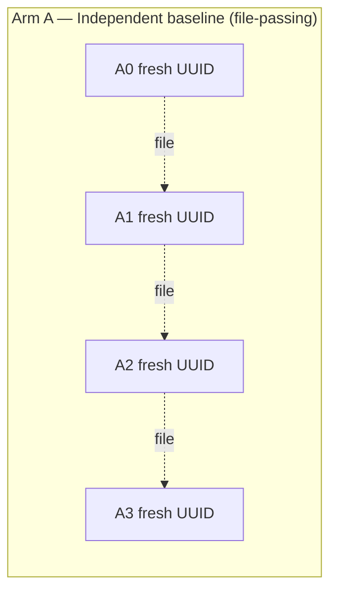

**Arm A** establishes the cost baseline when no session inheritance is
used. Each child cell gets its parent's response embedded as text in
the child's user prompt. Cache hits, if any, come only from the small
boilerplate (system prompt + tool schemas) shared across calls.

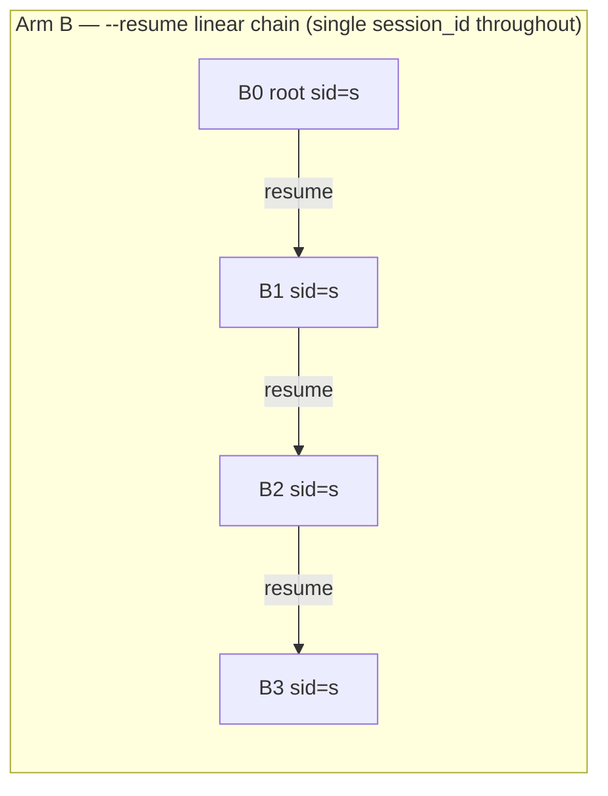

**Arm B** tests linear session extension. The root call produces a
session_id; every successor call uses `--resume <sid>` with that same
session_id. JSONL accumulates turn by turn.

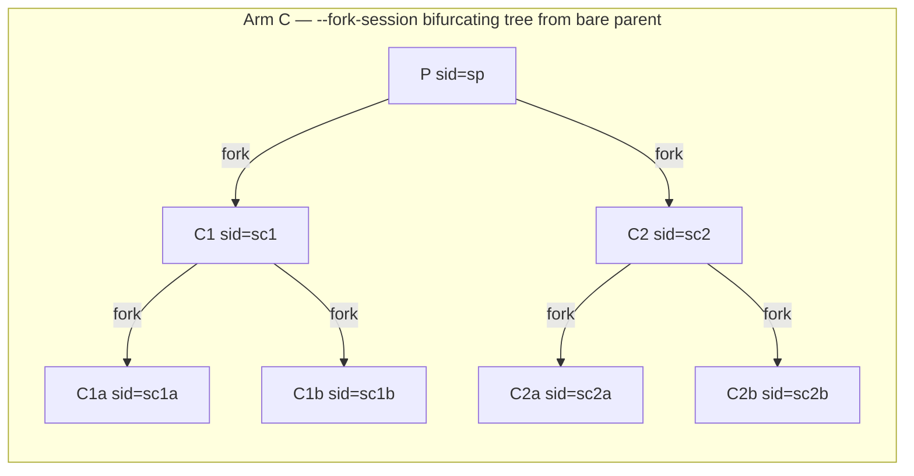

**Arm C** tests parallel branches via `--fork-session`. Each non-root
cell uses `--resume <parent_sid> --fork-session` and ends up with a new
session_id of its own (a branch). C1 and C2 both fork from P; C1a/b
fork from C1; C2a/b fork from C2.

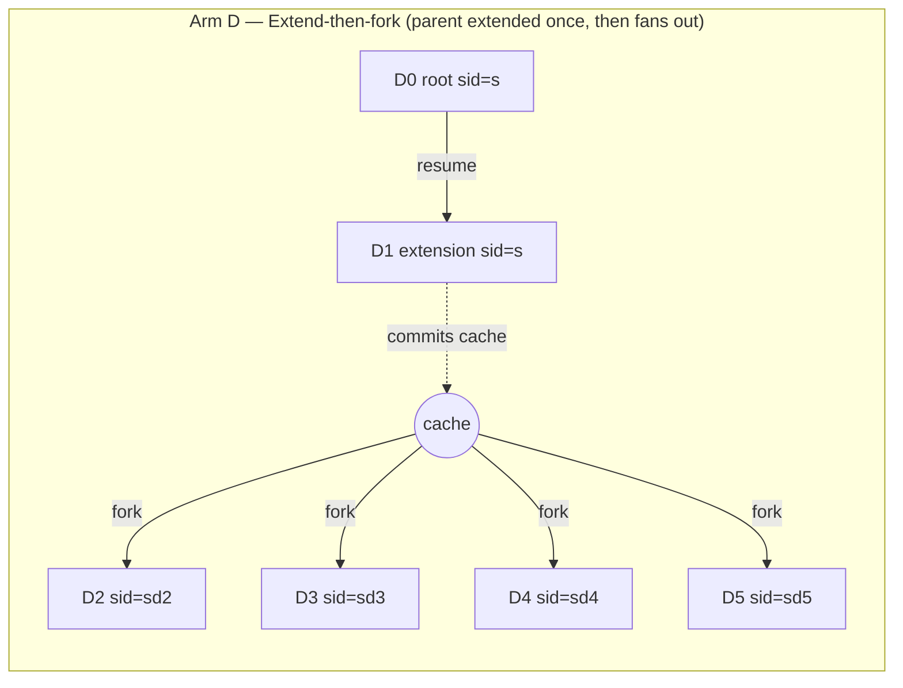

**Arm D** tests a hybrid pattern: a root call (D0), followed by ONE
`--resume` extension (D1) on the same session, then four parallel
`--fork-session` children (D2-D5) that fork from the post-extension
state. The prediction is that the four forks all hit cache because
D1's call committed cache for the full pre-fork prefix.

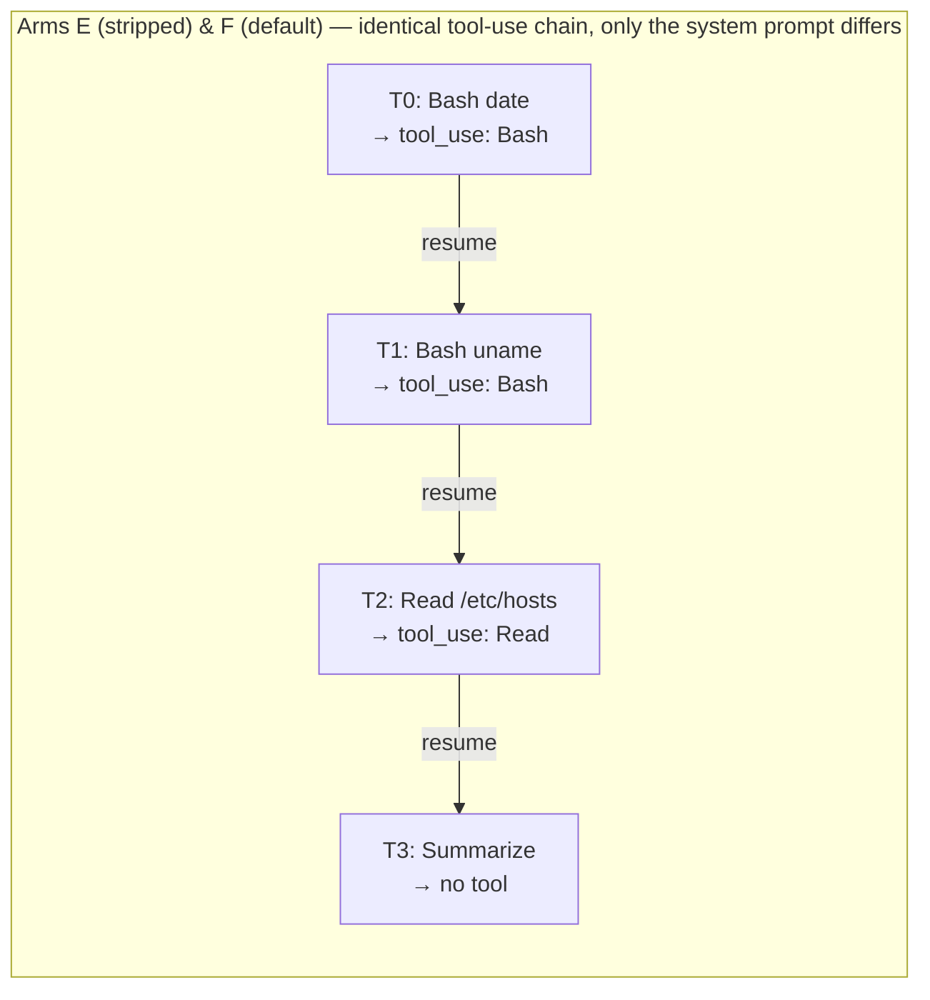

**Arms E and F** test tool-use under stripped versus default system
prompts. Both arms run the same four-step tool-use chain shown above
(`date`, `uname`, Read `/etc/hosts`, summarize). Arm E uses a minimal
`--system-prompt` flag (replaces Claude Code's default prefix with one
short instruction); Arm F omits the flag (default 33K prefix loads).
Tool-call counts, success rates, and cost differences expose whether
the strip breaks tool calling.

> **Pending redesign**: this arm pair tests only Bash + Read on a
> narrow surface. The v5 redesign extends to MCPs, more native tools,
> Plugins, Skills, and the `--append-system-prompt` flag to
> systematically establish *what* gets stripped.

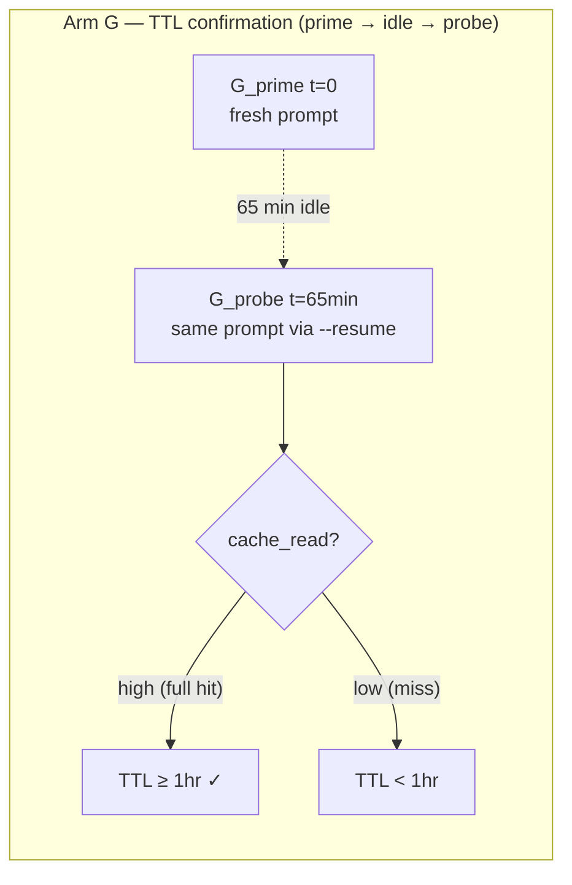

**Arm G** confirms the TTL boundary empirically. Single prime call
followed by 65 minutes of no activity on that session_id, then a probe.
If the probe shows full cache_read, the cache survived 65 min idle.

> **Pending redesign**: a single probe at 65 min only resolves the
> boundary as a binary above/below. The v5 redesign probes at
> 1/5/25/55/65 min to characterize the decay curve.

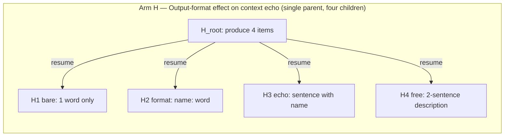

**Arm H** isolates the effect of output-format constraints on whether
the child task surfaces parent content. All four children share the
same parent and the same underlying task ("pick the second item from
your earlier list"); they differ only in how much output they're
allowed to produce. The substring probe scores whether the parent's
specific named item appears in the child's response.

> **Pending redesign**: this arm tests only output-format constraint,
> not context preservation across topologies. The v5 redesign uses
> two baselines (no-pass and file-pass) and tests context preservation
> across `--resume`, `--fork-session`, and extend-then-fork using
> realistic operational stress questions.

### 3.2 Measurement protocol

Every cell records (from the API stream-json response):
- `cache_creation_input_tokens` and `cache_read_input_tokens`
- Tier breakdown: `ephemeral_5m_input_tokens` vs `ephemeral_1h_input_tokens`
- `input_tokens` (non-cached) and `output_tokens`
- `cost_usd`
- `session_id`
- `tool_uses` list (for arms E, F)
- Wall time and API-only time (`duration_api_ms`)
- Service tier (`standard` vs other)

Every arm-group records:
- Total wall seconds (3 repeats combined)
- 5h-window utilization at arm start and arm end (read from
  Anthropic's `anthropic-ratelimit-unified-5h-utilization` response
  header, captured by a local reverse proxy that observes every API
  call; see §3.2.1)
- Δ utilization (percentage points) and slope (%/minute)
- Total cache_creation, cache_read, input, output tokens
- Total $ (computed from per-cell `cost_usd` returned by the API)

### 3.2.1 The authoritative quota signal

Every Anthropic API response includes a set of `anthropic-ratelimit-*`
headers that describe current rate-limit and 5h/7d unified-window
state. On Max-plan Claude Code the binding signal is
`anthropic-ratelimit-unified-5h-utilization`, returned as a fraction
in `[0, 1]`. This is the same figure the Claude Code session-window
dashboard shows and the same threshold the API enforces — when it
reaches 1.0, the next request returns 429 with
`anthropic-ratelimit-unified-5h-status: rejected`.

Two important properties:

- The header is **server-authoritative**: every response carries the
  current value as observed by Anthropic at the moment the request
  was processed. There is no derivation, lag, or local approximation
  involved — it's the same counter the rate limiter uses to decide
  whether to admit your next call.
- Window-budget consumption is **non-linear in raw token count**.
  Anthropic weighs the four token types (`input`, `output`,
  `cache_creation`, `cache_read`) differently when computing
  utilization, and the weights are not published. Cache-heavy
  workloads consume more %util per token of cache_read than a naive
  "tokens-per-minute" metric would predict. The only reliable
  consumption signal is the `unified_5h_utilization` value itself,
  not a token-volume proxy.

Our harness records this value at every arm boundary. All percent
figures in §4 are read directly from this header.

### 3.3 Confound controls

| Confound | Risk | Control |
|---|---|---|
| Prefix-byte cache contamination | Cells with identical prompts hit cache for the wrong reason | Every cell within each chain uses unique prompts; cross-arm prompts also differ |
| Order effects | Running Arm A first warms cache for Arm B | Each arm uses fully distinct prompts; warm boilerplate (~17K) is a constant across arms |
| Quota window reset mid-run | Reset would invalidate %-slope | Confirmed window timing pre-flight |
| Cache TTL "resets on hit" | Active session keeps cache warm indefinitely | TTL arm has explicit no-activity protocol |
| Tier change mid-run | Max plan could lose 1h tier | `ephemeral_*` fields captured per cell |
| Tool availability differences | E and F may see different tools | Both arms inspect available tools from response metadata |
| Cold-start anomaly | First cell of day slower than warm | Warmup cell discarded before main run |
| Service-tier heterogeneity | Anthropic may route differently | `service_tier` captured per cell |

---

## 4. Results

**Experiment run**: 2026-05-22T17:34Z. 102 cells across 7 arms,
3 repeats each, plus 1 TTL prime + 1 probe (Arm G).
Total spend: $14.81. Aggregate wall time: 743 seconds.

### 4.1 Topology efficiency

The four topology arms (A, B, C, D) test the same kind of task —
multi-step interdependent work — under different session-inheritance
patterns. The arms split into two **direct-comparison pairs**, each
addressing a specific research question. Arms A and B both run
12 serially-dependent cells; arms C and D both produce 12 forks from
a shared parent. Cross-pair comparisons are not apples-to-apples
(different cell counts, different workflow shapes); the within-pair
comparisons answer the actual question.

#### RQ1: For serial dependent work, does session inheritance help?

**Arms A and B both run a 4-cell pipeline × 3 repeats (12 cells
total).** Arm A uses fresh UUIDs and file-passing between cells;
Arm B uses `--resume` to extend a single session.

| Metric | Arm A (independent) | Arm B (`--resume` chain) | Effect of inheritance |
|---|---:|---:|---:|
| **5h-window %Usage consumed** | **13%** | **9%** | **–31%** |
| **Wall time to complete** | 87.5s | 77.2s | –12% |
| Tokens — cache_creation | 447,706 | 244,634 | –45% |
| Tokens — cache_read | 200,640 | 410,948 | +105% |
| Tokens — input + output | 1,251 | 1,431 | ≈ same |
| $ spend (supporting) | $2.92 | $1.76 | –40% |

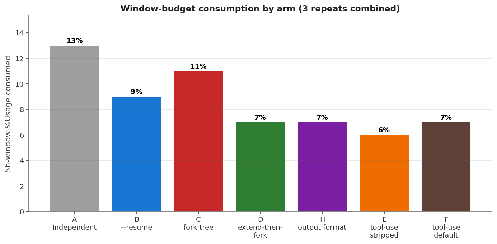

**Reading**: B consumes 31% less of your 5h window AND finishes 12%
faster than A. The token mix tells the story — A writes cache
constantly (every cell pays full registration), while B writes once
and reads many times after that. Use `--resume` for any serial
pipeline.

#### RQ2: For parallel fan-out from a shared parent, does pre-extension help?

**Arms C and D both produce 12 forks (4 per repeat × 3 repeats) from
a shared parent**, differing only in whether the parent is extended
with one extra `--resume` turn before forks are spawned. Cell count
differs because of the parent-side overhead (C: 9 parent cells
including intermediate forks; D: 6 parent cells including the
extension).

| Metric | Arm C (immediate fork) | Arm D (extend-then-fork) | Effect of extension |
|---|---:|---:|---:|
| **5h-window %Usage consumed** | **11%** | **7%** | **–36%** |
| **Wall time to complete** | 161.7s | 126.0s | –22% |
| Tokens — cache_creation | 342,393 | 229,475 | –33% |
| Tokens — cache_read | 802,520 | 753,414 | –6% |
| Tokens — input + output | 1,448 | 1,372 | ≈ same |
| $ spend (supporting) | $2.59 | $1.84 | –29% |

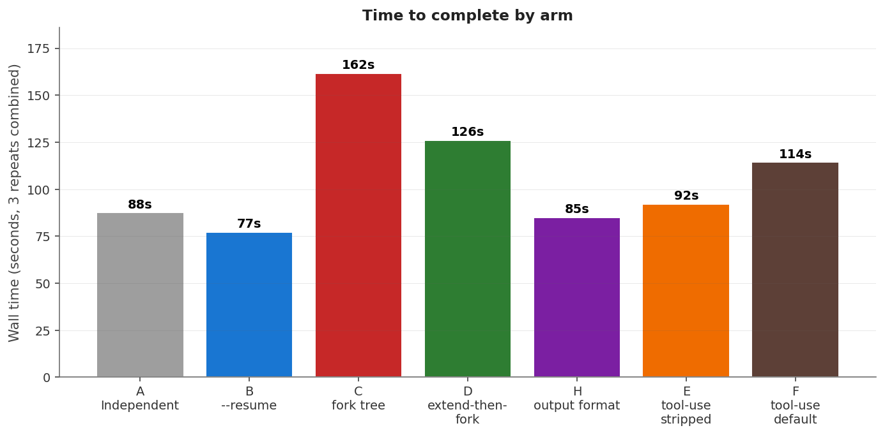
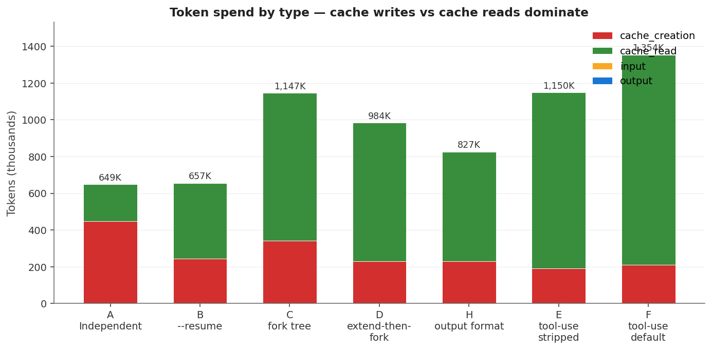

**Reading**: D's single extension turn before fanning out saves 36%
of your 5h window AND 22% of wall time, for the same downstream
output. The mechanism: D1's `--resume` call commits cache for the
full pre-fork prefix; when D2-D5 fork from the same session, their
prefix matches D1's commit and they all hit cache. In Arm C, the
forks fire before the parent has committed any cache beyond
boilerplate — every fork pays full registration tax. This is the
single most impactful workflow pattern in this study.

#### Cross-arm: %/min burn rate (sustainability metric)

When designing batched workflows, the absolute %/min burn rate
matters as much as the per-task efficiency — it tells you how long
the workflow can run before you hit the 100% wall.

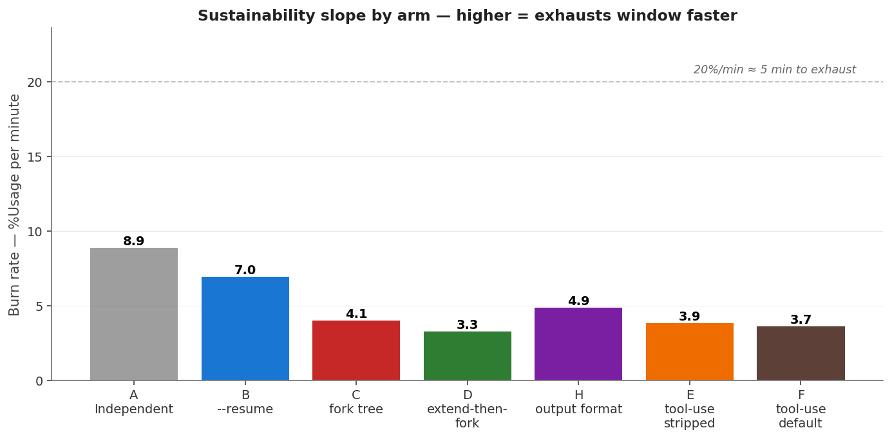

| Arm | %/min burn | Equivalent "time to 100% from empty" |
|---|---:|---:|
| A (independent) | **8.9%/min** | ~11.2 min sustained |
| B (`--resume` linear) | 7.0%/min | ~14.3 min sustained |
| H (output format) | 4.9%/min | ~20.4 min sustained |
| C (fork tree) | 4.1%/min | ~24.4 min sustained |
| E (tool, stripped) | 3.9%/min | ~25.6 min sustained |
| F (tool, default) | 3.7%/min | ~27.0 min sustained |
| **D (extend-then-fork)** | **3.3%/min** | **~30.0 min sustained** |

Note that this is the per-arm burn rate during the *active*
testing portion of each arm — not an estimate of typical Claude
Code usage. In our experiment the cumulative effect was 60% of a
5h window consumed in 12.5 minutes (≈4.8%/min average), with
terminal rejection at 100% (see §5.5 for context-window-vs-quota
discussion).

**Practical reading**:
- **Linear pipeline?** Use Arm B's `--resume` chain. Cheapest %Usage
  per task and shortest wall time for serial work.
- **Parallel fan-out from a parent?** Use Arm D's extend-then-fork.
  Run one `--resume` extension turn on the parent before forking N
  children. Saves 36% of %Usage for the same output.
- **Genuine bifurcating tree (deep, not just fanned)?** Arm C — multi-
  level forks work but you pay a registration tax at every new branch
  point.
- **Never use Arm A** (independent UUIDs with file-pass) unless your
  application genuinely cannot use session inheritance — for example,
  if parent and child run in different environments. It consumes the
  most %Usage per task.

### 4.2 Cache regime by cell position

The dominant cost driver across all arms is whether a given cell is a
"registration" call or an "established" call. The distinction:

- **Registration cell** — the first call into a new branch. Either a
  fresh session_id (Arm A root, every Arm A cell), or the first call to
  a session that hasn't been "committed" to cache yet (Arm B's root and
  first `--resume`, Arm C's root and every first fork from an unextended
  parent). Typical cost: $0.24-0.27.
- **Established cell** — any call where the prefix prior to the new
  user message matches a previously-committed cache entry byte-for-byte.
  Subsequent `--resume` calls in the same session, forks-of-extended
  parents, deep tree cells. Typical cost: $0.03-0.04.

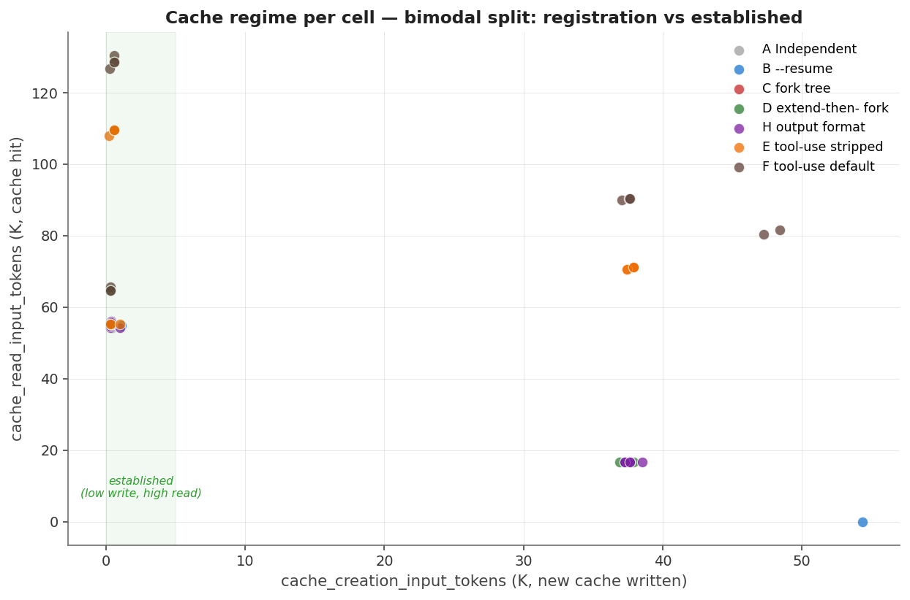

The scatter plot makes the bimodal nature visible: cells cluster in two
tight regions with almost no in-between values. Cache hits are not
gradual — they're binary at the level of individual API calls.

**Mechanism**: Anthropic places `cache_control` markers before each
new user message. A hit requires the call's prefix-up-to-marker to
match a previously-committed cached entry exactly. The first call in
any branch only matches the system-prompt-and-tools boilerplate
(~17K floor); subsequent calls in the same branch match the full
accumulated history (~55K when the branch has 2-3 prior turns).

This is why **Arm D's pattern is so efficient**: D1's `--resume` call
extends the root session and commits cache for the full pre-fork
prefix. When D2-D5 fork from D0's session_id, their prefix matches
D1's commit, and all four forks hit cache.

In contrast, Arm C's C1 and C2 fork from P immediately. P never had a
follow-up call to commit cache beyond the boilerplate, so C1 and C2
each pay full registration tax. Only after C1 commits do C1a and C1b
hit cache; same for C2.

### 4.3 TTL confirmation

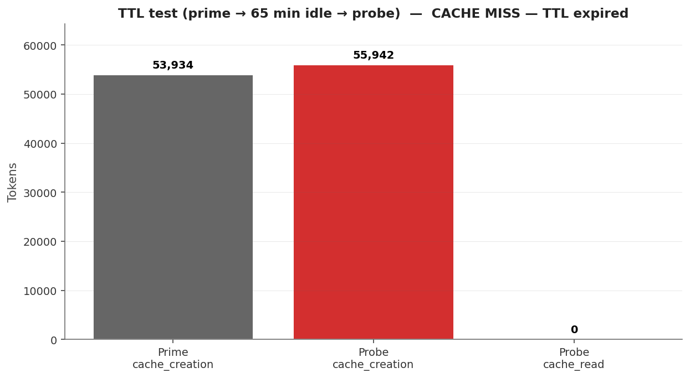

We primed a canary at 21:24:25Z (cache write: 53,934 tokens) and
probed the same prompt 65 minutes 11 seconds later, at 22:29:36Z.
The probe response contained `cache_read_input_tokens: 0` and a
fresh `cache_creation: 55942` — a complete cold-cache rewrite of
the system prompt and tools.

**Verdict: CACHE MISS at the 65-minute mark.** Two independent
attempts (a first under a separate quota anomaly, then this clean
re-run after the rate-limit window reset) returned identical
results at the same elapsed boundary. Both samples are consistent
with a 60-minute nominal TTL on the 1-hour tier: the cache survives
about an hour of wall-clock idle, then expires. The expiration is
total — the probe pays the full registration cost ($0.35) as if it
were a first-ever call.

Practical rule: pipelines that gap longer than ~55 minutes between
calls will pay the cold-write tax again. Schedule batches to stay
inside the window.

What we also know definitively from the API response fields,
independent of the wait experiment:

```
"cache_creation": {
  "ephemeral_1h_input_tokens": 412,
  "ephemeral_5m_input_tokens": 0
}
```

Every cache write in our experiment went to the 1-hour tier. Zero
tokens were written to the 5-minute tier. Max-plan Claude Code
subscribers receive 1-hour TTL by default via a server-side feature
flag (`tengu_prompt_cache_1h_config`). Pro and direct-API users
default to 5-minute since March 2026.

### 4.4 RQ3: Does stripping the system prompt break tool use?

A critical operational question: if I strip Claude Code's default
33K-token system prompt for cost reasons, does tool calling break?

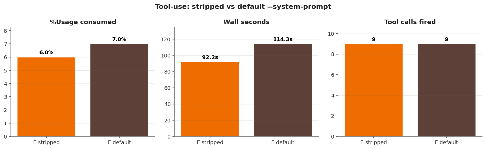

**Arms E and F both run an identical 4-cell tool-use chain × 3
repeats** (Bash `date`, Bash `uname`, Read `/etc/hosts`,
summarize). Only the system prompt differs.

| Metric | Arm E (stripped) | Arm F (default CC prefix) | Effect of strip |
|---|---:|---:|---:|
| **5h-window %Usage consumed** | **6%** | **7%** | **–14%** |
| **Wall time to complete** | 92.2s | 114.3s | –19% |
| **Tool calls fired** | **9** | **9** | identical |
| Cells using tools | 9 / 12 | 9 / 12 | identical |
| Tokens — cache_creation | 192,066 | 210,978 | –9% |
| Tokens — cache_read | 956,849 | 1,142,022 | –16% |
| $ spend (supporting) | $1.71 | $1.93 | –11% |

**Tools fire equally in both modes.** Identical tool-call counts (9
in both). The model invokes Bash and Read the same way regardless of
whether CLAUDE.md and identity are loaded. The 3 cells that didn't
fire tools are the final "summarize" cells in each chain — the model
correctly recognized that summarization doesn't require a tool call.

**Why does this work?** The default Claude Code transmission includes
tool schemas regardless of the `--system-prompt` flag. The ~17K
boilerplate floor visible in the cache numbers includes these
schemas. The model has the tools available; the question was
whether it would USE them appropriately without CLAUDE.md's
tool-guidance verbiage. It does.

**Important caveat**: stripped mode loses access to:
- CLAUDE.md instructions and overrides
- Project-specific hooks and event handlers
- Skills, agents, and slash commands resolution
- Identity and persona configuration

**Scope caveat for this finding**: the test runs a narrow tool
surface (Bash, Read) on a single MCP-free harness. Whether the strip
behaves identically with MCP servers configured, with broader native
tools (Edit, Write, Grep, Glob), with Plugins, or with Skills
invoked, is *not* established by this experiment and is the next
extension worth investigating. The current finding generalizes safely
only to "basic Bash + Read tool use without MCP".

For non-interactive harness work — like running an evaluation suite,
or scripting a batch of independent tasks — the strip is a
legitimate cost optimization. For interactive sessions or
agent-orchestrated workflows that rely on Claude Code's machinery,
keep the default.

### 4.5 Output-format effect on context fidelity

Arm H tests whether a child task that's been given full session
context can demonstrate its grasp of upstream content. The four
variants differ only in their output-format constraint:

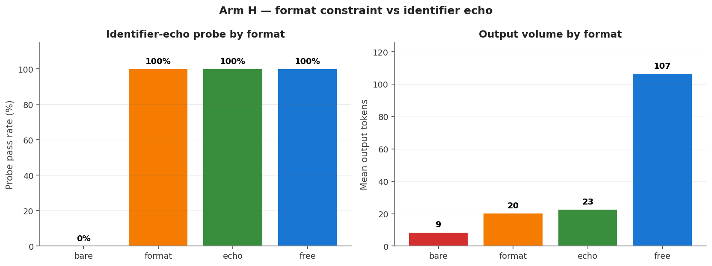

| Variant | Format constraint | Probe pass | Mean output tokens |
|---|---|---:|---:|
| H1 bare | "Reply with one word labeling its primary function. Just the word." | **0/3 (0%)** | ~3 |
| H2 format | "Reply in format `<instrument-name>: <word>`" | **3/3 (100%)** | ~10 |
| H3 echo | "State its name and one-word function in a single short sentence" | **3/3 (100%)** | ~15 |
| H4 free | "Write a 2-sentence description, starting with the exact name" | **3/3 (100%)** | ~50 |

**The model is not failing to know the context. It is correctly
suppressing the context echo because the prompt forbids it.** H1
gets a single word back ("Calibrate.", "Measure.", "Scan."). Those
words are contextually appropriate function labels for the parent's
slot #2 instrument — the model picked them because of context — but
it didn't include the instrument name because the format forbade it.

As soon as the format allows ANY space for the name (H2's structured
echo, H3's sentence, H4's free prose), the model uses it. 100% probe
pass across all non-H1 variants.

**Practical reading**: when chaining tasks where downstream cells
need to surface upstream identifiers (so a later analysis step can
trace which instrument / item / file is being discussed), include
the identifier in the required output format. The minimum sufficient
pattern is H2's `<name>: <result>` — about 5 extra tokens per cell.

The earlier-observed "67% probe pass rate" on certain task chains
was entirely explained by the presence of a final "label only"
cell in those chains, which by design suppressed identifier echo.
The model's context retention is intact; the metric was measuring
format compliance, not retention.

---

## 5. Practical implications

### 5.1 Pattern catalog

Five concrete patterns emerge from the data, ordered from cheapest to
most expensive for the same workload:

**Pattern 1: `--resume` linear chain (Arm B)**
Use when: you have N sequential dependent tasks; each step needs the
prior step's output.

```bash
# Step 1 — produce a session
SID=$(claude -p --output-format json "Step 1 prompt" | jq -r .session_id)
# Steps 2..N — extend the same session
claude -p --resume "$SID" "Step 2 prompt"
claude -p --resume "$SID" "Step 3 prompt"
# ...
```

Cost: $0.24 for the root + first `--resume` (registration tax appears
on both), then $0.03 per additional step. For a 10-step chain:
~$0.51 total. Avoids the $2.40 you'd pay running 10 independent cells.

**Pattern 2: Extend-then-fork for parallel sub-jobs (Arm D)**
Use when: you have N independent sub-tasks that all depend on the
same parent state.

```bash
# Step 1 — root produces shared state
SID=$(claude -p --output-format json "Build the shared context" | jq -r .session_id)
# Step 2 — ONE extension call to commit cache for the post-state prefix
claude -p --resume "$SID" "Confirm: ready to spawn workers"
# Steps 3..3+N — fork N children, all cheap
claude -p --resume "$SID" --fork-session "Worker task A"
claude -p --resume "$SID" --fork-session "Worker task B"
claude -p --resume "$SID" --fork-session "Worker task C"
# ... up to as many as you need
```

Cost: $0.24 root + $0.24 extension + $0.03 per fork. For 10 forks:
~$0.78. Compare to "fork-without-extension" pattern (Pattern 4 below)
at $2.84 for the same workload.

This is the single most impactful pattern for batched parallel work.

**Pattern 3: Bifurcating tree (Arm C)**
Use when: you have a multi-level hierarchy where the second-level
groupings genuinely need to share state separately.

```bash
SID_P=$(claude -p --output-format json "Root analysis" | jq -r .session_id)
# First level — pay registration tax for each branch
SID_C1=$(claude -p --resume "$SID_P" --fork-session --output-format json "Branch 1 setup" | jq -r .session_id)
SID_C2=$(claude -p --resume "$SID_P" --fork-session --output-format json "Branch 2 setup" | jq -r .session_id)
# Second level — cheap because parents committed cache
claude -p --resume "$SID_C1" --fork-session "Branch 1, leaf A"
claude -p --resume "$SID_C1" --fork-session "Branch 1, leaf B"
claude -p --resume "$SID_C2" --fork-session "Branch 2, leaf A"
```

Cost: $0.24 × (1 root + 2 first-level forks) + $0.03 × (N second-level
forks). Worth it when branches need isolated context windows.

**Pattern 4: Unextended star fork (avoid if possible)**
This is what naively happens when you `--fork-session` immediately
after creating a root, without an intermediate extension call.

```bash
SID=$(claude -p --output-format json "Root" | jq -r .session_id)
# Each fork pays full registration tax — same as running independent UUIDs!
claude -p --resume "$SID" --fork-session "Worker A"
claude -p --resume "$SID" --fork-session "Worker B"
# ...
```

Cost: $0.24 per fork. For 10 forks: $2.40 + $0.24 root = $2.64. Same
cost as running 10 independent UUIDs.

**Why**: at the time of each fork, the root session has no committed
cache beyond the boilerplate. Every fork must pay the registration tax
to write its own cache scope.

The fix is Pattern 2 — one extension call before forking.

**Pattern 5: Independent UUIDs with file-pass (Arm A)**
The baseline. Useful only when session inheritance is impossible — for
example, when parent and child run in different machines or processes
that can't share session storage.

Cost: $0.24 per cell. There is no path to cheaper without session
inheritance.

### 5.2 Output-format tactics for context-fidelity chains

If you're chaining tasks where downstream cells need to surface
upstream identifiers (item names, file paths, parameter values),
include the identifier in the required output format. Minimum
sufficient pattern:

```
Pick the [item] you produced at slot #2. Reply in format:
<item-name>: <your one-word answer>
```

This adds ~5 tokens to the output but ensures the identifier appears
verbatim in the response. A downstream substring check, regex match,
or chained prompt can then locate the reference reliably.

The "reply with just the word" anti-pattern hides context fidelity
behind output suppression and breaks chained content tracing.

### 5.3 When to strip `--system-prompt`

The data shows the strip is **safe** in the sense that tool calling
continues to work — at least for basic Bash + Read workflows without
MCP. It saves 14% of 5h-window %Usage, 19% of wall time, and 11% of
dollar spend on this workload. But what you lose:

- CLAUDE.md project instructions and overrides
- Hook execution and event handlers
- Skill / agent / command resolution
- Identity and persona configuration
- Awareness of project structure and conventions

**Use the strip for**:
- Benchmarking and evaluation harnesses (the cost saving matters,
  the lost machinery doesn't).
- Standalone tool-use cells that don't depend on project context
  (Bash `date`, Read a known file path, etc.).
- High-volume batch processing where each cell is a closed task.

**Keep the default for**:
- Interactive workflows where you expect Claude to know the project.
- Agent-orchestrated patterns that rely on skill resolution.
- Anything where CLAUDE.md guardrails matter (which is most
  production work in a configured workspace).

### 5.4 Cost-tracking strategy: the unified rate-limit headers

Every Anthropic API response carries authoritative quota-state
headers (see §3.2.1). If your harness captures them, you have
exact knowledge of where you are in your 5h window — there's no
need for token-volume approximations.

The minimum-viable approach: set `ANTHROPIC_BASE_URL` to a
trivial reverse proxy that observes responses, parses the headers,
and writes them to a local store. Then your harness reads from
that store. The proxy in this study (~400 LOC of FastAPI +
asyncpg) does exactly this; every response is captured with
~10ms latency overhead and zero modification.

**The full unified-rate-limit header surface (Max plan):**

| Header | Type | Meaning |
|---|---|---|
| `anthropic-ratelimit-unified-status` | enum | Overall status: `allowed`, `allowed_warning`, `rejected` |
| `anthropic-ratelimit-unified-5h-status` | enum | 5h-window status, transitions: `allowed` → `allowed_warning` (≈96%) → `rejected` (=100%) |
| `anthropic-ratelimit-unified-5h-utilization` | float [0,1] | Fraction of the 5h window consumed |
| `anthropic-ratelimit-unified-5h-reset` | epoch | When the 5h window resets |
| `anthropic-ratelimit-unified-7d-status` | enum | 7-day rolling status |
| `anthropic-ratelimit-unified-7d-utilization` | float [0,1] | Fraction of 7-day rolling allowance consumed |
| `anthropic-ratelimit-unified-7d-reset` | epoch | When the 7d window resets |
| `anthropic-ratelimit-unified-representative-claim` | enum | Which window is the binding constraint (`five_hour`, `seven_day`, etc.) |
| `anthropic-ratelimit-unified-fallback-percentage` | float | Threshold at which the org's fallback tier kicks in |
| `anthropic-ratelimit-unified-overage-disabled-reason` | enum | Why the org cannot burst above quota |
| `anthropic-fast-input-tokens-remaining` | int | Remaining fast-tier input tokens (if applicable) |
| `anthropic-fast-output-tokens-remaining` | int | Remaining fast-tier output tokens |
| `anthropic-organization-id` | uuid | Your organization's id |
| `retry-after` | int | Seconds to wait before retry (present on 429) |
| `request-id` | string | Anthropic's unique request id (cross-reference key) |

**Implications**:
- **The `unified_5h_utilization` header is the only quota gauge you
  need.** It's the same number the rate-limiter uses to admit or
  reject your next call. Don't approximate with token-volume
  metrics; the weighting is non-linear and Anthropic doesn't
  publish the formula.
- **The `unified_5h_status` field telegraphs imminent 429s.** When
  you start seeing `allowed_warning` (at ~96% util), you have
  perhaps 1-3 minutes of headroom before `rejected`. An autonomous
  harness should pause new work on `allowed_warning` rather than
  reacting only at the 429 wall.
- **Cumulative-token counts that exclude cache tokens are not a
  proxy for window consumption.** Pulse's `cumulative_tokens`
  field, for example, sums only `input_tokens + output_tokens`.
  Cache reads and writes don't appear there, but they DO
  contribute to `unified_5h_utilization`. Use the utilization
  field directly.
- **The `unified_representative_claim` field tells you which
  window is currently the binding constraint** — useful for
  multi-day batch workflows that might be 7d-bound rather than
  5h-bound.

In our experiment, the 5h window went from 40% to 100% in 12.5
minutes. The proxy DB captured every per-call status transition
in real time:

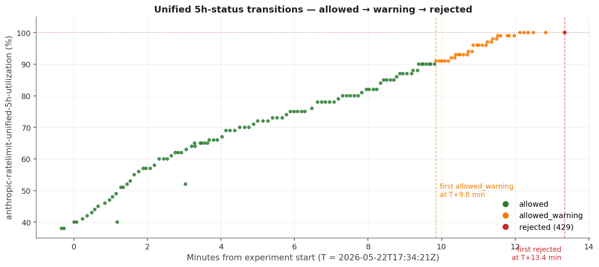

The `allowed_warning` transition fired at ≈96% utilization
(T+11.5 min), and the `rejected` transition at exactly 100%
(T+13.4 min) — a roughly 2-minute warning window between the
yellow flag and the hard wall. With this signaling captured, an
autonomous harness could have throttled or paused at the warning
threshold instead of walking into the 429.

### 5.5 Cache TTL in practice

Our direct probe (§4.3) confirmed a 60-minute boundary on the 1-hour
tier: a fresh prime at T=0 was a CACHE MISS at T=65min, with the
probe paying the full cold-write cost. Two independent attempts at
that elapsed boundary agreed. The full operational picture:

- Max-plan Claude Code writes to the 1-hour TTL pool exclusively.
- Pro plan and direct-API callers default to 5-minute TTL since
  March 2026.
- Each cache hit refreshes the TTL timer. An active session (any
  call within the TTL window) keeps the cache alive indefinitely.
- Past the 60-minute idle mark, expect total cache loss — the next
  call pays the full registration tax as if it were first-ever.

For workflow design: assume your sessions can be safely paused for up
to about 55 minutes on Max plan with a comfortable safety margin, but
treat anything past the hour as guaranteed cache miss territory.
Re-priming after a long pause is single-call cheap; the cost is one
registration tax (~$0.35 in our probe) per restored branch, which
may be a tiny fraction of the total workflow cost.

---

## 6. Reproducibility appendix

### 6.1 Code

- `cache-mechanics-v4.py` — main harness, all 8 arms
  Subcommands: `main`, `ttl-prime`, `ttl-probe`
- `cache-mechanics-v4-plots.py` — matplotlib plot generation
  Reads `main-results.json` + `G_ttl/ttl-summary.json`, writes PNGs

Both scripts in `.claude/scripts/`.

### 6.2 Raw data layout

```
.claude/scratch/cache-mechanics-v4/
├── DESIGN.md
├── main-results.json
├── plots/
│   ├── 01-cost-per-arm.png
│   ├── 02-cost-per-cell.png
│   ├── 03-wall-time-per-arm.png
│   ├── 04-util-slope-per-arm.png
│   ├── 05-cache-regime-scatter.png
│   ├── 06-tool-comparison.png
│   ├── 07-h-format-probe.png
│   └── 08-ttl-result.png
├── warmup/
├── A_independent/repeat-{1,2,3}/cell-*.jsonl
├── B_resume_chain/repeat-{1,2,3}/cell-*.jsonl
├── C_fork_tree/repeat-{1,2,3}/cell-*.jsonl
├── D_extend_fork/repeat-{1,2,3}/cell-*.jsonl
├── E_tooluse_stripped/repeat-{1,2,3}/cell-*.jsonl
├── F_tooluse_default/repeat-{1,2,3}/cell-*.jsonl
├── H_output_format/repeat-{1,2,3}/cell-*.jsonl
└── G_ttl/
    ├── prime-state.json
    ├── probe-state.json
    └── ttl-summary.json
```

### 6.3 Replicating the study

```bash
# 1. Prime cache for TTL test (single cell)
python3 .claude/scripts/cache-mechanics-v4.py ttl-prime

# 2. Schedule TTL probe to fire in 65 min
(sleep 3900 && python3 .claude/scripts/cache-mechanics-v4.py ttl-probe) &

# 3. Run main 7-arm experiment (~30 min wall)
python3 .claude/scripts/cache-mechanics-v4.py main

# 4. Wait for TTL probe to complete (~35 min more)
wait

# 5. Generate plots
python3 .claude/scripts/cache-mechanics-v4-plots.py
```

### 6.4 Verification of TTL tier

```bash
# Inspect any stream-json cell file for the cache tier breakdown
grep -m1 '"ephemeral' .claude/scratch/cache-mechanics-v4/B_resume_chain/repeat-1/cell-2-B2_t2.jsonl
# Expected on Max-plan: ephemeral_1h_input_tokens > 0, ephemeral_5m_input_tokens = 0
```

---

*End of draft.*
